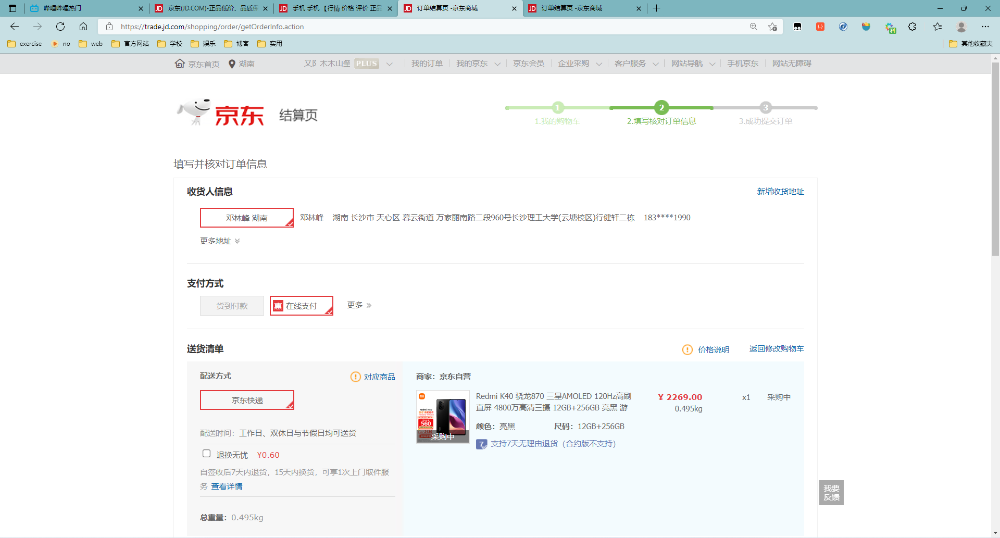
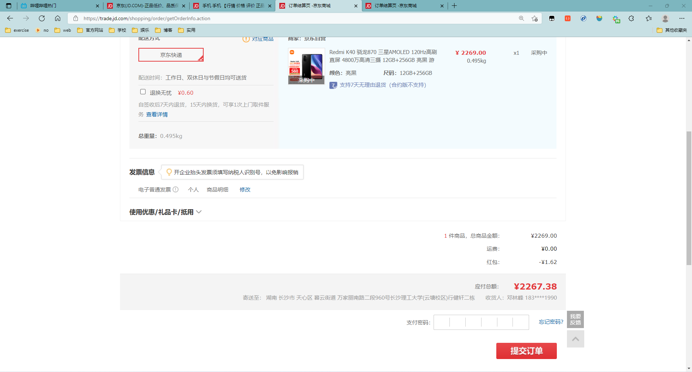
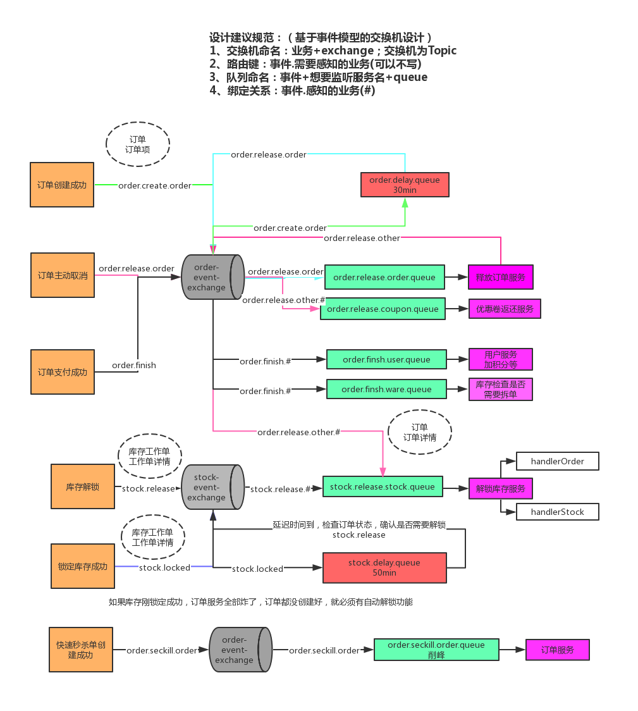

# 1、订单基本流程


1. 订单的创建与支付
   1. 订单创建前需要预览订单，选择收获信息等
   2. 订单创建需要锁定库存，库存有才创建，否则不能创建
   3. 订单创建后超时未支付需要解锁库存
   4. 支付成功后，需要进行拆单，根据商品打包方式、所在仓库、物流等进行拆单
   5. 支付的每笔流水都需要记录，以待查账
   6. 订单创建，支付成功等状态都需要给MQ发送消息，方便其他系统感知订阅
2. 逆向流程
   1. 修改订单，用户没有提交订单，可以对订单的一些信息进行修改，比如配送信息，优惠信息，以及其他一些订单可以修改范围的内容，此时只需对数据进行变更即可
   2. 订单取消，用户主动取消订单和用户超时未支付，两种情况下订单都会取消。而超时情况是系统自动关闭订单，所以在订单支付的响应机制上面要做支付的限时处理，尤其是在前面说的下单减库存的情形下，可以保证快速的释放库存。另外需要处理的是促销优惠中使用的优惠券，权益等视平台规则，进行相互补回给用户
   3. 退款，在代发货订单状态下取消订单时，分为缺货退款和用户申请退款。如果是全部退款则订单更新为关闭状态，若只是做部分退款则订单仍需进行，同时生成一条退款的售后订单，走退款流程。退款金额需原路返回用户的账户
   4. 发货后的退款，发生在仓储货物配送，在配送过程中商品遗失，用户拒收，用户收获后对商品不满意，这样的情况下用户发起退款的售后诉求后，需要商户进行退款的审核，双方达成一致后，系统更新退款状态，对订单进行退款操作，金额原路返回用户的账户，同时给关闭原订单数据。仅退款情况下暂不考虑仓库系统变化。如果发生双方协调不一致的情况下，可以申请平台客服介入。在退款订单商户不处理的情况下，系统需要做限期判断，比如5天商户不处理，退款单自动变更为同意退款。


以京东为例，在购物车里面点击去结算的时候，这个时候就应该要跳转到订单确定页






然后在这个页面，我们需要用户的收获地址信息、在购物车中勾选的想买的商品信息、以及运费和优惠价格、是否有货等信息，这些数据都需要我们在点击**去结算按钮**的时候获取到，然后传给前端进行展示。

**在京东里面，由于之前购物车的设计是靠redis去实现的，而且还会实时的存储当前用户是否勾选了指定的商品，因此有关购物车的数据可以直接实时的从redis中查询得到**

接着要去实现提交订单功能。同样的，在京东里面，提交订单的时候会在后台自己去查询一次购物车中的数据，无需由前端提交给后端相应的数据。但是前端还得提供给后端一些数据，比如：收获地址的id、支付方式、订单备注、应付价格（用来在后端进行验价，判断当前的商品是否发生了价格变动或者用户在前端恶意修改价格）。

**而且订单的提交这个操作应该是要满足幂等性**，也就是说，用户如果多次点击提交订单按钮，应该保证订单号唯一。这个在后续的幂等性相关笔记详细记录。但是可以说一下大致操作：

我们可以在点击**去结算按钮**去往结算页的时候，可以给结算页提供一个token（或者url后面拼接上token），然后同时在redis中存储同一个token，在提交订单的时候，可以在后端进行验证，看前端传过来的token和后端在redis中存储的token是否相等，如果不相等就不让他提交订单。**注意从redis中获取token、判断token、删除token应该是一个原子操作**

原因：想一想，我提交了订单，但是我通过浏览器左上角那个返回箭头有返回到了结算页，此时页面的token还是之前的token，但是我们redis中的token已经被删掉了，这样就不会比对成功。或者我们由于网络的原因在点击提交订单的时候快速点击了很多次，但是也只会只有一次会生效，其余的都会由于放重令牌的机制而校验不通过，这样就实现了接口幂等性。虽然我们是将token放到页面上，然后设置hidden进行隐藏，有些不法分子能够找到这个token，但是也没有用，因为这是前后端双端校验。

```java
String token = UUID.randomUUID().toString().replace("-", "");
//参数一： 用户的id，参数二令牌,参数三：30分钟的过期时间
redisTemplate.opsForValue().set(OrderConstant.USER_ORDER_TOKEN_PREFIX+memberRespVo.getId(),token,30, TimeUnit.MINUTES);//给服务器一个防重令牌
//给页面一个防重令牌
confirmVo.setOrderToken(token);
```

```java
//0：令牌校验失败
//1：删除成功，也即令牌对比成功了才删除成功
String script = "if redis.call('get', KEYS[1]) == ARGV[1] then return redis.call('del', KEYS[1]) else return 0 end"; //如果使用token机制，就应该使用脚本的方式来对比和删令牌
String orderToken = vo.getOrderToken();//拿到页面传过来的值
//第一个参数：脚本信息和返回的脚本类型，第二个参数：获取到哪个的值，也即要验证的key 第三个参数：就是要对比的值   把页面的值和服务器端的值来做一个对比操作
//原子验证防重令牌和删锁令牌操作的脚本
Long result = redisTemplate.execute(new DefaultRedisScript<Long>(script, Long.class), Arrays.asList(OrderConstant.USER_ORDER_TOKEN_PREFIX + memberRespVo.getId()), orderToken);//执行脚本
```

在说完提价订单的幂等性之后，我还得记录一下有关提交订单的具体业务流程。

首先前端给后端提供上述提到的相关数据，然后后端会生成对应的订单，以及对应的订单Items，并且删除购物车中相应的数据，然后还要在库存服务里面占住对应的库存的坑（等到结算之后才会真正扣减库存）。谷粒商城使用的是分布式微服务架构，然后在提交订单的时候，难免会调用库存服务的对应远程方法。但是这时候就会出现**分布式事务问题**了，详情在笔记分布式事务章节记录。

# 2、库存解锁



场景：

1. 下订单成功，订单过期没有支付被系统自动取消、被用户手动取消。都要解锁库存
2. 下订单成功，而且库存锁定成功，但是出现了分布式事务，也就是接下来的业务调用失败，导致订单回滚，之前锁定的库存就要在一段时间之后自动解锁。而这个解锁如果要用分布式事务seata来做就太慢了，就可以采用MQ的可靠消息 + 最终一致性方案（异步确保型）

**库存服务自身的解锁步骤**

在库存服务里面，根据订单服务传过来的需要锁定库存的orderItemList，将每一个orderItem都要锁定库存，然后分别向rabbitmq中发送消息（库存工作单的详细信息），告诉rabbitmq我们已经锁定了库存，并且还要在数据库里面保存相应的库存工作单详情（哪个商品在哪个仓库中锁了几件库存，是哪个订单号）。如果由于库存服务成功，但是订单服务失败导致订单回滚，此时库存无法回滚，就可以通过rabbitmq里面的消息来自动解锁。具体步骤：库存锁定成功后向rabbitmq发送消息，放到一个**50分钟**的延时队列里面，等到50分钟之后就可以根据消息进行具体分析：

1. 首先根据延时队列收到的消息的库存工作单详情，获得工作单详情id，并且去数据库里面进行查询。如果都没有查到数据，说明库存服务当时本身自己就出了问题，自己已经回滚了，就无需我们来解锁库存。
2. 如果数据库中有该库存工作单详情，就可以通过消息里面的订单号来查询一下我们这个订单有没有创建成功。
   1. 如果根本就没有找到这个订单，就说明订单服务当时自己回滚了，此时需要我们来解锁库存
   2. 如果找到了订单，并且订单此时的状态是取消状态，就说明用户自己取消了订单或者长时间未支付（**30分钟**），自己取消了，也需要我们来解锁库存。
   3. 其余的情况就无需解锁库存；
3. 在解锁的时候，也得判断一下库存工作单详情里面的状态是否是已锁定，如果是已锁定状态才能解锁，并且修改库存工作单的状态；如果已经解锁过了就无需解锁了。

**但是还得考虑一个东西，那就是我们这里设置的是库存自动解锁放在50分钟之后，订单自动取消放在30分钟之后，但是如果我们订单自动取消的时候由于网络等原因导致花费了一个小时才收到消息，就会先收到库存自动解锁的消息，发现此时订单还不是取消状态，就无法解锁，消息消费完毕，而等到订单取消的消息收到的时候，此时已经无法解锁库存了**

**因此就得让生成订单的时候，发送一个消息放到30分钟的延时队列里面，然后在关单操作的时候再次进行一次库存解锁，防止卡顿的订单永远也无法解锁库存**

1. 首先得通过订单号查询一下有没有对应的库存工作详情单，并且还得看对应的哪些商品还没有解锁过库存，只有还没解锁过的商品才需要解锁，如果已经解锁过的就无需再次解锁了。

# 3、关单

关单操作较为简单，就是监听一下订单延时队列里面的消息，也就是那些30分钟后的消息，如果此时该消息所属的订单还是新建状态，就将其改为已取消状态，这就是关单。但是注意一点的是，在关单之后，还得通知一下相关的库存服务，让他再看看能否解锁库存，也就是上一讲提到的防止卡顿的订单永远也无法解锁库存这种现象产生。

# 4、消息可靠性

1. 要保证消息的可靠性，保证消息一定会被发送出去，每一个消息都可以做好日志记录（给数据库保存每一个消息的详细信息）。定期扫描数据库将失败的消息再发送一遍。
2. 做好消息确认机制（pulisher、comsumer【手动ack】）

```mysql
CREATE TABLE `mq_message` (
    `message_id` char(32) NOT NULL,
    `content` text,
    `to_exchane` varchar(255) DEFAULT NULL,
    `routing_key` varchar(255) DEFAULT NULL,
    `class_type` varchar(255) DEFAULT NULL,
    `message_status` int(1) DEFAULT '0' COMMENT '0-新建1-已发送2-错误抵达3-已抵达',
    `create_time` datetime DEFAULT NULL,
    `update_time` datetime DEFAULT NULL,
    PRIMARY KEY (`message_id`)
) ENGINE=InnoDB DEFAULT CHARSET=utf8mb4
```

**消息丢失**

1. 消息发送出去，由于网络问题没有抵达服务器
   - 做好容错方法（try-catch），发送消息可能会网络失败，失败后要有重试机制，可记录到数据库，采用定期扫描重发的方式
   - 做好日志记录，每个消息状态是否都被服务器收到都应该记录
   - 做好定期重发，如果消息没有发送成功，定期去数据库扫描未成功的消息进行重发
2. 消息抵达Broker，Broker要将消息写入磁盘（持久化）才算成功。此时Broker尚未持久化完成，宕机
   - publisher也必须加入确认回调机制，确认成功的消息，修改数据库消息状态
3. 自动ACK状态下。消费者收到消息，但是还没来得及消费然后宕机
   - 一定开启手动ACK，消费成功才移出，失败或者没来得及处理就noAck并重新入队

**消息重复**

1. 消息消费成功，事务已经提交，ack时，机器宕机。导致没有ack成功，Broker的消息重新由unack变成ready，并发送给其他消费者
2. 消息消费失败，由于重试机制，自动又将消息发送出去
3. 成功消费，ack时宕机，消息由unack变成ready，Borker又重新发送
   1. 消费者的业务消费接口应该设计为幂等性的
   2. reabbitMQ的每一个消息都有redelivered字段，可以获取是否是被重新投递过来的，而不是第一次投递过来的，但是这里还得判断该消息是否已经被消费过。

**消息积压**

1. 消费者宕机积压
2. 消费者消费能力不足积压
3. 发送者流量过大
   1. 上线更多消费者，进行正常消费
   2. 上线专门的队列消费服务，将消息先批量取出来，记录数据库，离线慢慢处理

# 5、支付功能

可以使用支付宝的沙箱环境进行模拟支付：[开放平台-沙箱环境 (alipay.com)](https://openhome.alipay.com/platform/appDaily.htm)

1. 首先需要设置自己的秘钥，查看网页步骤即可
2. 在官方提供的demo示例里面可以查看需要哪些配置
3. 使用natapp进行内网穿透，下载好natapp.exe，使用命令行natapp -authtoken=***运行，注意每一次运行的话都会随机分配一个域名地址，付费版的就没有这个烦恼。

**整合阿里支付功能**

**1、引入阿里支付宝的依赖**

```xml
<dependency>
    <groupId>com.alipay.sdk</groupId>
    <artifactId>alipay-sdk-java</artifactId>
    <version>4.9.28.ALL</version>
</dependency>
```

**2、将官方提供的demo内的配置文件粘贴进来**

```java
@ConfigurationProperties(prefix = "alipay")
@Component
@Data
public class AlipayTemplate {

    //在支付宝创建的应用的id
    private   String app_id = "自己的id";

    // 商户私钥，您的PKCS8格式RSA2私钥
    public static String  merchant_private_key = "自己的商户私钥";
    // 支付宝公钥,查看地址：https://openhome.alipay.com/platform/keyManage.htm 对应APPID下的支付宝公钥。
    public static String alipay_public_key = "自己的支付宝公钥";
    // 服务器异步通知页面路径  需http://格式的完整路径，不能加?id=123这类自定义参数，必须外网可以正常访问
    //只要支付支付成功了，会每隔几秒发送一条消息，告知支付成功了，可以接收到这个消息以后，后台修改一下订单的这个成功页
//    public static String notify_url = "http://dor0fw1nn0.54http.tech/payed/notify";
    public static String notify_url = "http://g8snjw.natappfree.cc/payed/notify";


    // 页面跳转同步通知页面路径 需http://格式的完整路径，不能加?id=123这类自定义参数，必须外网可以正常访问
    //支付宝支付成功以后要跳转的页面地址
    public static String return_url = "http://member.gulimall.com/memberOrder.html";

    // 签名方式
    private  String sign_type = "RSA2";

    // 字符编码格式
    private  String charset = "utf-8";

    private String timeout = "30m";

    // 支付宝网关； https://openapi.alipaydev.com/gateway.do
    private  String gatewayUrl = "https://openapi.alipaydev.com/gateway.do";

    public  String pay(PayVo vo) throws AlipayApiException {

        //AlipayClient alipayClient = new DefaultAlipayClient(AlipayTemplate.gatewayUrl, AlipayTemplate.app_id, AlipayTemplate.merchant_private_key, "json", AlipayTemplate.charset, AlipayTemplate.alipay_public_key, AlipayTemplate.sign_type);
        //1、根据支付宝的配置生成一个支付客户端
        AlipayClient alipayClient = new DefaultAlipayClient(gatewayUrl,
                app_id, merchant_private_key, "json",
                charset, alipay_public_key, sign_type);

        //2、创建一个支付请求 //设置请求参数
        AlipayTradePagePayRequest alipayRequest = new AlipayTradePagePayRequest();
        alipayRequest.setReturnUrl(return_url);
        alipayRequest.setNotifyUrl(notify_url);

        //商户订单号，商户网站订单系统中唯一订单号，必填
        String out_trade_no = vo.getOut_trade_no();
        //付款金额，必填
        String total_amount = vo.getTotal_amount();
        //订单名称，必填
        String subject = vo.getSubject();
        //商品描述，可空
        String body = vo.getBody();

        alipayRequest.setBizContent("{\"out_trade_no\":\""+ out_trade_no +"\","
                + "\"total_amount\":\""+ total_amount +"\","
                + "\"subject\":\""+ subject +"\","
                + "\"body\":\""+ body +"\","
                + "\"timeout_express\":\""+timeout+"\","
                + "\"product_code\":\"FAST_INSTANT_TRADE_PAY\"}");

        String result = alipayClient.pageExecute(alipayRequest).getBody();

        //会收到支付宝的响应，响应的是一个页面，只要浏览器显示这个页面，就会自动来到支付宝的收银台页面
        System.out.println("支付宝的响应："+result);

        return result;

    }
}
```

**3、创建支付Vo**

```java
@Data
public class PayVo {
    private String out_trade_no; // 商户订单号 必填
    private String subject; // 订单名称 必填
    private String total_amount;  // 付款金额 必填
    private String body; // 商品描述 可空
}
```

**4、处理支付请求**

```java
@Autowired
AlipayTemplate alipayTemplate;

@ResponseBody
@GetMapping(value = "/payOrder",produces = "text/html") //要产生这种类型的数据
public String payOrder(@RequestParam("orderSn") String orderSn) throws AlipayApiException {
    PayVo payVo = orderService.getOrderPay(orderSn); //获取订单的支付信息
    String pay = alipayTemplate.pay(payVo);
    System.out.println(pay);
    //返回的是一个支付页面，将此页面直接交给浏览器就行了，就能进入支付页面
    return pay;
}
```

**5、执行异步通知，告诉订单支付成功，并新增流水记录**

```java
/**
 * 支付成功后的监听器
 */
@RestController
public class OrderPayedListener {

    @Autowired
    OrderService orderService;

    @Autowired
    AlipayTemplate alipayTemplate;

    /**
     * 订单支付成功的请求
     * @return
     */
    @PostMapping("/payed/notify")
    public String handleAlipayed(PayAsyncVo vo, HttpServletRequest request) throws AlipayApiException {
        //只要收到了支付宝给我们的异步的通知，告诉我们这个订单支付成功了，就应该我们的系统返回success给支付宝
        Map<String, String[]> map = request.getParameterMap();//接收到支付宝发来的数据参数
        for (String key : map.keySet()) { //获取到请求参数的key
            //获取到请求参数的值
            String value = request.getParameter(key);
            System.out.println("参数名："+key+"==>参数值："+value);
        }
//        //处理支付结果之前要验签名，验是不是支付宝给系统返回的数据
//        System.out.println("支付宝通知到位了,数据："+map);
//        String  result = orderService.handlePayResult(vo); //处理支付结果
//        return result;

        //验签名，看是不是支付宝给系统返回的相应数据
        Map<String,String> params = new HashMap<String,String>();
        Map<String,String[]> requestParams = request.getParameterMap();
        for (Iterator<String> iter = requestParams.keySet().iterator(); iter.hasNext();) {
            String name = (String) iter.next();
            String[] values = (String[]) requestParams.get(name);
            String valueStr = "";
            for (int i = 0; i < values.length; i++) {
                valueStr = (i == values.length - 1) ? valueStr + values[i]
                        : valueStr + values[i] + ",";
            }
            //乱码解决，这段代码在出现乱码时使用
//            valueStr = new String(valueStr.getBytes("ISO-8859-1"), "utf-8");
            params.put(name, valueStr);
        }

        boolean signVerified = AlipaySignature.rsaCheckV1(params, alipayTemplate.alipay_public_key, alipayTemplate.getCharset(), alipayTemplate.getSign_type()); //调用SDK验证签名
        if(signVerified){
            System.out.println("签名验证成功...");
            String result = orderService.handlePayResult(vo);
            return result;
        }else {
            System.out.println("签名验证失败...");
            return "error";
        }
    }
}
```

**6、收单**

1. 订单在支付页，不支付，一直刷新，订单过期了才支付，订单状态改为已支付了，但是库存解锁了。
   - 可以使用支付宝自动收单功能解决，只要一段时间不支付就不能支付了，（timeout_express)
2. 由于时延问题，订单解锁完成，正在解锁库存的时候，异步通知才到
   - 订单解锁，手动调用收单
3. 网络阻塞问题，订单支付成功的异步通知一直不到达
   - 查询订单列表时，ajax获取当前未支付的订单状态，查询订单状态时，再获取一下支付宝此订单的状态
4. 其他各种问题
   - 每天晚上闲时下载支付宝对账单，进行对账。

