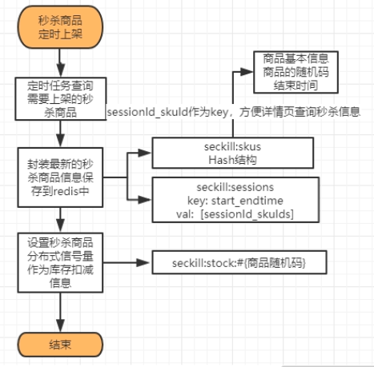
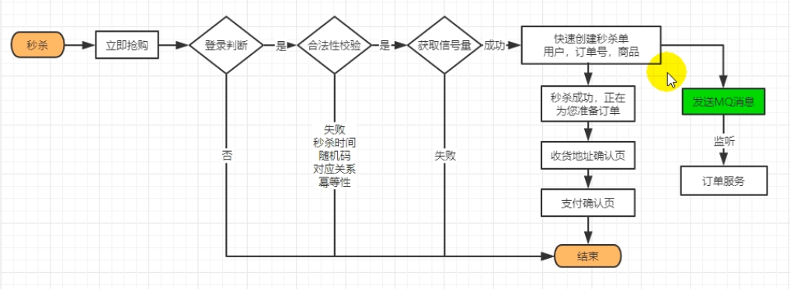
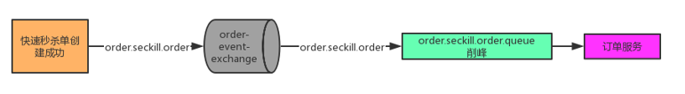

# 1、SpringBoot整合定时任务

1、**@EnableScheduling**

2、再想要定时任务的方法上写注解 `@Scheduled(cron = "0 0 3 * * ?")  //每天晚上凌晨三点执行`

3、Spring中不允许第7位的年的定时任务

4、Spring中周一到周日就是1到7

5、**定时任务不应该阻塞**，默认是阻塞的

- 可以让业务运行以异步的方式，自己提交到线程池

- 支持定时任务线程池，设置：

  ```properties
  spring.task.scheduling.pool.size=5
  ```

- 让定时任务异步执行：**@EnableAsync**，开启异步任务功能，并且通过**@Async**给希望异步执行的方法上标注，还可以自动配置类TaskExecutionAutoConfiguration属性绑定在TaskExecutionProperties

  ```properties
  spring.task.execution.pool.core-size=5
  spring.task.execution.pool.max-size=50
  ```

# 2、秒杀商品定时上架

一般来说，可以由定时任务自动设置每天晚上3点，上架最近三天需要秒杀的商品，不过这得处理一下重复上架问题。

定时任务还得注意一下分布式情况下要加锁，保证幂等性



如图所示，在秒杀商品上架的时候，可以将最新秒杀的上架商品数据缓存到redis中，并做好库存的预热扣减。然后还可以缓存活动关联的商品信息，能按照一个活动能查询出它的所有关联的商品。

同时不要忘记为每个场次的每个商品都设置一个自己的随机码，这个随机码的作用就是防止被攻击，只要秒杀一开放，如果不加随机值，那么立马请求发出去，肯定就第一个抢到。所以引入随机码的目的就是想要来参加秒杀，若不知道这个随机码，那么就算发送请求也没用，这个随机码只有在秒杀开启的那一刻才暴露出来。

还可以使用信号量来当作商品的秒杀上限数量。

# 3、秒杀系统设计

1. 服务单一职责+独立部署

   - 如果秒杀服务扛不住压力而挂掉，也不会影响到其余的服务正常执行

2. 秒杀链接加密

   - 可以通过令牌的方式给秒杀链接加密，也就是当秒杀时间到了的时候才会公布这个令牌，而且每次秒杀都必须携带这个令牌，可以防止商品未到秒杀的时间时候，恶意攻击通过秒杀链接来恶意请求从而秒杀到商品

3. 库存预热+快速扣减

   - 秒杀读多写少，无需每次实时校验库存，我们可以进行库存预热，将其放入redis中，并且通过redis的信号量控制来进行秒杀的请求，就不用每次频繁的访问数据库了

   - 设置信号量

     ```java
     //5.每一个商品都要设置分布式的信号量。也即使用库存作为分布式的信号量
     //信号量的一大作用也是：限流
     RSemaphore semaphore = redissonClient.getSemaphore(SKU_STOCK_SEMAPHORE + token);
     //商品可以秒杀的件数作为信号量
     semaphore.trySetPermits(seckillSkuVo.getSeckillCount());
     //商品有多少就放多少的信号量，只要真正一个秒杀流量进来就减去一个信号
     ```

   - 扣减信号量

     ```java
     //所以就使用分布式信号量来进行操作，能减成功就说明能秒杀成功
     RSemaphore semaphore = redissonClient.getSemaphore(SKU_STOCK_SEMAPHORE + randomCode);
     //从信号量中取出一个，但是我们要取几个，就要按照买的数量来
     //秒杀成功，进行快速下单，发送一个MQ消息
     boolean b = semaphore.tryAcquire(num);
     ```

4. 动静分离

   - nginx做好动静分离，保证秒杀和商品详情页的动态请求才能打到后端的服务集群
   - 使用CDN网络，分担本集群压力

5. 恶意请求拦截

   - 比如说未登录的，已经参与过秒杀的等等

6. 流量错峰

   - 使用各种手段，将流量分担到更大宽度的时间点，比如验证码或者加入购物车，这样可以导致每个人花费的时间不一样，就可以进行流量错峰

7. 限流&熔断&降级

   - 前端限流+后端限流
   - 限制次数，限制总量，快速失败降级运行，熔断隔离防止雪崩

8. 队列削峰

   - 一万个商品，每个1000件秒杀，双11所有秒杀成功的请求，进入消息队列，慢慢创建订单，扣减库存即可

# 4、秒杀流程



对于秒杀流程来说，可以通过各种手段来进行流量削峰。秒杀请求传给后端killId（场次id + 商品id）、购买数量、随机码

1. 先判断用户是否登陆，前端后端都需要验证一遍。

2. 根据killId在redis中判断是否有这个秒杀的商品，如果没有就不让秒杀

3. 还可以检验其合法性

   1. 当前时间是否在我们的秒杀区间内
   2. 前端传过来的随机码是否和redis中当前秒杀商品的随机码一致
   3. 当前用户是否已经秒杀过该商品了，如果秒杀过就在redis中记录一下，用来保证幂等性，
   4. 在秒杀商品上架的时候就已经往redis中根据我们的随机码设置了一个信号量了，只要正确进来一个请求，这个信号量数字就减去一个，所以使用分布式信号量来进行操作，能减成功就说明能秒杀成功。

4. 接着就可以将订单的一些信息当作消息发送给rabbitmq，

   

   然后将消息传给订单服务，在后台可以慢慢的进行后续的业务流程。

