## **0. 反问问题和自我介绍**

**反问问题：**

实习时间、实习生培养机制、部门技术栈

请问能不能谈谈你作为一个公司老员工对公司的感受？

我觉得我这次表现不是太好，你有什么建议或者评价给我吗？

接下来我会有一段时间的空档期，有什么值得注意的或者建议学习的吗？

未来如果我要加入这个团队，你对我的期望是什么？

## **1. 项目话术**

1、编写时间工具类的时候，使用的是SimpleDateFormat，但是多线程下，该类会出现问题，这就牵扯到使用threadlocal来进行更改。**详情看笔记JUC进阶版第九章相关内容**

2、热点商品点赞计算器，点赞数加加统计，不要求实时精确。**详情看笔记JUC进阶版8.5LongAdder相关内容**

3、问到项目的时候，可以说那个乐享小程序，用到了ThreadLocal的知识来结合JWT令牌和Spring拦截器获取当前用户的ID

4、字典树在项目中的应用：使用前缀树过滤黑白名单域名。

### 1.1 线程池的应用

在乐享平台中，对于进入活动详情页而言，我们需要查询一系列信息，包括：

- 当前活动的基本信息，比如活动开始时间、结束时间、活动名称、活动地点、官方群等等，
- 而且还需要根据活动的publisherId查询活动发布者相关的信息，比如发布者的头像、名称、所属机构
- 当前用户是否收藏该活动，有一个中间表，一个用户可以收藏多个活动，一个活动可以被多个用户收藏
- 当前用户是否报名该活动，同样遵循第三范式，有一个中间表
- 是否关注该活动发布者，
- 考虑到每个活动方都会有自己额外的一些信息，不包括在基本信息之内的信息，用一张action_info表来管理，action_id、title、content。

这些信息要去不同的表进行查询，而且相互之间关系不大，就可以试着使用线程池管理。

8核16G

| 压测前提                                                     |
| ------------------------------------------------------------ |
| 固定actionID，随机userId，单次执行大约900ms；100 * 10压测下，吞吐量7.7/sec，平均值 |
| 固定actionID，随机userId，单次执行大约300ms；100 * 10压测下，吞吐量6.6/sec，线程池 20、200 |
| 加了索引，单次执行26左右（没用线程池），20左右（用了线程池）；压测下， |
| 961\1006\1069                                                |

技术参考：[Java线程池实现原理及其在美团业务中的实践 - 美团技术团队 (meituan.com)](https://tech.meituan.com/2020/04/02/java-pooling-pratice-in-meituan.html)

**场景1】快速响应用户请求**

就比如用户要查看一个商品的信息，就需要将商品维度的一系列信息比如：从库存服务里面查找商品价格、库存服务里面查找商品库存、优惠券服务里面查找该商品所拥有的优惠券、商品服务里面查找商品的详细信息、SKU、SPU等等给聚合起来展示给用户。

从用户的体验来说，这个结果的响应越快越好。可以将各种服务的调用封装成任务异步并行的执行，最后再总的封装起来，这里就可以去使用**CompletableFuture + 线程池**的技术进行实现。**这种场景最重要的就是获取最大的响应速度去满足用户，所以应该不设置队列去缓冲并发任务（采用同步队列SynchronousQueue），调高corePoolSize和maxPoolSize去尽可能创造更多的线程快速执行任务。**

**场景2】快速处理批量任务**

。。。。使用有界队列去缓冲大批量的任务，但是队列容量必须声明，防止任务无限制堆积。

**问题1】如何确定线程池的参数？**

我们应该怎么去确定线程池中的参数呢？最大线程数和核心线程数的值应该是多少呢？实际上在真正的业务中是很难合理预估的，

- 一方面线程池的运行机制并不是很好理解，配置合理需要强依赖于开发人员的个人经验和知识；
- 另一方面，线程池执行的情况和任务类型相关性较大，IO密集型和CPU密集型的任务运行起来的情况差异很大；
- 再者还可能受到硬件环境如CPU、内存、硬盘读写速度、网络状况等影响，

这导致很难有一个简单有效的通用公式帮我们直接计算出结果。

注：**可以说通用化公式以8核16线程cpu的服务器为例，核心线程设置为8，线程最大数量：可以调整为服务器线程x2**

但是为了更好的使用线程池，我们也可以去实现动态线程池（核心线程数、最大线程数、队列长度），将线程池的参数通过nacos等配置中心去进行配置。然后可以去设计一个系统去监控我们的项目中所有的线程池，在线程池中的线程数量即将达到阈值或者出现了RejectedException的时候，去触发警告，然后将警告信息推送到该服务相关负责人。负责人根据实际情况去通过nacos进行相关配置，降低故障发生的概率。

**不过还是存疑，具体仍然不知道实战中如何去使用它，以及到底是否真正的需要这种动态化线程池仍是一种未知。**

**【更多的核心线程数和最大线程数的配置见笔记7.3】**

面试时候可以将这些参数的选择理念说一说，然后如果说到具体的数据时，就说可以根据CPU核数*（1+IO耗时/CPU耗时）来计算，但是其实还得考虑到具体的业务，和访问情况，需要不停的调整参数，考虑到这种因素，当时只是做了理论的实现

> **如果在线程池中的task中出现了没有捕获的异常会对当前线程有什么影响？对线程池有什么影响？** 

https://blog.csdn.net/weixin_37968613/article/details/108407774

### 1.2 Redis在项目中的应用

购物车、不常用数据缓存、实现销量排行功能的时候，在第一个版本中，使用到了MySQL进行实现，并对访问次数进行索引建立。这里可以提一下在后续优化中，使用Redis实现排行榜的功能。

- List：展示活动最新评论中，就可以通过List实现
- String：活动信息数据缓存、活动名额缓存，分布式锁解决缓存击穿问题

### 1.3 项目中的关于MySQL的优化

对商品的价格进行排序的时候，对商品价格建立了索引。同时当时是一次性将所有的数据都查出来了，然后进行优化，限制查询数据量。

### 1.4 消息队列在项目中的应用

在订单服务的时候使用到了RabbitMQ，并且对MQ可靠性做了一定的保障。

### 1.5 幂等性

幂等性的特点就是多次相同的操作产生的影响均与一次执行的影响相同。

**场景1】唯一性索引**

一个电话号码只能注册一个用户，对于这种场景，就可以给用户表中的电话号码添加唯一性索引，就可以保证不会出现多个用户共用一个电话号码的情况。

比较适用于插入操作

**场景2】乐观锁**

1. 先查出当前要更新的数据的version
2. update table set name = #xxx, version = version + 1 where version = #version

**场景3】token令牌机制**

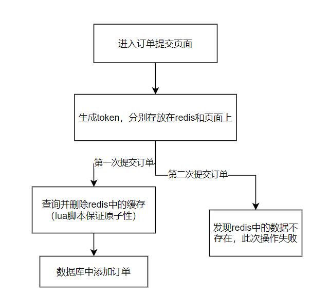

1. 如果redis在第一次请求的时候挂掉了，都没有redis了就不用考虑后续流程了。
2. 如果第一次请求删除缓存失败，就不会有操作数据库的行为
3. 如果第一次请求删除操作非常长，但是redis的这种操作是单线程的，完全不用考虑此时另外一个请求的查询。
4. 还有就是redis的确删除成功了，但是在返回的时候由于网络波动时间很长，然后在此期间另一个请求还是会发现redis中已经没有数据了，此次请求失败。

### 1.6 数据一致性

对于一致性要求高的业务，就可以采用**异步更新缓存**的方式去保证数据一致性：

- 写操作会先去删除缓存，然后去更新数据库，之后通过使用canal中间件订阅binlog来异步更新缓存。

- 读操作先判断缓存中有没有，如果没有就去查询数据库，但是不会去将数据添加进redis进行缓存。

- 比如此时线程A执行写操作，它先删除缓存，然后在更新数据库的时候由于网络波动等各种原因耗时较长；线程B执行读操作，它会发现缓存中没有数据了，就去数据库读，但是此时数据库还没有更新完成，就读取的是旧数据，然后将旧数据返回。此时数据库并没有更新成功，因此不算数据不一致，没有出现问题。

- 然后A执行更新数据库成功之后，此时缓存中的数据就是脏数据了，就得马上将其删除，就可以通过canal订阅binlog的方式，去异步的删除掉redis中的缓存。

也可以采用**延时双删**的方式，在更新完数据库之后，就可以sleep一段时间之后，再次去删除缓存，此时即使缓存中的数据是脏数据也会被删除。但是问题就是这个sleep的时间要根据具体的业务场景去设置，比较难以确定。而且要sleep一段时间，这会导致该更新方法的吞吐量下降。就可以采用**异步删除**的方式，将sleepM秒的操作和二次删除缓存的操作放到另一个线程里面，A线程在更新完数据库之后就直接结束。如果第二次删除缓存不成功，就可以采用重试的方式，直到删除成功。

而且对于StringRedisTemplate来说，使用delete操作会返回是否成功，如果失败了也可以选择抛出一个异常，然后对整个的更新方法进行一个事务回滚。更新操作都没了就不用谈数据不一致了。

对于我的商城项目来说，我缓存的是三级菜单，这种数据更新频率不高，而且对一致性要求并没有那么严格，因此出现短暂的数据不一致性是完全可以接受的。而且缓存并不是永久的，而是会有过期时间。

[缓存和数据库一致性问题，看这篇就够了 | Kaito's Blog (kaito-kidd.com)](http://kaito-kidd.com/2021/09/08/how-to-keep-cache-and-consistency-of-db/)

> **如何保证本地缓存和分布式缓存的一致性？**

比如Caffeine和Redis构成的二级缓存。

可以采用消息队列的方式：

1. 设置适当的过期时间，可以允许短暂的不一致，而达到最终一致性。
2. 引入消息队列，保证消息的可靠性，但是增加了系统的复杂度

### 1.7 jwt

> **为什么使用cookie会导致csrf攻击？**

> **为什么使用jwt能避免csrf攻击呢？** 

### 1.8 redis内存高利用

```java
@SpringBootTest
public class TestZsetFun {
    @Autowired
    private StringRedisTemplate redisTemplate;

    @Autowired
    private ActionService actionService;

    @Test
    public void init() {
        ZSetOperations<String, String> zSetOperations = redisTemplate.opsForZSet();
        ValueOperations<String, String> stringValueOperations = redisTemplate.opsForValue();
        for (int i = 1; i < 301; i++) {
            Action action = actionService.getById(i);
            stringValueOperations.set("actionInfo:" + i, JSON.toJSONString(action));
            zSetOperations.add("hot_actions", String.valueOf(i), 5);
        }
    }

    private double LFULogIncr(double score) {
        double r = Math.random();
        double baseval = score - 5;
        if (baseval < 0) baseval = 0;
        double p = 1.0/(baseval +1);
        if (r < p) score++;
        return score;
    }

    private double LFUDecrAndReturn(double score,Long idleTime) {
        Long idle_periods = (long)(idleTime / 15);
        if (idleTime > 0)
            score = (idle_periods > score) ? 0 : score - idle_periods;
        return score;
    }

    private long idleTime(String key) {
        long interval = 0;
        try {
            interval = (Long)redisTemplate.execute((RedisCallback<Long>) connection ->
                                                   connection.idletime(key.getBytes()).getSeconds());
        } catch (Exception e) {
            e.printStackTrace();
        }
        return interval;
    }

    public Action getActionFromRedis(Long actionId,double score) {
        ValueOperations<String, String> opsForValue = redisTemplate.opsForValue();
        ZSetOperations<String, String> opsForZSet = redisTemplate.opsForZSet();
        // 获取访问间隔
        long idleSeconds = idleTime("actionInfo:" + actionId);
        // 衰减分数
        score = LFUDecrAndReturn(score,idleSeconds);
        // 增长分数
        score = LFULogIncr(score);

        opsForZSet.add("hot_actions",String.valueOf(actionId),score);
        Action action = JSON.parseObject(opsForValue.get("actionInfo:" + actionId),Action.class);
        return action;
    }


    public Action getActionWithScoreAdapt(Long actionId) {
        ZSetOperations<String, String> opsForZSet = redisTemplate.opsForZSet();
        Double score = opsForZSet.score("hot_actions", actionId + "");

        if (score == null) {
            Action action = actionService.getById(actionId);
            return action;
        }

        return getActionFromRedis(actionId,score);
    }

    @Test
    public void test() {
        //        for (int i = 1; i < 1000; i++) {
        //            getActionWithScoreAdapt((long) (Math.random() * 300 + 1));
        //        }
        //        for (int i = 1; i < 30000; i++) {
        //            getActionWithScoreAdapt((long) (Math.random() * 150 + 1));
        //        }
        //        while (true) {
        //            getActionWithScoreAdapt(96L);
        //        }
        //        getActionWithScoreAdapt(124L);
        for (int i = 1; i <= 300; i++) {
            getActionWithScoreAdapt(Long.parseLong(String.valueOf(i)));
        }
    }
}

```


## **2. MySQL相关面试题**

### 2.1 最左匹配原则

以最左边的为起点任何连续的索引都能匹配上，同时遇到范围查询（> < between lilke）就会停止匹配。

比如我们创建了一个联合索引，idx_abc(a, b, c)。在组合索引中，最底层的叶子节点先按照a列从左到右递增排序，但是b列和c列是无序的，而b列只有在a列值相等的情况下，才会小范围内有序，同理，c列只有在a和b都相等的情况下，才会小范围内有序。

B+树会先比较a列，才能确定下一步到底是往左还是往右，如果查询条件没有a列，B+树就不知道应该从哪个节点查起。

### ⭐2.2 什么是ACID，分别用什么来保证他们

[Innodb中的事务隔离级别和锁的关系 - 美团技术团队 (meituan.com)](https://tech.meituan.com/2014/08/20/innodb-lock.html)

- **原子性**：事务是最基本的一个单位，一个事务要么全部完成，要么全部不完成，**MySQL使用undo log来解决**
- **一致性**：有了原子性、隔离性、持久性的保证之后，事务的一致性才能得到保证（执行事务前后，数据保持一致，比如转账业务中，无论事务是否执行成功，转账人和收款人的总额应该是不变的）
- **隔离性**：并发访问数据库时，一个用户的事务不被其它事务所干扰，各并发事务之间数据库是独立的。**使用锁机制、MVCC来保障**
- **持久性**：一个事务被提交之后，它对数据库中数据的更改是持久的，即使数据库发生故障也不应该对其有任何影响。**使用redo log来保障**

### ⭐2.3 一条慢sql怎么去优化

如果是问：**怎么处理MySQL的慢查询**，就可以多一句：

**开启慢查询日志，准确定位到哪个sql语句出现了问题。**

如果这条语句大部分情况下正常，偶尔很慢：

- 数据库在刷新脏页，比如redo log写满了需要同步到磁盘
- 执行的时候遇到锁

如果这条语句一直执行的缓慢：

1. 首先看这条sql有没有索引，如果有索引，就看该sql语句有没有索引失效；查看是否走全表扫描，如果索引区分度比较低可能造成全表扫描。
2. 看看是否是不恰当的sql语句，比如select *，或者在大数据表中使用< limit m，n>（比如找出10到20的记录，就可以写成`select xxx from t where id >= 10 limit 10`），以及对非索引字段进行排序。
3. 如果对语句的优化已经无法进行，可以考虑对表中的数据量是否过大，如果是的话就可以进行分库分表。

### ⭐2.4 MySQL如何避免死锁

MySQL中死锁产生的原因：MySQL默认是RR级别，且可以使用行锁。如果事务A给account表的id = 1这一行添加上了排它锁：`select * from account where id = 1 for update`，并且事务B给id = 2的行记录添加排它锁。再次之后，事务A想给id = 2的记录添加排它锁，事务B想给id = 1的记录添加排它锁，这就会造成mysql的死锁。

以上例子是为了理解，下面才是场景案例：

比如我们创建订单的时候需要做幂等性，就得先通过订单号查询该订单是否存在，如果不存在则新增订单记录。

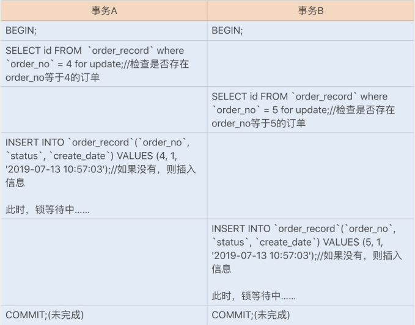

这是因为两个事务都加了排它锁，又因为order_no为非唯一索引，又是RR级别，所以select的加锁类型为gap lock，这里gap范围是4到正无穷。当我们想插入数据的时候，会在插入间隙上再次获取插入意向锁。它和gap lock是冲突的，需要等待其它事务释放gap lock之后，才能获取到插入意向锁。

解决办法：

1. **设置超时时间，当一个事务的等待时间超过设置的某个阈值，就对这个事务进行回滚**
2. 合理设计索引，尽量减少锁的范围
3. 尽量让数据表中的数据检索都通过索引来完成，避免无效索引导致行锁升级为表锁。
4. **将order_no设置为唯一索引，可以利用它的唯一性来保障订单记录不重复创建。**
5. **使用其它方式来代替数据库实现幂等性校验。**
6. 在允许幻读和不可重复读的情况下，尽量使用 RC 事务隔离级别，可以避免 gap lock 导 致的死锁问题；
7. 更新表时，尽量使用主键更新
8. 避免长事务，尽量将长事务拆解。

### ⭐2.4 说一下并发事务带来的问题：

- **脏读：**一个事务正在访问数据库并对数据进行了修改，而这个修改暂时没有提交到数据库中，此时另一个事务读取了这个数据，然后使用了这个数据。因为这个数据是未提交的数据，那么另一个事务读取到的就是脏数据。**简而言之，一个事务可以读取其它事务未提交的数据**
- **丢失修改：**一个事务读取一个数据，另一个事务也读取了该数据，那么在第一个事务修改了这个数据之后，第二个事务也修改了这个数据，那么第一个事务的修改就被丢失了。比如一个数据为20，第一个事务将其-1，第二个事务也是-1，最终该数据为19，丢失了一次修改。
- **不可重复读：**在一个事务中，第一次读取的数据和第二次读取的数据不一致。比如第一个事务读取了一个数据，此时第二个事务对这个数据进行了修改，并且提交。而此时第一个事务再次读取整个数据，就会发现两次读取的数据不一致。
- **幻读：**和不可重复读类似。第一个事务读取了数据之后，第二个事务进行了数据的insert，然后第一个事务再次读取，发现行数不一致，这就是幻读。

### ⭐2.5 说一下事务的隔离级别以及他们的原理

| 隔离级别 | 脏读  | 不可重复读 | 幻读  |
| ---- | --- | ----- | --- |
| 读未提交 | √   | √     | √   |
| 读已提交 | ×   | √     | √   |
| 可重复读 | ×   | ×     | √   |
| 串行化  | ×   | ×     | ×   |

1. **读未提交**：原理：直接读取数据，不能解决任何并发问题
2. **读已提交**：读操作不加锁，写操作加排他锁，解决了脏读。原理：利用MVCC实现，每一句语句执行前都会生成Read View（一致性视图）
3. **可重复读**：MVCC实现，只有事务开始时会创建Read View，之后事务里的其他查询都用这个Read View。解决了脏读、不可重复读，快照读（普通查询，读取历史数据）使用MVCC解决了幻读，当前读（读取最新提交数据）通过间隙锁解决幻读（lock in share mode、for update、update、detete、insert），间隙锁在可重复读下才生效。（**默认隔离级别**）
4. **可串行化**：原理：使用锁，读加共享锁，写加排他锁，串行执行

### 2.6 如何判断事务提交了？

InnoDB存储引擎对事务采用了WAL技术（write-ahead logging），这种技术的思想是先写日志，再写磁盘，只有日志写入成功，才算事务提交成功，这里的日志指的是redo日志

### 2.7 什么时候用表锁，什么时候用行锁

- 首先我们肯定绝大部分情况下都应该使用行锁，毕竟事务和行锁往往是我们之所以选择InnoDB存储引擎的原因。
- 事务需要更新大部分或者全部数据，表又比较大，如果使用默认的行锁，会导致该事务效率低，并且可能造成其它事务长时间等待和锁冲突，这时候可以使用表锁
- 事务涉及多个表，比较复杂，可能造成死锁导致大量事务回滚。这种情况也可以考虑一次性锁定事务涉及的表，从而避免死锁、减少数据库因事务回滚带来的开销。

### 2.8 count(*)、count(1)、count(列名)

**从执行结果来说**：

1. 前两者没有区别，他们都不会去过滤空值
2. count(列名)会过滤空值

**从执行效率来说**

1. 如果以列为主键，count（列名）优于count（1）
2. 如果表中存在主键，count（主键列名）效率最优
3. 如果表中只有一列，count（*）最优
4. 如果表有多列，且不存在主键，count（1）优于count（*）

所谓的count（1）其实就是计算一共有多少符合条件的行。1并不是表示第一个字段，而是表示一个固定值。

count（*）执行时会把星号翻译成字段的具体名字，效果也是一样，只不过多个一个翻译的动作，比固定值的方式效率稍微低一些。 

### 2.9 Memory存储引擎

Memory存储引擎将所有的数据都放在内存中，默认的索引结构是**哈希索引**，每个memory存储引擎的表实际上对应一个磁盘文件，**该文件只存储表的结构，而表的数据都存储在内存中。**

### ⭐2.10 redo log、bin log、undo log

#### 1. redo log

首先我们知道，mysql中的数据是以页为单位，查询的时候会将该记录所在的整个页数据都加载到Buffer Pool中。然后会将”在某个数据页做了什么修改“记录到**重做日志缓存（redo log buffer）**中，接着会刷盘到redo log文件里。

我们必须知道的是，InnoDB存储引擎会有**一个后台线程，每隔1秒，就会将redo log buffer中的内容写进文件系统缓存（page cache），然后调用`fsync`刷盘**。也就是说，一个没有提交事务的redo log记录，也会刷盘。

**除此之外，当redo log buffer占用的空间即将达到`innodb_log_buffer_size`一半的时候，后台线程会主动刷盘。**

但是除此之外，还有三种刷盘策略：

1. **每次事务提交时不进行刷盘策略**：如果MySQL挂了或者宕机了可能会有1秒的数据丢失
2. **每次事务提交时都将进行刷盘策略（默认）：**只要事务提交，redo log记录就一定在磁盘里，不会有任何数据丢失。如果事务执行期间MySQL挂了或者宕机了，这部分日志丢了，但是事务还没有提交，所以日志丢了也不会有任何损失。
3. **每次事务提交时都只把redo log buffer中的内容写到page cache：**如果仅仅只是MySQL挂了将不会有任何损失，但是宕机可能会有一秒钟数据的丢失。

#### 2. binlog

redolog是物理日志，记录内容是”某个数据页上做了什么修改“。而binlog是逻辑日志，记录的是语句的原始逻辑，属于MySQL Server层。不管什么引擎，只要发生了表数据更新，都会产生binlog日志

**binlog有两种格式：**

- **statement**：记录的内容是SQL语句原文，但是如果该SQL语句中包含了像`update_time=now()`之类的函数，就会导致与原库中的数据不一致。
- **row**：该格式记录的内容不再是简单的SQL语句了，还包含操作的具体数据，以该格式记录的内容看不到详细信息，需要通过`mysqlbinlog`工具解析出来。但是这种格式需要更大的容量来记录，比较占用空间，恢复与同步时会更加消耗IO资源，影响执行速度。
- **mixed**：前两者的混合，MySQL会判断这条SQL语句是否可能引起数据不一致，如果是就用row，否则使用statement。

**写入时机**

事务执行期间，会先把日志写进`binlog cache`中，事务提交的时候，再将binlog cache写到binlog文件中。


**write**只是将日志写入到文件系统的page cache，并没有持久化到磁盘上，所以速度比较快

**fsync**才是将数据持久化到磁盘的操作。

他们的时机可以通过参数**`sync_binlog`**来控制，默认是0；

- 为0表示每次提交事务只是执行write，由系统自行判断什么时候执行fsync
- 为1表示每次提交事务都会执行fsync，就如同redolog刷盘流程一样
- 为N（N>1），表示每次事务只执行write，但是积累N个事务之后再进行fsync

#### 3. 两阶段提交

redolog让数据库拥有了崩溃恢复的能力，binlog让数据库保证了集群架构的数据一致性。他们的侧重点不同；

而且redolog是在事务过程中不断写入，binlog只有在事务提交的时候才会写入。写入的时机不一样。

但是如果这两部分日志逻辑不一致，会发生问题。比如在写完redolog之后，写入binlog的时候发生了异常，导致binlog没有写成功。当MySQL重启恢复数据的时候，就会发现数据不一致。

解决办法，**两阶段提交：将redolog的提交拆分成两个部分，prepare和commit**。


如果binlog发生了异常导致没有写成功，MySQL根据redolog日志恢复数据的时候，发现redolog还处于prepare阶段，并且没有对应的binlog，就会回滚事务：


如果redolog设置commit阶段发生了异常呢？这就可以看下图的右边框框的流程图了，因为此时binlog肯定是写入成功了，能通过事务id找到binlog日志，所以MySQL认为是完成的，就会提交事务恢复数据。


#### 4. undo log

如果想要保证事务的原子性，就需要在异常发生的时候，对已经执行的操作进行回滚，而回滚是通过undolog来实现的，**所有的事务进行的修改会先记录到这个回滚日志中，然后再执行相关的操作。如果执行过程中遇到异常的话，我们直接利用回滚日志中的信息将数据回滚到修改之前的样子即可**。而且回滚日志先于数据持久化到磁盘中，这样就保证了即使遇到数据库突然宕机等情况，当用户再次启动数据库时，数据库还能通过查询回滚日志来回滚将之前未完成的事务。

### 2.10 唯一索引一定比普通索引快吗？

- 不一定
- 首先对于唯一索引的查询来说，因为知道是唯一了，在找到那条数据之后就会立即返回该数据，而普通索引还会继续匹配下一条数据，因此查询中唯一索引要比普通索引快，但是也是微乎其微的。因为查询的时候会以页为单位，将数据页加载进内存，不需要一条记录一条记录读取磁盘。
- 而对于更新来说，普通索引只需要将更新的数据放到changeBuffer就行了，而对于唯一索引来说，它必须去判断该数据的唯一性，还得将缓冲中的数据读入内存看有没有数据冲突。因此性能相对于普通索引来说比较慢。

**补充**：普通索引若数据再内存中直接内存中更新，否则会将更新操作先记录到change buffer中，等下一次查询将数据读到内存中再进行change buffer里相关更新操作后将数据返回，这样一来，再**写多读少的情况下就减少了磁盘IO**，若写完就马上查询，就大可不必用change buffer，不但没提高多少效率还造成维护change buffer额外消耗

### 2.11 索引下推？

[五分钟搞懂MySQL索引下推 - 掘金 (juejin.cn)](https://juejin.cn/post/7005794550862053412)

索引下推能够有效的利用联合索引减少回表的次数。

比如有一张user表，并且建了个联合索引（name、age）。执行下面的语句：

```mysql
select * from user where name = '张%' and age = 10;
# 如果查出来的记录如下：
id name age school
1    张三    10 长理
2    张四    11    长理
```

1、如果没有索引下推，那么存储引擎会先根据name索引找到id为1和2的记录，然后进行回表（两条记录两次回表），将id为1和2的完整的行记录查询出来交给server层，接着server层就会以age = 10进行筛选。

2、如果有索引下推，就会在查询到id为1的记录时判断它的age是否=10，符合条件；而查询id为2的时候，发现age不符合就直接给筛选掉了。这里就只需要回表id为1的行记录，只回表一次。

> 索引下推的目的是为了减少回表次数，也就是要减少IO操作。对于`InnoDB`的**聚簇索引**来说，数据和索引是在一起的，不存在回表这一说。

### 2.12 char和varchar的区别

1. char适用于对存取速度要求比较高或者占据空间一致的场景
2. **占据空间不同**：char的长度是不可变的（**固定为创建表时声明的长度，当char值被存储的时候，他们被空格填充到特定的长度，检索char值时也需要删除尾随空格。**），而varchar的长度是可变的
3. **存取速度不同**：char的存取速度比varchar要快，因为其长度固定，方便程序的存储和查找
4. **存储方式不同**：char是对英文字符占用1个字节，对汉字占用两个字节；而varchar的存储方式是对每个英文字符占用2个字符，汉字也是。

### 2.13 SQL注入原因？如何防止

- **原因：**开发过程中不注意规范书写sql语句对特殊字符进行过滤，导致客户端可以通过全局变量POST和GET提交一些sql语句正常执行。
- **防止措施：**
  1. 开启配置文件中的magic_quotes_gpc和magic_quotes_runtime设置
  2. 过滤掉关键词：select、update、insert
  3. 提高数据库和字段的命名技巧，对一些重要的字段根据程序的特点命名，不易被猜到。

### 2.14 MySQL一天五万条以上的数据增量，预计运维三年，怎么优化？

1. 设计良好的数据库结构，允许部分数据冗余，尽量避免join查询，提高效率
2. 选择合适的表字段数据类型和存储引擎，适当的添加索引
3. 主从读写分离
4. 进行分库分表，减少单表中的数据量
5. 添加缓存机制
6. 书写高效的SQL，比如只返回部分字段。

### 2.15 表a是主键、b是普通索引、c没有索引，select a,b,c from table where b =x 会用到索引吗？

正常情况下，mysql根据普通索引b来查询到对应的主键，然后会回表去找到该主键对应的记录。

但是当数据库b列相同的列到达一定的量之后，会发现mysql根本没有用到索引，而是会全表扫描。我估计是mysql的查询优化器会进行权衡判断这种情况要不要用索引。（可能是mysql觉得这个时候回表再查已经无意义，毕竟b的区分度已经不高了。

### 2.16 为什么不建议使用外键约束

使用外键约束可以保证数据的完整性和一致性；级联操作方便；将数据的完整性判断托付给了数据库完成，减少程序代码量。

1. **性能问题：**如果有一张表table里面有两个外键，每次向table插入数据的时候都得看那两个外键对应的表中有没有相应的数据，增加了查询过程。
2. **并发问题：**在每次修改数据都需要到另外一个表检查数据，需要获取额外的锁。更容易造成死锁。
3. **扩展性问题：**在水平拆分和分库的情况下，外键是无法生效的。

### 2.17 讲一下索引失效？

**根本原因：**

- 全局扫描的效率高于建立索引
- 索引涉及强制的类型转换
- 索引上做相关的运算操作

**具体表现：**

1. 组合索引未使用最左前缀
2. like未使用最左前缀，`where A like '%China'`
3. 搜索一个索引而在另一个索引上使用order by，`where A = a order by B`，只是用A上的索引，因为查询只使用一个索引。
4. or语句前后没有同时使用索引会使索引失效。`where A = a1 or A = a2（生效）、where A = a1 or B = b1（失效）`
5. 如果列类型是字符串，要使用引号。（否则会进行类型转换）
6. where中索引列有运算，或者索引列使用了函数
7. where中在索引字段上使用not、<>、!=（不等于操作符是永远不会用到索引的，因为对它的处理只会产生全表扫描，优化方法：key<>0改为key>0 or key < 0）
8. 在索引列上使用IS NULL 或 IS NOT NULL：索引是不索引空值的，所有这样的操作不能使用索引，可以将NULL值变成数字类型，或给字符串类型设置一个默认值，判断是否等于默认值即可。

**没必要使用到索引的场景**

1. 唯一性差
2. 频繁更新的字段不用
3. where中不用的索引
4. 索引使用<>时，效果一般

### 2.18 分库分表

1、**RANGE（水平分表）**

可以指定一个数据范围来表示分表，比如每百万条数据放到一个表中，但是这个得用redis或者其余的工具来维护表的ID。

2、**HASH取模**

根据用户的ID进行hash取模的方式，将数据放到不同的表中，但是如果要对MySQL服务器进行扩容，在数据迁移的时候就很麻烦，还得重新去计算hash值。**这时候就可以使用一致性哈希**

3、**垂直分表**

将经常用的数据独立出来成为一张新的表。

> 分库分表的缺点

**事务问题**：只能使用分布式事务，而无法使用本地事务

**跨节点join问题**：可以分为两次查询解决这个问题

**ID问题**：无法使用数据库提供的主键自增，最简单的可以考虑UUID

**排序分页问题**

**跨节点的count、order by、group by**：可以从各个节点上得到结果之后，在应用层进行合并

### 2.19 MySQL脏页刷盘

首先对于MySQL来说，如果想要更新数据，都是会查询到指定的记录所在的数据页，然后将整个数据页都加载出来到BufferPool中。然后它在BufferPool中进行更新。这时候就会导致内存数据页和磁盘数据页的不一致，这种不一致的内存数据页就被称为脏页。等到该脏页写入到磁盘之后，数据一致性就得到了解决。

但是试想一下， 如果每更新一条记录就对该页进行一次刷盘，无疑是非常消耗性能的；如果到达一个阈值之后才进行一次刷盘，数据库突然宕机之后，这些数据都会被丢失。**因此就可以引入redolog进行记录**，将每个记录在哪个页做了什么修改进行记录。

虽然redolog的内存缓冲区中的日志写入日志文件中也需要进行磁盘IO，但是这个过程是顺序IO的，在磁盘文件的尾部追加即可。而IO刷盘是随机存储的（需要寻找刷新的磁盘位置）。所以redolog写入磁盘的速度远远快于数据的刷盘。

**刷脏页情景**：

- **redo log写满了**：停止所有更新操作，推动checkpoint向前移动，推进那部分日志的脏页更新到磁盘中

- **系统内存不够用**：将一部分数据页进行淘汰，如果是干净页就直接淘汰，如果是脏数据页就全部同步到磁盘。
  
  MySQL采用缓冲池来管理内存，当要读取的数据页没有在内存中的时候，就会从缓冲池中申请一个数据页，如果此时缓冲池满了，就必须得按照LRU算法将最近最少使用的数据页从内存中淘汰。如果淘汰的是一个干净页，直接释放然后复用。如果淘汰的是一个脏页，就必须得先将脏页刷到磁盘里面。

- MySQL自认为空闲时，也会试着去找机会刷新脏页。

- MySQL正常关闭之前，会将所有的脏页都flush到磁盘上

如果一个查询要淘汰的脏页个数太多就会导致查询的响应时间变长。而日志写满，更新全部堵住，也是无法接受的。 

> InnoDB刷脏页的控制策略

我们首先使用innodb_io_capacity参数设置InnoDB所在机器的磁盘能力，该值越高代表机器磁盘能力越强，假设设置的过低，那么innoDB就会认为这个机器的性能就这么差，导致刷脏页的速度比生成脏页的速度还慢，就造成脏页积累。

但是磁盘能力不只是用来刷新脏页，还得服务用户请求。因此设置的值也无法全力去用来刷新脏页，还得需要一个R%来控制磁盘能力中用来刷脏页的能力。

什么时候需要控制刷盘的速度？一种是内存中的脏页太多，一种是redo log写满。

InnoDB会根据innodb_max_dirty_pages_pct（脏页比例上限，默认75%）计算出一个0-100之间的数字

```c
F1(M) {
    if M >= innodb_max_dirty_pages_pct then
        return 100;
    return 100 * M/innodb_max_dirty_pages_pct;
}
// M表示当前的脏页比例
```

然后也会根据当前写入redo log的序号跟checkpoint对应的序号之间的差值计算出另一个0-100之间的数字，差值越大，计算出来的数字也就越大。 

最后就根据计算得到的两个值，取其中较大的值记为R，然后存储引擎就可以按照innodb_io_capacity定义的能力和百分之R相乘，这就是控制刷脏页的速度。

```
能力：innodb_io_capacity * max(脏页比例M，当前写入的redolog序列号差值N) / 100
```

> InnoDB中的“连坐”策略

一个查询请求执行过程中，如果需要先flush一个脏页的话，可能导致这个查询要比平时慢。

同时，在准备刷新一个脏页的时候，如果这个数据页旁边的数据页刚好是脏页，也会将它一起刷掉，依次递归。在innodb中，使用innodb_flush_neighbors参数来控制这个行为，1表示有连坐机制。注意的是，在MySQL8的时候，就将默认值改为0了，也就是只刷自己。因为在以前使用机械硬盘的时候，这个可以减少很多随机IO从而提升性能。而现在的SSD这种硬盘，效率较高，所以重点只关注自己，可以更快的执行完必要的刷盘操作，从而提升查询语句的响应时间。

### 2.20 RR下MVCC不能完全解决幻读

对于快照读来说，在InnoDB的RR模式下，依靠与MVCC的确可以解决幻读。但是它**并没有解决更新操作后的幻读**。

比如一开始t表中只有一条记录A，事务2在第一次读取的时候发现表中只有记录A，然后会生成一个ReadView，接着事务1向其添加了记录B，事务2在第二次查看的时候，发现表中仍然只有记录A，这就解决了快照读下的幻读问题。可是如果此时事务2对记录B进行update操作，然后第三次查询，发现表中多了条记录B，这就没有解决幻读问题。

### 2.21 讲一讲索引设计原则

**适合创建索引的情况：**

1. 字段的数值拥有唯一性的限制，比如学号、身份证号码
2. 频繁作为where查询条件的字段
3. 频繁作为group by和order by的列。
4. update、delete的where列。
5. distinct字段需要创建索引
6. 多表连接的连接条件
7. 使用字符串前缀创建索引。
8. 尽量创建联合索引

**不适合创建索引的情况**

1. where中使用不到的字段。
2. 数据量小的情况
3. 大量重复数据的字段
4. 经常更新的字段
5. 不建议使用无序的值作为索引
6. 删除不再使用或者很少使用的索引
7. 不要定义冗余或重复的索引。

### 2.22 什么是页分裂

按照正常的流程来说，我们一般都会使用默认的自增主键，但是如果使用UUID作为主键就可能会造成页分裂。因为在InnoDB索引的设定中，要求主键索引是递增的，这样构建索引树的时候才方便，因为得保证下一个数据页中的所有行一定要比前一个数据页中的行的主键id要大。而UUID则是无序的，就可能导致页分裂，从而调整成为有序的。

**页分裂的目的就是保证：后一个数据页中的所有行主键值比前一个数据页中主键值大。**

- 页分裂会导致申请新的数据页，然后挪动部分数据过去，这个过程会损耗性能。
- 除此之外，原本放在一个页中的数据，可能会被分到两个数据页中，影响数据页的利用率。
- 当相邻两个页由于删除了数据等，导致利用率很低之后，也会将数据页进行合并，合并的时候同样也会造成性能损耗

### 2.23 MySQL常见异常

- Access denied for user 'root'@'localhost' (using password: YES)。

无权限，密码错误

- MySQL5.7 group by 新特性报错

ONLY_FULL_GROUP_BY规定SELECT中的列必须在GROUP BY中。

- 高版本的驱动类包出错。

MySQL8.0使用的是com.mysql.cj.jdbc.Driver，而之前的是com.mysql.jdbc.Driver

### 2.24 三大范式？

第一范式：字段具有原子性，不可再分，字段单一原则

第二范式：在满足第一范式的前提下，每行应该被唯一区分，而且还得有主键（都要依赖主键）

第三范式：在满足前两个范式的前提下，一个表不能包含其他表已存在的非主键信息

优点：重复冗余数据少，更新快，修改少，去重少

缺点：由于无法存在冗余重复数据，可能造成查询的时候需要额外关联导致效率变低，而且可能导致一些索引策略失效。比如我要查询a表的e字段和b表的f字段，但是遵循第三范式，就无法建立联合索引ef。

### 2.25 MyISAM和Innodb

- Innodb支持ACID事务，支持四种隔离级别
- Innodb支持行锁以及外键约束
- select count(*)效率：Innodb不存储总行数，MyISAM存储
- Innodb主键采用聚簇索引，MyISAM采用非聚簇索引，索引文件的数据域指向数据文件的指针。

### 2.26 自增主键的理解

InnoDB的自增值实际上是**保存在内存中，到MySQL8.0的时候才有了自增值持久化的能力**

如果发生了重启：在MySQL5.7以及之前的版本，自增值会保存在内存中，并没有持久化。每次重启之后，第一次打开表的时候，都会去找自增值的最大值max(id)，然后将最大值 + 1的值作为这个表当前的自增值。

也就是说，如果一个表当前数据行里面最大的id是10，则自增值为11，然后我们删除id为10的记录，然后重启实例，之后这个表的自增值就变成了10。

**而在MySQL8.0版本，将自增值的变更记录在了redo log中，重启的时候依靠redo log恢复重启之前的值。**

> 为什么自增主键不连续

- MySQL5.7以及之前的版本，自增保存在内存中，没有持久化机制
- **事务回滚**：自增值无法回滚，因为并发插入数据的时候，回滚自增ID可能造成主键冲突
- **唯一键冲突**：假如执行SQL的时候表中的id = 10，此时内存中的自增值为11，插入的时候发生了唯一键冲突写库失败（比如如果name字段建立了唯一索引，并且id为10的记录和之前的记录的name值发生冲突），则表中就没有id为10的记录，下一次插入的时候id就从11开始了。**自增值的修改发生在真正执行插入数据的操作之前**
- **批量写库操作**：对于批量插入数据的语句，MySQL第一次会申请一个自增id，第二次会申请两个，每次都申请之前的两倍。如果此时插入4条记录，第一次申请一个，第二次申请两个，第三次申请四个， 但是我们只有四条记录，就会有三个自增id浪费掉。

> 为什么主键推荐使用自增ID

自增ID有序，会按照顺序往最后插入，减少了页分裂和内存碎片的产生，减少大量随机IO。

新插入的行一定会在原有的最大数据行下一行，MySQL定位和寻址很快，不会为计算新行的位置而做出额外的开销。

### 2.27 MySQL行转列

```mysql
mysql> SELECT * FROM t_gaokao_score;
+----+--------------+--------------+-------+
| id | student_name | subject      | score |
+----+--------------+--------------+-------+
|  1 | 林磊儿       | 语文         |   148 |
|  2 | 林磊儿       | 数学         |   150 |
|  3 | 林磊儿       | 英语         |   147 |
|  4 | 乔英子       | 语文         |   121 |
|  5 | 乔英子       | 数学         |   106 |
|  6 | 乔英子       | 英语         |   146 |
|  7 | 方一凡       | 语文         |    70 |
|  8 | 方一凡       | 数学         |    90 |
|  9 | 方一凡       | 英语         |    59 |
| 10 | 方一凡       | 特长加分      |   200 |
| 11 | 陈哈哈       | 语文         |   109 |
| 12 | 陈哈哈       | 数学         |    92 |
| 13 | 陈哈哈       | 英语         |    80 |
+----+--------------+--------------+-------+
13 rows in set (0.00 sec)

+--------------+--------+--------+--------+--------------+
| student_name | 语文   | 数学   | 英语   | 特长加分     |
+--------------+--------+--------+--------+--------------+
| 林磊儿       |    148 |    150 |    147 |            0 |
| 乔英子       |    121 |    106 |    146 |            0 |
| 方一凡       |     70 |     90 |     59 |          200 |
| 陈哈哈       |    109 |     92 |     80 |            0 |
+--------------+--------+--------+--------+--------------+
4 rows in set (0.00 sec)
```

**使用case..when..then**

```mysql
SELECT student_name,
    SUM(CASE subject WHEN 语文 THEN score ELSE 0 END) as 语文,
    SUM(CASE subject WHEN 数学 THEN score ELSE 0 END) as 数学,
    SUM(CASE subject WHEN 英语 THEN score ELSE 0 END) as 英语,
    SUM(CASE subject WHEN 特长加分 THEN score ELSE 0 END) as 特长加分
FROM t_table
GROUP BY student_name
```

**使用IF**

```mysql
SELECT student_name,
    SUM(IF(`subject`='语文',score,0)) as '语文',
    SUM(IF(`subject`='数学',score,0)) as '数学',
    SUM(IF(`subject`='英语',score,0)) as '英语',
    SUM(IF(`subject`='特长加分',score,0)) as '特长加分' 
FROM t_gaokao_score 
GROUP BY student_name;
```

## **3. Redis相关面试题**

### 3.1 布隆过滤器

是一种数据结构，用来告诉**某样东西一定不存在或可能存在**

通常判断某个元素是否存在可以使用hashMap，但是HashMap的存储容量比较高，而且如果数据集比较大，也不太可能能一次性全部加载到内存当中。

布隆过滤器是一个bit向量或者说bit数组。**如果我们要映射一个值到布隆过滤器中，需要使用多个不同的哈希函数生成多个哈希值，然后对每个哈希值指向的bit设置为1**

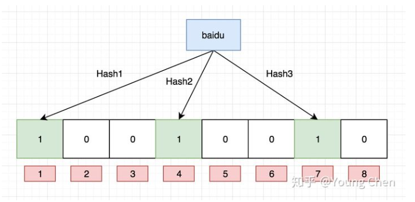

**实战场景：**

某些存储系统的设计中，会存在空查询缺陷：当查询一个不存在的key时，需要访问慢设备，导致效率低下。比如一个前端页面的缓存系统，可能这样设计：先查询某个页面在本地是否存在，如果存在就直接返回，如果不存在，就从后端获取。但是当频繁从缓存系统查询一个页面时，缓存系统将会频繁请求后端，把压力导入后端。

这是只要增加一个bloom算法的服务，后端插入一个key时，在这个服务中设置一次。需要查询后端时，先判断key在后端是否存在，这样就能避免后端的压力。

### 3.2 Redis跳跃表

[Redis数据结构——跳跃表 - Mr于 - 博客园 (cnblogs.com)](https://www.cnblogs.com/hunternet/p/11248192.html)

如果一个有序集合（zset）包含的**元素数量比较多**或者**成员是比较长的字符串**时，redis就会使用跳跃表来作为有序集合键的底层实现。

为什么要元素数量比较多或者成员比较长的字符串呢？首先跳跃表这个结构是以空间换时间，来让链表快速的获取到指定的元素。当数量比较多时，或者成员变量是比较长的字符串时，跳表带来的空间消耗就相对而言非常少了，其优势必然会放大。


Redis的跳跃表由zskiplistNode和skiplist两个结构定义，其中上图蓝色的部分就是skiplist，右边的四个部分就是zskiplistNode结构。

### 3.3 AOF文件过大怎么办

[(34条消息) 面试真题：AOF文件越来越大怎么办？_Z-AI-CSDN博客_aof文件过大怎么处理?](https://blog.csdn.net/qq_19595957/article/details/122122367)

1. AOF重写，Redis在AOF文件过大时会对命令进行合并重写。
2. redis考虑到像集合这种元素过多的时候不是一个命令能写完的，而是也会分多个命令写入。因为写入太多可能导致缓冲区溢出（先写缓冲区再写入AOF文件中）
3. 如果是大量写入的话，线程会被长时间阻塞，redis是单线程的，解决办法就是将重写放到**子进程**中，父进程可以继续处理命令请求，子进程带有父进程的数据副本，使用子进程而不是线程是因为可以避免使用锁，保证数据安全性
4. 但是可能会导致子进程和父进程数据不一致，比如在写入原来的数据时，父进程又处理了新的命令。解决办法是提供一个aof重写缓冲区，创建子进程开始，redis执行完写命令后会将命令发送到AOF缓冲区和AOF重写缓冲区，当子进程完成AOF重写工作后，子进程向父进程发送一个信号，父进程将AOF重写缓冲区的内容写入到新AOF文件中。

### ⭐3.4 缓存一致性解决办法？

https://blog.csdn.net/qq_42253147/article/details/94447103

要是问到为什么简历上写的是双写一致性，我就说当时做项目的时候是这么考虑的，然后随着后续的学习，发现这样子对性能有影响，就对项目进行了改造，采用延时双删。

如果是**先写数据库再更新缓存**，首先会有数据不一致问题，比如A线程写了数据库，然后由于网络等原因，没来得及更新缓存。此时B线程进行更新了数据库，然后将缓存写到了redis，这时候线程A又开始写缓存了，就会导致线程B的缓存更新无效。同时如果数据库一小时更新了很多次，就会导致缓存也更新很多次。然后这个缓存可能一个小时内只会被读取一次，那么额外更新的缓存数就完全没有必要。**因此缓存应该是被删除而不是被更新**

因此采用的策略是**先删除缓存，再更新数据库**，解决方案是**延迟双删**

问题产生：先删除缓存，此时数据库还没有更新成功，如果另一个线程来读取缓存，发现缓存为空，就会去数据库读取新的值，但是此时数据库还未更新成功，因此读到的就是旧值，缓存不一致发生。

解决办法：为了避免在更新数据库的时候，其它线程从缓存中读取不到数据，就在更新完成之后sleep一段时间，然后再次删除缓存。同时sleep的时间要对业务读写缓存的时间做出评估，sleep时间大于读写缓存的时间即可。

1. 线程1删除缓存，然后去更新数据库
2. 线程2来读缓存，发现缓存已经被删除，所以直接从数据库中读取，这时候由于线程1还没有更新完成，所以读到的是旧值，然后把旧值写入缓存
3. 线程1，根据估算的时间，sleep，由于sleep的时间大于线程2读数据+写缓存的时间，所以缓存被再次删除
4. 如果还有其他线程来读取缓存的话，就会再次从数据库中读取到最新值

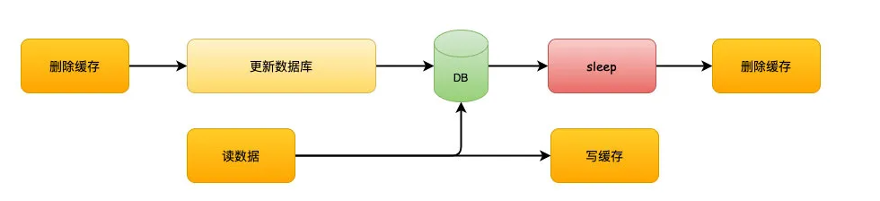

### 3.5 说一下redis中的事务

首先在redis中，每一条命令都是原子性的。而对于redis的事务而言，它其实并不能保证原子性，你可以将它看成是一个打包的批量执行脚本，如果中间某条指令执行失败了，并不会导致前面已经执行完了的指令回滚，也不会导致后续未执行的指令不执行。

redis的事务提供了一种将多个命令打包，然后一次性、有序地执行的机制。多个命令会被人入队到事务队列中，然后按照FIFO的顺序执行。

### 3.6 数据倾斜？

[Redis如何避免数据倾斜问题？-云社区-华为云 (huaweicloud.com)](https://bbs.huaweicloud.com/blogs/194535)

简单的来说，数据倾斜就是我们在计算数据的时候，数据不够分散，大量的数据集中到了一台或几台机器节点上，就导致这些节点负载过大，而其余的节点确是空闲等待中的，最终导致整体效率低下。

比如一些big key的存在，数据量比较大，在业务上举例：论坛中的大型持久盖楼活动；聊天室系统中的热门聊天室的消息列表。

big key解决办法：如果big key是个大JSON，通过mset，将该key的存储内容分散到各个实例中。如果是个大list，就将list进行拆分。

### 3.10 redis中有一亿条数据，其中10w个以某个固定的已知前缀开头，找到这些数据？

可以使用keys命令配合通配符找到这些keys，但是使用keys的话会导致redis阻塞一段时间，直到指令执行完毕。这个时候可以使用scan指令，它可以无阻塞的提取出指定模式的key列表，但是会有一定的重复概率，在客户端去一次重就好了，但是整体所花费的时间会比keys指令长。

## **4. JVM相关面试题**

### 4.1 说一下垃圾回收器的三色标记

[面试官:你说你熟悉jvm?那你讲一下并发的可达性分析 - 掘金 (juejin.cn)](https://juejin.cn/post/6844904070788939790)

所谓的三色标记其实就是白色、黑色、灰色

- 白色：表示对象尚未被垃圾回收器访问过
- 黑色：表示对象已经被垃圾回收器访问过，而且这个对象所有的直接引用都已经扫描过
- 灰色：表示对象已经被垃圾回收器访问过，但是这个对象至少有一个引用还没有被扫描过。

由于垃圾回收器和用户线程是并发工作的，再加上被标记为黑色的对象就一定不会再次被扫描。因此并发标记就会产生两个问题：对象消亡和浮动垃圾

**对象消亡：**把原本存活的对象错误的标记为已消亡

1. 存在对象关系，A指向B，B指向C，但是A不指向C。
2. 将A标记后，并开始标记B
3. 刚开始标记对象B，但是还没开始标记对象B的下一个对象C，此时A是黑色，B是灰色，C是白色。如果此时将引用关系改为A指向了C，并且断开了B和C的联系，根据三色标记原则，对象C是白色的，就会被错误的当成垃圾进行回收。

总的来说，**对象消亡需要两个条件**

1. 赋值器插入了一条或多条从黑色对象指向白色对象的新引用
2. 赋值器删除了全部从灰色对象到白色对象的直接或间接引用。

**有两种方式解决，增量更新和原始快照**

- 增量更新：用的是写后屏障，记录了所有新增的引用关系。当黑色对象插入新的指向白色对象的引用之后，就会将这个新插入的引用记录下来，等并发扫描结束之后，再将这些记录过的引用关系的黑色对象为根，再次扫描一遍。
- 原始快照：当灰色对象要删除指向白色对象的引用关系时，就会将这个要删除的引用记录下来，在并发扫描结束之后，再将这些记录过的引用关系中的灰色对象为根，重新扫描一次。也就是无论引用关系删除与否，都会按照刚刚开始扫描的那一刻的对象图快照进行搜索。

**CMS基于增量更新，G1基于原始快照**

### 4.2 说一下类卸载，或者说怎么判断无用类

- 该类的所有的实例都已经被回收，即堆空间中不存在任何该类以及它的派生子类的实例。
- 该类的类加载器已经被回收
- 该类所对应的Class对象没有在任何地方被引用，无法在任何地方通过反射访问该类。

### 4.3 新生代中的survival满了怎么办？

首先得看是否发生了内存泄漏，可以使用JVisualVM来判断。

- 首先看服务器的内存是否足够，如果足够，建议直接增大新生代空间。
- 如果内存不够的话，就可以压缩Eden区，但是Eden区的减少会增加MinorGC的次数，可以根据系统对延迟和吞吐量的指标来看是否符合。
- 如果调整了之后内存还是不够用，可以试着去增加服务器的内存，或者把负担分担到多个JVM实例上。

### 4.4 tomcat如何打破双亲委派机制的？

**双亲委派机制的优点：**

1. 保证了Java程序的稳定运行
2. 可以避免类的重复加载
3. 保证了Java核心API不被篡改。

[1.5 tomcat是如何打破双亲委派机制的? - 盛开的太阳 - 博客园 (cnblogs.com)](https://www.cnblogs.com/ITPower/p/13217145.html)

我们都知道，一个tomcat可以加载多个不同的应用程序，比如可以同时加载spring5和spring4两种应用程序。而在spring4和spring5中，有很多类类名相同，但是他们的实现不一样。如果没有打破双亲委派机制，就只能加载一份，也就无法同时加载多个不同的应用程序了。

在tomcat中，每一个项目打包成war包的时候，tomcat都会自动生成一个类加载器，专门用来加载这个war包，而这个类加载器就打破了双亲委派机制。webapp类加载器就不需要再让上级去加载，它自己就可以加载对应war包里面的class文件了。

**双亲委派机制时ClassLoader类中的loadClass方法来实现的，重写该方法用来打破双亲委派机制**

### 4.5 FullGC效果不好，每次只能从90-85-90，该怎么办

（如果是一次fullgc后，剩余对象不多。那么说明你eden区设置太小，导致短生命周期的对象进入了old区。如果一次fullgc后，old区回收率不大，那么说明old区太小。）

### 4.6 内存分配策略

- 新对象优先在Eden中分配

- 大对象直接进入老年代

- 长期存活的对象进入老年代，默认是15

- 动态对象年龄判定：如果survivor中相同年龄所有对象大小的总和大于s空间的一半，则年龄大于或等于该年龄的对象可以直接进入老年代，无需等到15岁（HotSpot虚拟机遍历所有对象时，按照年龄从小到大对其所占有的空间进行累积，当累积的某个年龄大小超过了s区中的一半时，取出这个年龄和MaxTenuringThreshold中更小的一个值，作为新的晋升年龄阈值）
  
  ```c
  uint ageTable::compute_tenuring_threshold(size_t survivor_capacity) {
      //survivor_capacity是survivor空间的大小
      size_t desired_survivor_size = (size_t)((((double)survivor_capacity)*TargetSurvivorRatio)/100);
      size_t total = 0;
      uint age = 1;
      while (age < table_size) {
          //sizes数组是每个年龄段对象大小
          total += sizes[age];
          if (total > desired_survivor_size) {
              break;
          }
          age++;
      }
      uint result = age < MaxTenuringThreshold ? age : MaxTenuringThreshold;
      ...
  }
  ```

- 空间分配担保：在执行MinorGC之前，JVM会先检查老年代的最大可连续空间是否大于新生代所有对象的总空间，如果大于，则认为这次GC是安全的；如果不大于，就看HandlePromotionFailure的值是否允许担保失败，如果允许那么就会继续检查老年代最大可用的连续空间是否大于历次晋升到老年代对象的平均大小，如果大于就尝试进行一次MinorGC；如果小于，或者不允许担保，就要进行FullGC；**在JDK6 Update24之后，规则变为只要老年代的最大连续可用空间大于新生代对象总大小或者历次晋升的平均大小就会进行MinorGC，否则将进行FullGC。**

### 4.7 CPU占用过高的问题以及定位

[(34条消息) CPU占用过高的问题如何定位_weixin_32822759的博客-CSDN博客](https://blog.csdn.net/weixin_32822759/article/details/108170281)

1. 首先使用top命令查看正在执行进程的CPU使用率，内存使用率以及系统负载等信息。可以看到哪个进程id的进程cpu使用率最高，比如7139
2. 接下来就可以使用`top -p 7139 -H`，单独监视该进程下的所有线程信息，找到是哪个线程占用cpu最高。
3. 使用`jstack 指定线程id > xxx.txt`将线程的所有信息做dump记录。
4. 或者使用`jstat`相关命令
5. 或者使用`jmap`相关命令，或者使用`jvisualvm`可视化来看哪些对象用的最多，或者查看GC频率等

或者如果是业务线程CPU占用高，就检查代码，CPU狂算或者死循环；如果是GC线程，频繁FGC，读日志。如果每次回收不掉，内存泄漏

### 4.8 JVM如何对指令重排序，排序的依据?

[(34条消息) Java JVM（十二）：指令重排序_Sauron1的博客-CSDN博客_指令重排序](https://blog.csdn.net/pzxwhc/article/details/48984209)

**数据依赖性**：如果两个操作访问同一个变量，且这两个操作中有一个写操作，此时这两个操作之间就存在数据依赖性。

| 名称  | 示例代码          | 说明             |
| --- | ------------- | -------------- |
| 写后读 | a = 1;  b = a | 写一个变量之后，再读这个变量 |
| 写后写 | a = 1;  a = 2 | 写一个变量之后，再写这个变量 |
| 读后写 | a = b; b = 1  | 读一个变量之后，再写这个变量 |

**在单线程环境中，JVM指令重排序会保证最终执行结果和代码顺序结果一致。并且处理器在执行重排序的过程中会考虑数据依赖性（如果不存在数据依赖性，编译器和处理器可能会对操作进行重排序）。但是多线程环境中，并不会保证。**

也就是说，as-if-serial语义：**不管怎么重排序，单线程下程序的执行结果不能被改变**

除了考虑数据依赖性以外，**还得考虑happens-before**

两个操作之间存在先行发生原则，并不意味着一定要按照该原则制定的顺序来执行。如果重排序之后的执行结果与按照先行发生原则来执行的结果一致，那么这种重排序并不非法。

### 4.9 了解堆内内存和堆外内存吗？

**堆内内存：**

1. 堆内内存 = 新生代 + 老年代 + 永久代

**堆外内存：**

1. 堆外内存就是把内存对象分配在Java虚拟机的堆以外的内存。
2. 使用`java.nio.DirectByteBuffer`对象进行堆外内存的管理和使用，该类会在创建对象时就分配堆外内存。
3. 元空间就是使用的堆外内存。
4. 对堆外内存的申请主要是通过成员变量`unsafe`来操作
5. **优点**：
   - 减少了垃圾回收机制
   - 加快了复制的速度：堆内在flush到远程时，会先复制到直接内存再发送，而堆外内存（本身就是物理机内存）几乎省略了该步骤
6. **缺点：**内存难以控制；使用堆外内存就间接失去了JVM管理内存的可能性，改由自己来管理，当发送内存溢出时排查起来十分困难。

### 4.10 Java8为什么用元空间代替永久代

- HotSpot JVM和JRockit VM进行了融合，而JRockit中没有永久代。
- 永久代内存经常不够用或发生内存溢出，这是因为在1.7的时候永久代的内存受JVM的内存限制，并且回收率较低，导致更容易溢出。而且PermGen分配多大的空间很难确定，它的大小依赖于很多因素，比如JVM加载的class总数、常量池的大小和方法的大小。

### 4.11 常见的性能调优

**1、降低MinorGC频率**

如果频繁发生MinorGC，可能是新生代的空间太小所导致的，因此就可以适当的增大新生代的空间。但是有人可能会说，增大了空间，难道不会导致单次MinorGC时间变长吗？值得注意的是，MinorGC分为扫描和复制。如果在堆内存中存在较多的长期存活的对象，此时增大年轻代空间，反而会增加MinorGC的时间；但是如果堆中的短期对象很多，那么扩容新生代，单次MinorGC反而不会显著增加，因为GC频率变低，就可能导致大量的对象已经过期了，存活的对象少了，在复制阶段的损耗也会大大减少。

**2、降低FullGC频率**

可以**减少创建大对象**，因为大对象会直接创建在老年代；即使被创建在了年轻代，由于年轻代内存空间有限，通过MinorGC之后也会进入到老年代。这种大对象过多很容易导致FullGC。因此可以将大对象拆解出来，只查询一些重要的字段，如果还需要其它字段辅助查看，再通过第二次查询显示剩余的字段。

**增大堆内存空间**

**3、选择合适的GC回收器**

如果对低延时有要求，就可以选择CMS；如果对吞吐量有要求，就选择Parallel Scavenge；如果内存较大，可以选用G1。

### 4.12 FullGC的触发条件

1. **调用System.gc()**，只是建议JVM执行，但是它不一定真正去执行，不建议使用这种方式。
2. **老年代空间不足**：大对象直接进入老年代，长期存活的对象进入老年代。尽量不要创建大对象以及数组。
3. **空间分配担保失败**：使用复制算法的MinorGC需要老年代的内存空间作为担保，如果担保失败会执行一次FullGC
4. **JDK1.7以及之前的永久代空间不足：**当系统要加载的类、反射的类和调用的方法较多时，可能会被占满。
5. **Concurrent Mode Failure**：使用CMS垃圾回收器的时候，用户线程并没有被中断，如果在回收过程中，老年代空间不足了（也有可能是浮动垃圾过多，或者碎片过多），便会报错，并且触发一次FullGC，临时采用serial old收集器来重新进行老年代的垃圾收集，这时也会整理碎片

### 4.13 JVM调优

> 调优时机

- FullGC频繁
- GC停顿时间过长
- 应用出现OOM等内存异常
- 应用中有使用本地缓存并占用大量内存空间
- 系统吞吐量与响应性能不高或下降

> JVM调优步骤

- 分析GC日志及dump文件，判断是否需要优化，确定瓶颈问题点
- 确定JVM调优量化目标（比如目标让堆空间使用率下降到百分之七十）
- 确定JVM调优参数
- 依次调优内存、延迟、吞吐量等指标
- 对比观察调优前后的差异
- 不断的分析和调整，直到找到合适的JVM参数配置
- 找到最合适的参数，将这些参数进行应用，并进行后续的跟踪

> 常见的JVM参数

**堆栈配置相关**

- -Xmx3550m：最大堆大小为3550m。
- -Xms3550m：设置初始堆大小为3550m。
- -Xmn2g：设置年轻代大小为2g。
- -Xss128k：每个线程的堆栈大小为128k。
- -XX:MaxPermSize： 设置持久代大小为16m
- -XX:NewRatio=4: 设置年轻代（包括Eden和两个Survivor区）与年老代的比值（除去持久代）。
- -XX:SurvivorRatio=4：设置年轻代中Eden区与Survivor区的大小比值。设置为4，则两个Survivor区与一个Eden区的比值为2:4，一个Survivor区占整个年轻代的1/6
- -XX:MaxTenuringThreshold=0：设置垃圾最大年龄。如果设置为0的话，则年轻代对象不经过Survivor区，直接进入年老代。

**垃圾收集器相关**

- -XX:+UseParallelGC：选择垃圾收集器为并行收集器。
- -XX:ParallelGCThreads=20：配置并行收集器的线程数
- -XX:+UseConcMarkSweepGC：设置年老代为并发收集。
- -XX:CMSFullGCsBeforeCompaction：由于并发收集器不对内存空间进行压缩、整理，所以运行一段时间以后会产生“碎片”，使得运行效率降低。此值设置运行多少次GC以后对内存空间进行压缩、整理。
- -XX:+UseCMSCompactAtFullCollection：打开对年老代的压缩。可能会影响性能，但是可以消除碎片
- -XX:+UseConcMarkSweepGC 使用CMS垃圾收集器

**辅助信息**

- -XX:+PrintGC
- -XX:+PrintGCDetails

> 常见的调优策略

- 选择合适的垃圾收集器
- 调整内存大小：如果垃圾收集频繁，而此时内存较小的话，就可以适当调整内存大小
- 调整内存区域大小比率（某一个区域的GC频繁，其他正常）
- 调整对象升老年代的年龄（老年代频繁GC，每次回收的对象很多）
- 调整大对象的标准（老年代频繁GC，每次回收的对象很多，并且体积都比较大）
- 调整触发GC的时机（CMS、G1经常Full GC，程序卡顿严重）
- 调整JVM本地内存大小（ GC次数、时间、回收的对象都正常，堆内存空间充足，但是报OOM）

### 4.14 分代假说

- 弱分代假说：绝大多数对象都是朝生夕灭的
- 强分代假说：熬过越多代垃圾回收的对象约难消亡
- 跨代引用假说：对象不是孤立的，对象之间会存在跨代引用，但是跨代引用相对于同代引用来说占极少数。也就是存在相互引用关系的两个对象，是应该倾向于同时生存或同时消亡的；也因此我们不应该为这些少量的跨代引用去扫描整个老年代，也不必浪费空间专门记录每一个对象是否存在及存在哪些跨代引用。只需要在新生代上建立一个全局的数据结构，也就是记忆集，将老年代划分成若干个小块，标识出老年代的哪一块内存会存在跨代引用。

## **5. Spring相关面试题**

### ⭐5.1 Spring事务中的隔离级别？

Spring中的事务有五种，其实和MySQL的事务基本一致

| 隔离级别             | 脏读  | 不可重复读 | 幻读  |
|:----------------:|:---:|:-----:|:---:|
| DEFAULT          | -   | -     | -   |
| READ_UNCOMMITTED | √   | √     | √   |
| READ_COMMITTED   | ×   | √     | √   |
| REPEATABLE_READ  | ×   | ×     | √   |
| SERIALIZABLE     | ×   | ×     | ×   |

其中DEFAULT代表的含义就是**使用数据库默认的事务隔离级别**

如果Spring事务和MySQL的事务不一致的话，会默认使用Spring的事务，因为Spring的事务可以看作是MySQL的一种封装。

### 5.3 Spring中的设计模式

- 工厂设计模式：Spring使用工厂模式通过BeanFactory、ApplicationContext创建bean对象，IOC的实现中其实也是用到了工厂 + 反射。
- 代理设计模式：AOP功能的实现。
- 单例设计模式：Bean默认都是单实例的
- 原型模式：Bean的prototype作用域
- 策略模式：Resource的实现类，针对不同的资源文件，实现了不同方式的资源获取策略。还有逆向生成就用了策略。
- 模板方法：将相同部分的代码放在父类中，而将不同的代码放入不同的子类中，用来解决代码重复的问题，比如RestTemplate、RedisTemplate
- 适配器模式：AOP的增强或通知（Advice）使用到了适配器模式、SpringMVC中也是用到了适配器模式适配Controller
- 桥接模式：根据客户的需求能够动态切换不同的数据源，比如我们项目需要连接多个数据库，客户在每次访问中根据需要会访问不同的数据库。
- 享元模式：数据库连接池

### 5.5 说一下@Transactional失效的场景

1. 注解用在非public修饰的方法上，不支持回滚
   - 原因就是SpringAOP在动态代理的时候，TransactionInterceptor（事务拦截器）会在目标方法前后进行拦截。DynamicAdvisedInterceptor（CglibAopProxy 的内部类）的 intercept 方法或 JdkDynamicAopProxy 的 invoke 方法会间接调用 AbstractFallbackTransactionAttributeSource 的 computeTransactionAttribute 方法，获取Transactional 注解的事务配置信息，
   - 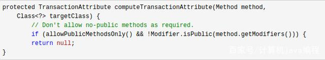
2. 注解的rollbackFor设置错误：**Spring默认抛出了未检查（unchecked）异常（继承自 RuntimeException 的异常）或者 Error才回滚事务，其他异常不会触发回滚事务**
3. 普通方法A调用同类中的事务方法B，方法B的事务不会生效：**这还是由于使用Spring AOP代理造成的，因为只有当事务方法被当前类以外的代码直接调用时，才会由Spring生成的代理对象来管理，进而由 TransactionInterceptor （事务拦截器）生成事务对象。**
4. 数据库引擎不支持事务
5. 如果异常被try-catch处理了，也不会回滚。

### ⭐5.6 说一下Spring事务的传播行为

1. **REQUIRED**：默认的传播机制，如果当前没有事务，就新建一个事务，如果已经存在在一个事务中，就加入到这个事务。
2. **SUPPORTS**：持当前事务，如果当前有事务，就以事务方式执行；如果当前没有事务，就以非事务方式执行
3. **MANDATORY**：使用当前的事务，且必须在一个已经有的事务中执行，如果当前不存在事务，就会抛出异常。
4. **REQUIRES_NEW**：不管是否存在事务，都创建一个新的事务，原来的挂起，新的执行完毕，继续执行老的事务。
5. **NOT_SUPPORTED**：以非事务方式执行，如果当前存在事务，就把当前事务挂起
6. **NEVER**：以非事务方式执行，且必须在一个没有的事务中执行，如果当前存在事务，则抛出异常【和MANDATORY相反】
7. **NESTED**：如果当前存在事务，则在嵌套事务内执行，如果当前没有事务，则执行与REQUIRED类似的操作。

### 5.7 如何实现一个IOC容器？

IOC即控制反转，是一种思想，意味着将你设计好的对象交给容器来控制，而不是传统的在你的对象内部直接控制。将对象之间的相互依赖关系交给IOC容器进行管理，并由IOC容器完成对象的注入，简化应用开发，把应用从复杂的依赖关系中解放出来。

1. 先准备一个基本的容器对象，包含一些map结构的集合，用来方便后续过程中存储具体的对象。
2. 进行配置文件的读取工作或注解的解析工作，将需要创建的bean对象都封装成BeanDefinition对象存储在容器中。
3. 容器将封装好的BeanDefinition对象通过反射的方式进行实例化，完成对象的初始化工作。
4. 进行对象的初始化操作，也就是给类中对应属性值进行设置，也就是依赖注入，完成整个对象的创建，变成一个完整的bean对象，存储在容器的某个map结构中。
5. 通过容器对象来获取对象，进行对象的获取和逻辑处理工作
6. 提供销毁操作，当对象不用或者容器关闭的时候将无用的对象进行销毁。

### 5.8 Spring的优势

1. Spring拥有强大的生态圈，将Spring扩展到不同的领域
2. IOC容器降低了业务对象替换的复杂性，提高了组件之间的解耦
3. AOP支持允许将一些通用任务比如安全、事务、日志等进行集中处理，从而提供更好的复用
4. 高度开放性和可扩展性
5. 低侵入设计，代码的污染极低。
6. 拥有一个庞大而且活跃的社区，提供不同范围的，真实用户的持续反馈。这也帮助Spring不断改进、不断发展

### 5.9 BeanFactory和ApplicationContext

**相同：**

1. 两者都是Spring提供的IOC容器，它们都可以用来配置XML属性，也支持属性的自动注入。
2. 都可以通过getBean("bean name")来获取bean。

**不同点：**

1. 对于BeanFactory来说，采用延迟加载形式注入bean，只有使用getbean时才会对该bean进行加载实例化，如果某个Bean的某一个属性没有注入，只有等到第一次调用getBean获取该Bean的时候才会抛出异常；而后者在容器启动时一次性创建了所有的Bean。
2. 前者不支持国际化，即i18n，后者支持
3. 前者提供基本的IOC和DI功能，后者提供高级功能，比如AOP。
4. ApplicationContext是BeanFactory的子接口。

**什么时候用哪个？**

**延迟实例化优点：**应用启动的时候占用资源很少，对于资源要求较高的应用，比较有优势。

**不延迟实例化优点：**所有的Bean在启动的时候就已经加载了，系统运行速度较快。又因为如此，我们能在系统启动的时候发现系统中的配置问题。建立Web应用。

### 5.10 bean的生命周期


初始化->设置属性->setBeanName（如何实现了BeanNameAware接口）->setBeanFactory (如果实现了BeanFactoryAware接口)->setApplicationContext(如果实现了ApplicationContextAware接口)->预初始化方法postProcessorBeforeInitialization(如果实现了BeanPostProcessor接口)->afterPropertiesSet方法（如果实现了InitializingBean接口）-> 调用自定义的方法init-method（如果指定了） -> 初始化之后的方法postProcessorAfterInitialization(如果实现了BeanPostProcessor接口)->最后是destroy（如果实现了DisposableBean） 和destroy-method方法。

1. 解析类得到BeanDefinition
2. 如果有多个构造方法，则要推断构造方法
3. 确定好构造方法之后，进行实例化得到一个对象
4. 进行属性填充，设置对象属性。
5. 回调Aware方法，比如BeanNameAware、BeanFactoryAware
6. 调用BeanPostProcessor的初始化前的方法，然后调用初始化方法，接着调用初始化后的方法（这里会AOP）
7. 如果当前创建的bean是单例的，就会将bean放到单例池
8. 此时Bean就可以被使用了
9. 在销毁的时候看看Bean有没有实现DisposableBean接口或者使用destory-method声明了销毁方法。

### 5.11 IOC

**IOC即控制反转**，它将在程序中手动创建对象的控制权交给了Spring框架来管理。Spring IOC负责创建对象，管理对象（通过DI），装配对象，配置对象，并且管理这些对象的整个生命周期。

**DI即依赖注入**，就是IOC容器在运行期间，动态地将某种依赖关系注入到对象中。

通过引入IOC容器，利用依赖注入的方式，来实现对象之间的解耦。

**作用：**

- 对象之间的耦合度或者说依赖程度降低。比如我们如果针对于UserDao接口开发了它的实现类UserDaoImpl，然后传统方式在用到该实现类的地方都去new UserDaoImpl，但是如果我们想去使用新的实现类NewUserDaoImpl，就得在每个使用到UserDaoImpl的地方去修改代码，这就非常的麻烦。
- 资源变得容易管理，它支持单例和原型。
- 简化开发，让程序员更加的专注于业务的实现。

**实现原理：工厂模式 + 反射机制**

```java
interface Fruit {
    void eat();
}

class Apple implements Fruit {
    @Override
    public void eat() {
        System.out.println("我吃苹果！");
    }
}

class FruitFactory {
    public static Fruit getInstance(String className) {
        Fruit fruit = null;
        try {
            fruit = (Fruit)Class.forName(className).newInstance();
        } catch (Exception e) {
            e.printStackTrace();
        }
        return fruit;
    }
}

public class Test{
    public static void main(String[] args) throws NoSuchFieldException, IllegalAccessException {
        Fruit apple = FruitFactory.getInstance("Apple");
        if (apple != null) {
            apple.eat();
        }
    }
}
```

其实对于IOC和DI，这两者是同一种东西的不同说法。对于IOC来说，一开始我们都是自己new对象，然后自己去控制它的生命周期，比如`OrderService orderService = new OrderServiceImpl ()`，但是如果我们进行了技术迭代，从而导致出现了新的实现类`OrderServiceImplNew`，我们就得去修改源代码，比较麻烦。于是我们就可以利用IOC思想，将我们所有的对象都交给IOC容器进行管理，我们需要什么对象就去找IOC容器去拿，然后Spring会在合适的时机将你需要的对象给你。我们不再关心我们所依赖的对象是怎么创建、销毁的，控制对象生命周期的不再是我自己，而是Spring容器。这就叫控制反转。

而如何动态的将某个对象提供给它所需要的其他对象，这就是通过DI依赖注入实现的。上述的合适的时机，其实就是DI做的事情。

### 5.12 AOP

#### 1. 概念

AOP一般被称为面向切面编程，它能够将那些与业务无关，却是业务所共同调用的逻辑或责任，比如事务处理、日志管理、权限控制等。AOP能够减少系统的重复代码，降低模块之间的耦合度，并有利于未来的扩展性和维护性。

#### 2. 原理

Spring AOP底层是使用动态代理的，又可以分为JDK动态代理和Cglib动态代理。

#### 3. Spring AOP和AspectJ AOP

AOP的实现是基于代理的，而代理又分为动态代理和静态代理。其中Spring AOP是动态代理，AspectJ AOP是静态代理。

**SpringAOP属于运行时增强，AspectJAOP属于编译时增强**

- 前者不会去修改字节码，而是每次运行时在内存中临时为方法生成一个AOP对象，这个对象包含了目标对象的全部方法，并且在特定的切点做了增强处理，并回调原对象的方法。
- 后者是基于字节码操作的，它会在编译阶段生成AOP代理类，因此也称为编译时增强，他会在编译阶段将AspectJ（切面）织入到Java字节码中，运行的时候就是增强之后的AOP对象。

#### 4. JDK动态代理和Cglib

JDK动态代理只能代理实现了某个接口的类或者直接代理该接口，而CGLIB可以代理未实现任何接口的类。同时CGLIB是通过生成一个被代理类的子类来拦截被代理类的方法调用，因此不能代理声明为final类型的类和方法，private修饰的方法也不行。

### 5.13 @Autowired和@Resource

这两个注解都是用于依赖注入。

其中@Autowired默认是按照类型装配注入的，如果想要按名称注入，就得配合@Qualifier

而Resource是java中的注解，默认按照名称来装配注入，只有当找不到与名称匹配的bean才会按照类型来装配注入。

### 5.14 Spring中Bean的自动装配

bean的自动装配指的是bean的属性值在进行注入的时候通过某种特定的规则和方式去容器中查找，并设置到具体的对象属性中，它有五种方式：

1. no：缺省情况下，自动配置是通过ref属性手动设定，在项目中最常用
2. byName：根据属性名称自动装配。如果一个bean的名称和其它bean属性的名称是一样的，将会自动装配它。
3. byType：根据类型自动装配
4. constructor：在构造函数参数的byType方式
5. autodetect：如果找到默认的构造函数，使用构造函数，否者按类型自动装配。

### 5.15 SpringMVC的工作流程

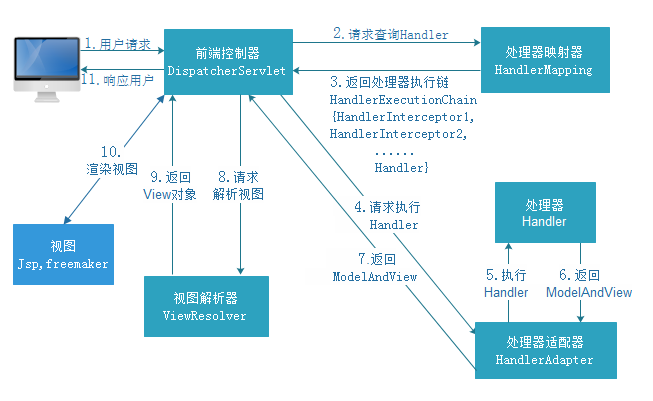

1、用户向服务器发送请求，这个请求会先到中央控制器DispatcherServlet

2、中央控制器接收到请求后会调用HandlerMapper处理器映射器。由此得知该请求该由哪个Controller来处理

3、中央控制器调用HandlerAdapter处理器适配器，告诉处理器适配器应该要去执行哪个Controller

4、处理器适配器HandlerAdapter去执行Controller并得到ModelAndView，然后层层返回给DispatcherServlet

5、中央控制器将ModelAndView交给ViewResolver视图解析器解析视图，然后返回真正的视图。

6、中央控制器将模型数据填充到视图中，然后将结果响应给用户。

### 5.16 spring怎么根据不同的环境条件注入不同的对象（比如win和linux）

[(34条消息) Spring之条件注解@Conditional，条件（系统）不同注入的对象也不同。_Small-Young的博客-CSDN博客_条件注入](https://blog.csdn.net/yjc_1111/article/details/78807129)

我们可以使用注解**@Conditional**，大致就是我们先定义一个接口TomcatService，里面包含两个方法：getTomcatStartupPath、getTomcatShutdownPath。然后可以搞两个不同的实现类去实现这个接口，比如WindowsTomcatService、LinuxTomcatService。下一步就实现两个不同的Condition的子类，然后就可以在注册TomcatService的时候，根据不同的Conditional去注册不同的TomcatService。

```java
public class WindowsCondition implements Condition {
    public boolean matches(ConditionContext context, AnnotatedTypeMetadata metadata) {
        return context.getEnvironment().getProperty("os.name").contains("Windows");
    }
}

public class LinuxCondition implements Condition {
    public boolean matches(ConditionContext context, AnnotatedTypeMetadata metadata) {
        return context.getEnvironment().getProperty("os.name").contains("Linux");
    }
}

@Configuration
public class ConditionConfig {
    @Bean
    @Conditional(WindowsCondition.class)
    public TomcatService wndowsListService() {
        return new WindowsTomcatServiceImpl();
    }

    @Bean
    @Conditional(LinuxCondition.class)
    public TomcatService wndowsListService() {
        return new LinuxTomcatServiceImpl();
    }
}
```

## **6. SpringBoot相关面试题**

### 6.1 说一下SpringBoot的加载过程

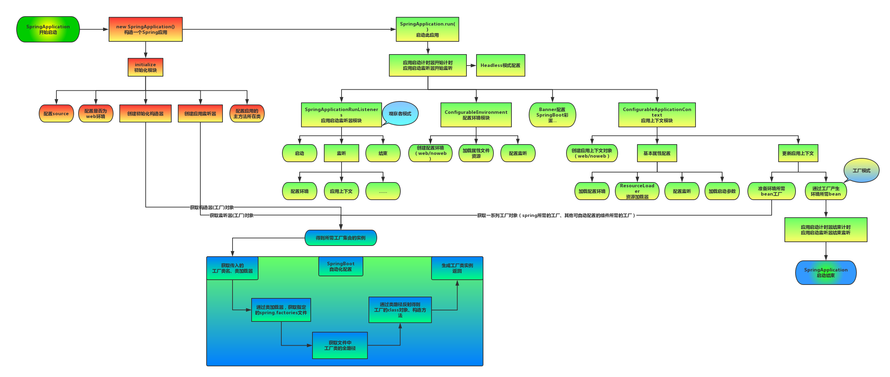

大体启动流程分为三个部分：

1. 进行SpringApplication的初始化模块，配置一些基本的环境变量、资源、构造器、监听器
2. 实现了应用具体的启动方案，包括启动流程的监听模块、加载配置环境模块、及核心的创建上下文环境模块
3. 自动化配置模块，该模块作为springboot自动配置的核心。

一开始会调用SpringApplication.run方法，它首先会初始化SpringApplication对象，初始化的时候会设置ApplicationContextInitializer和ApplicationListener对象，之后会调用内部的run方法，发布SpringApplicationRunListeners starting事件，准备相关配置环境，初始化ApplicationContext，然后调用prepareContext设置环境加载一部分bean如mainApplication等，最后会调用refreshContext创建BeanFactory容器，加载并初始化bean，执行Bean的后置处理等。

### 6.2 说一下拦截器的使用和底层原理

首先我们可以实现HandlerInterceptor接口，并在里面实现preHandler方法和afterComplete方法。接着去WebMvcConfigurer中配置好拦截器

拦截器的底层原理大概是，找出处理该请求的所有拦截器，并根据责任链模式一次执行拦截器，只有上一个拦截器返回了true才能执行下一个拦截器，否则不让被拦截的方法执行。 

### 6.3 说一下自动装配

SpringBoot通过@EnableAutoConfiguration注解开启自动装配功能，加载spring.factories中注册的各种AutoConfiguration类，当某个AutoConfiguration类满足其注解@Conditional指定的生效条件时，实例化该AutoConfiguration类中定义的Bean（组件等），并注入Spring容器中，就可以完成自动配置。

## **7. JUC相关面试题**

### 7.1 JDK15为什么取消偏向锁

- 偏向锁导致synchronized子系统的代码复杂度过高，并影响其它的子系统，造成代码的维护和升级困难。
- 偏向锁带来的性能提升从整体来看并没有带来太多的收益，因为偏向锁的撤销成本过高，需要等待全局安全点，并且还需要暂停线程来做锁的撤销。

### 7.2 threadlocal在父子线程间是否可见，父子线程间如何通信

[(34条消息) 【并发编程】（十一）父子线程数据共享——InheritableThreadLocal原理_语言日记-CSDN博客_父子线程怎么共享数据](https://blog.csdn.net/qq_38249409/article/details/114300384?utm_medium=distribute.pc_aggpage_search_result.none-task-blog-2~aggregatepage~first_rank_ecpm_v1~rank_v31_ecpm-2-114300384.pc_agg_new_rank&utm_term=什么是父子线程&spm=1000.2123.3001.4430)

### 7.4 什么是协程

[什么是协程？ - 知乎 (zhihu.com)](https://zhuanlan.zhihu.com/p/172471249)

协程是一种协作式的用户态线程

1. 线程和进程是抢占式执行的，意思是系统帮我们自动快速切换线程和进程来让我们感觉同步运行的感觉，这种切换动作由系统自动完成。
2. 协作式执行说的就是，**想要切换线程，必须用户手动来切换**

协程为什么那么快原因就是因为，无需系统自动切换（系统自动切换会浪费很多的资源），而协程是我们用户手动切换，而且是在同一个栈上执行，速度就会非常快而且省资源。  

   但是，协程有他自己的问题：  **协程只能有一个进程，一个线程在跑，一旦发生IO阻塞，这个程序就会卡住。**所以我们要使用协程之前，必须要保证我们所有的**IO都必须是非阻塞的**  

**协程调用阻塞IO操作的时候，操作系统会让线程进入阻塞状态，当前的协程和其它绑定在该线程之上的协程都会陷入阻塞而得不到调度，这往往是不能接受的。**

   协程的真正目的其实并不是为了解决高并发而存在的，而是为了解决无限回调而存在的；  

   协程不是被操作系统内核所管理，而完全是由程序所控制（也就是在用户态执行）。这样带来的好处就是性能得到了很大的提升，不会像线程切换那样消耗资源。

### 7.5 run( )和start( )

**区别：**

1. run方法被称为线程体，每个线程执行的时候都是执行run方法里面的代码。而通过调用Thread中的start方法来启动一个线程。
2. start方法用于启动线程，而run方法用于执行线程的运行时代码。run可以重复调用，而start只能调用一次。
3. 调用start方法无需等待run方法执行完毕，可以直接继续执行其它的代码，此时线程是就绪态，并没有运行。然后通过此thread类调用run方法来完成其运行态，run方法运行结束，此线程终止，然后CPU调度其它的线程。

**为什么调用start方法的时候会执行run方法，为什么不能直接调用run方法？**

1. new一个Thread会让该线程进行新建态。调用start方法会启动一个线程并使线程进入了就绪态，当该线程分配到了CPU的时间片之后就可以开始运行。start会执行线程的相应准备工作，然后自动执行run方法里面的内容，这是真正的多线程运行。
2. 如果直接调用run方法，会把run方法当成一个main线程下的普通方法执行。

### 7.6 CAS为什么这么快？

1. CAS，比较并交换，如果内存中的值与预期原值相匹配，那么处理器就会自动将该位置的值更新为新的值。否则处理器不做任何操作。
2. 白话：我认为V的值一定等于A，如果是那就将V的值更新为B，否则不修改并告诉V的值实际是多少。
3. CAS的实现并不是简单的代码层面控制的，**而是需要硬件的支持**，因此在不同体系的架构中执行的性能差异很大。 **现代大多数处理器都是从硬件层面通过一些列指令实现CAS同步原语，进而操纵系统和JVM可以直接使用这些指令实现锁和并发的数据结构**
4. **JVM对CAS的支持**：由于Java程序运行在JVM上，所以应对不同的硬件体系架构的处理则需要JVM来实现。在不支持CAS操作的硬件上，JVM将使用自旋锁来实现。

### 7.7 为什么还要有非公平锁

1. 首先恢复挂起的线程到真正获取到锁还是有一定的时间差的。
2. 假设线程A持有一个锁，并且线程B请求这个锁。由于锁被A持有，因此B将被挂起。当A释放锁之后，B将被唤醒，然后B会再次尝试获取这个锁。与此同时，线程C也来请求这个锁，那么C很有可能在B被完全唤醒之前获得该锁，以及使用并释放该锁。因此非公平锁能更充分的利用CPU等待时间片，尽量减少CPU的空闲时间。
3. 举例：比如我在排队加油，我是第二个，但是我一直在玩手机，忘了到我了，然后后面的人就先行加油。

### 7.8 AQS原理

AQS 核心思想是，如果被请求的共享资源空闲，则将当前请求资源的线程设置为有效的工作线程，并且将共享资源设置为锁定状态。如果被请求的共享资源被占用，那么就需要一套线程阻塞等待以及被唤醒时锁分配的机制，这个机制 AQS 是用 CLH 队列锁实现的，即将暂时获取不到锁的线程加入到队列中。

CLH(Craig,Landin,and Hagersten)队列是一个虚拟的双向队列（虚拟的双向队列即不存在队列实例，仅存在结点之间的关联关系）。AQS 是将每条请求共享资源的线程封装成一个 CLH 锁队列的一个结点（Node）来实现锁的分配。  

**AQS 定义两种资源共享方式**  

- Exclusive（独占）：只有一个线程能执行，如 ReentrantLock。又可分为公平锁和非公平锁： 

- - 公平锁：按照线程在队列中的排队顺序，先到者先拿到锁 
  - 非公平锁：当线程要获取锁时，无视队列顺序直接去抢锁，谁抢到就是谁的 

- Share（共享）：多个线程可同时执行，如CountDownLatch、Semaphore、 CyclicBarrier、ReadWriteLock 我们都会在后面讲到。 

ReentrantReadWriteLock   可以看成是组合式，因为   ReentrantReadWriteLock   也就是读写锁允许多个线程同时对某一资源进行读。  

不同的自定义同步器争用共享资源的方式也不同。自定义同步器在实现时只需要实现共享资源 state 的获取与释放方式即可，至于具体线程等待队列的维护（如获取资源失败入队/唤醒出队等），AQS 已经在顶层实现好了。  

1. 非公平锁在调用 lock 后，首先就会调用 CAS 进行一次抢锁，如果这个时候恰巧锁没有被占用，那么直接就获取到锁返回了。
2. 非公平锁在 CAS 失败后，和公平锁一样都会进入到 tryAcquire 方法，在 tryAcquire 方法中，如果发现锁这个时候被释放了（state == 0），非公平锁会直接 CAS 抢锁，但是公平锁会判断等待队列是否有线程处于等待状态，如果有则不去抢锁，乖乖排到后面。

### 7.9 synchronized和volatile的区别

1. sync表示只有一个线程可以获取作用对象的锁，执行代码，阻塞其余的线程；volatile表示变量在CPU寄存器中是不确定的，必须从主存中读取，保证多线程环境下变量的可见性，禁止指令重排。
2. volatile是变量修饰符，而sync可以作用与静态方法、方法和代码块。
3. volatile不会造成线程的阻塞
4. volatile标记的变量不会被编译器优化
5. volatile是线程同步的轻量级实现，性能比sync要高，但是volatile只能用于变量，而且volatile无法保证原子性。sync有了锁升级和各种优化，比如锁粗化和锁消除。

### 7.10 举一举线程不安全的例子

**线程安全的概念**：当多个线程同时访问一个对象时，如果不用考虑这些线程在运行时环境下的调度和交替执行，也不需要进行额外的同步，或者在调用方进行任何其他的协调操作，调用这个对象的行为都可以获得正确的结果。

- 代码本身封装了所有必要的正确性保障手段（互斥或者同步），调用者无需关系这些内容，无需自己去实现任何措施来保证多线程环境下的正常调用。

比如多个线程同时操作i++，或者多个线程共享一个HashMap，导致在1.7的时候会产生环形链或者数据覆盖，而1.8的时候利用尾插法解决了环形链，但是还是会有数据覆盖。

**并发三要素：**

1. 原子性：指的是一个或多个操作要么全部执行成功，要么全部执行失败。
2. 可见性：一个线程对共享变量的修改，另一个线程能够马上看得到。
3. 有序性：程序执行的顺序按照代码的先后顺序执行。（处理器可能会对执行进行重排序）

**出现线程安全问题的原因：**

1. 多线程的切换带来的原子性问题
2. JMM内存模型，即缓存带来的可见性问题
3. 编译优化带来的有序性问题（执行重排）

**解决办法：**

1. JDK Atomic开头的原子类、synchronized、Lock、CAS自选，解决原子性问题
2. volatile、sync、lock解决可见性问题
3. happens-before解决有序性问题。

### 7.11 synchronized底层实现原理

可以从两方面来回答：

**1、JVM层面**

如果使用同步代码块，底层是通过monitorenter来获取锁，使用monitorexit来释放锁。但是注意的是**同步代码块方式的sync会有两个monitorexit**，这是问题：

防止在同步代码块中线程因异常退出，而锁没有得到释放，这必然会导致死锁。因此最后一个monitorexit是保证在异常情况下，锁也可以得到释放，避免死锁。

而如果sync修饰方法，则字节码文件中没有monitorenter和monitorexit，而是会有个标识，`ACC_SYNCHRONIZED`；如果sync修饰静态方法，则还会多一个`ACC_STATIC`。

**2、底层层面**

每个锁其实都对应着一个monitor对象，多个线程想要访问共享资源的时候，就必须获取该锁的monitor，而这个monitor在c++层面是由ObjectMonitor实现的，每个对象都会有一个monitor与之关联。在ObjectMonitor中就维护了计数器和指向持有该monitor的线程的指针。

**synchronized可重入锁原理：**

每个锁底层都维护着一个计数器和一个指向只有该锁的线程的指针，当线程获取该锁的时候，计数器加一，当释放锁的时候，计数器减一。当计数器为零，标识该锁没有被任何线程占有。

### 7.12 synchronized和Lock

1. sync是Java中的关键字，在JVM层面；而Lock是Java中的一个类。
2. sync可以给方法、静态方法、代码块加锁，而Lock只能给代码块加锁。
3. sync不需要手动的释放锁，使用简单，而Lock需要手动释放锁。
4. Lock支持精准唤醒，而sync只能随机唤醒或者全部唤醒。

### 7.13 为什么wait、notify等方法需要在sync内部使用

当一个线程正在某个对象的同步方法中运行时调用了这个对象的wait方法，那么这个线程将释放对象的独占锁并放入这个对象的等待队列中。注意的是wait方法会强制当前线程释放对象锁，这就意味着**在调用某对象的wait方法之前，当前线程必须已经获得该对象的锁。**因此wait方法必须在sync中使用。

当线程调用某对象的notify或notifyall方法时，任意一个或者所有的在该对象的waitSet中的线程，将会被转移到该对象的EntryList中，接着这些队列将会竞争该对象的锁，最终获得锁的线程继续执行。如果没有线程在该对象的等待队列中等待获得锁，那么notify或notifyAll将不起任何作用。在调用对象的notify或notifyAll方法之前，调用线程必须已经得到该对象的锁，因此必须在sync内部使用。

拿生产者消费者的例子进一步说明：生产者向缓冲区中写入数据，消费者从缓冲区中读取数据。消费者线程需要等待直到生产者完成一次写入操作，生产者需要等待消费者完成一次读取操作。假如wait、notify、notifyAll不需要加锁就能够被调用，那么此时消费者线程调用wait，然后正在进入等待队列（可能还未进入，只是正在进入），在同一时刻，生产者调用notify打算向消费者线程通知状态改变，那么此时消费者线程将错过这个通知并一直阻塞。而生产者认为自己已经发出了通知，一直在等待消费者将自己唤醒，这就出现问题了。

## **8. 不知道分类面试题**

### 8.1 说一下一致性哈希

[白话解析：一致性哈希算法 consistent hashing-朱双印博客 (zsythink.net)](https://www.zsythink.net/archives/1182)

场景假设：如果我们有三台服务器用来缓存图片，那么就可以使用哈希算法以图片的名称计算hash，并且将其映射到这三台服务器上。这就可以让图片近乎均匀的缓存在这三台服务器上。

但是如果有一天，有一台服务器要下了，或者要增加一台新的服务器，这时所有的图片缓存都需要进行hash重算，就会导致所有的缓存都失效，也就是造成缓存雪崩问题，导致整个系统的压力过大而崩溃。而且就算不崩溃，几乎所有的缓存的位置都会发生变化，这也会对性能产生影响。

这时候一致性哈希算法就应运而生。

一致性哈希首先会假设有一个hash环。我们可以对服务器的IP地址进行取模运算，公式如下：

**hash（服务器A的IP地址）%2^32**

这样就会将这三台服务器放在hash环中的某个位置：（理想状况）

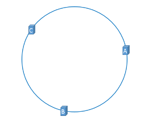

同时，对于每一张图片，我们也同样计算它的位置：**hash（图片名称）%2^32**，

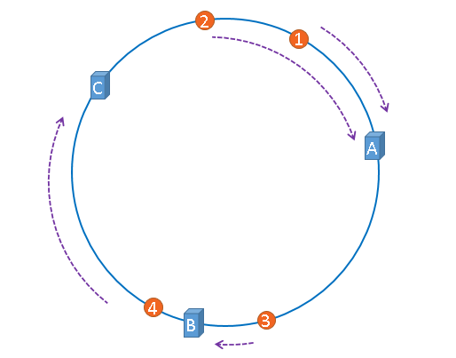

我们以顺时针的方式来判断该图片应该属于哪一个服务器。上图的示例就是图片1和图片2缓存到服务器A，图片3缓存到服务器B，图片4缓存到服务器C上。

如果此时B给宕机了，那么只需要将图片3给缓存到服务器C就行了，其余的图片就不需要改变。这就只会影响一部分的缓存，从而减少系统的压力。

但是其实上面是理想的情况，我们还可能造成**hash环的倾斜**

实际计算hash的过程中，不会分布的那么均匀，就可能导致服务器之间在hash环上的位置非常的窄小，就会导致缓存的数据分布不均匀：

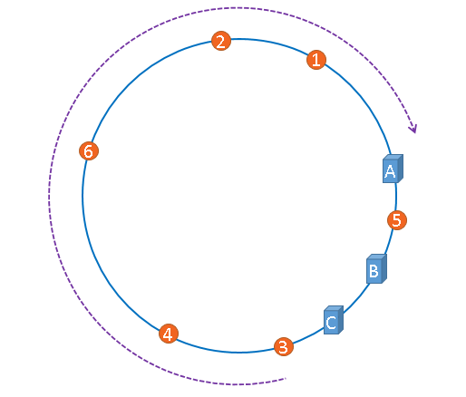

**这就需要虚拟节点了**

我们凭空的让服务器节点多起来，既然没有多余的真正的物理服务器节点，我们就只能将现有的物理节点通过虚拟的方法复制出来，这些由实际节点虚拟复制而来的节点被称为”虚拟节点”。


**“虚拟节点”是”实际节点”（实际的物理服务器）在hash环上的复制品,一个实际节点可以对应多个虚拟节点。**虚拟节点越多，hash环上的节点就越多，缓存被均匀分布的概率就越大。

### 8.2 什么是倒排索引

倒排索引源于实际应用中需要根据属性的值来查找记录。这种索引表中的每一项都包括一个属性值和具有该属性值的各记录的地址。由于不是由记录来确定属性值，而是由属性值来确定记录的位置，因而称为倒排索引(inverted index)。

### 8.3 负载均衡算法的实现

[几种简单的负载均衡算法及其Java代码实现 - 五月的仓颉 - 博客园 (cnblogs.com)](https://www.cnblogs.com/xrq730/p/5154340.html)

1. **轮询法：**它试图做到请求转移的绝对均衡。但是同时也需要付出一定代价，因为为了保证并发下的均衡，可能得引入悲观锁或者CAS。
2. **随机法：**基于概率统计的理论，吞吐量越大，随机算法的效果越接近于轮询算法的效果。
3. **源地址哈希法**：获取客户端访问的IP地址值，通过哈希函数计算得到一个哈希值，用该值对服务器列表的大小进行取模运算。
4. **加权轮询**：不同的服务器可能配置不同，因此可以给配置高、负载低的机器赋予更大的权重。
5. **最小连接数**：以后端服务器的视角来观察系统的负载，而不是请求发起方来观察。该算法比较灵活，由于后端服务器的配置不尽相同，对于请求的处理有快有慢，因此该算法就会动态的选取其中当前积压连接数最少的一台服务器来处理当前请求，尽可能提高后端服务器的利用效率，将负载合理地分流到每一台机器。

### 8.4 CPU的原子操作

[(34条消息) CPU实现原子操作的方法_盐焗咸鱼的博客-CSDN博客_cpu原子操作](https://blog.csdn.net/qq_33215865/article/details/88562456)

首先对于单核CPU来说，所有的时间都是串行，执行完第一个才会去执行第二个，每个指令都是原子的。

对于多核CPU来说：

1. CAS：它会检测现在内存中的值是不是符合预期值，如果符合就更新为新值，否则就丢弃新值
2. 使用总线锁：用来锁住某一个共享内存，当一个CPU要对内存进行操作的时候，会加上总线锁，限制其它cpu对共享内存操作。
3. 使用缓存锁：使用总线锁会锁定cpu与内存的通信，所以开销很大。而缓存锁在一个cpu进行回写时，会使用缓存一致性机制来保护内部内存，当其它处理器回写已被锁定的缓存行的数据时缓存行无效。

### 8.5 Hash冲突的解决办法

[解决哈希冲突的常用方法分析 - 简书 (jianshu.com)](https://www.jianshu.com/p/4d3cb99d7580)

1. **拉链法**
2. **开放地址法：**从发生冲突的单元起，按照一定的次序，从哈希表找到一个空闲的单元，然后将发生哈希冲突的元素存入到该单元。
3. **再哈希法：**同时构造多个不同的哈希函数。当H1=RH1（key）发生冲突时，再用H2 = RH2（key）进行计算，直到冲突不再发生，这种方法不易产生聚集，但是增加了计算的时间。
4. **建立公共溢出区：**将哈希表分为基本表和溢出表，凡是和基本表发生冲突的元素，一律填入溢出表。

### 8.6 git常用命令


### 8.7 典型的对称加密和非对称加密算法

> 对称加密算法 AES、DES、3DES

DES是一种分组数据加密技术（先将数据分成固定长度的小数据块，之后进行加密），速度较快，适合于大量数据加密。3DES是一种基于DES的加密算法，使用3个不同密钥对同一个分组数据块进行3次加密，使密文强度更高。

相对于DES和3DES来说，AES算法有着更高的速度和资源使用效率，安全级别更高，被称为下一代加密算法

> 非对称加密算法：RSA、DSA、ECC

RSA和DSA的安全性及其各方面性能都差不多，而ECC较之则有着很多的性能优越，包括处理速度，带宽要求，存储空间等

RSA算法包含了RSA加密算法和哈希算法

### 8.8 JWT

> session的缺点

HTTP是无状态的协议，它无法识别用户发出的请求的身份，因此可以使用Cookie或者Session机制。

但是Session是保存在服务端的，随着用户增多，可能造成服务端内存压力过大。而且如果是分布式的应用，就限制了应用扩展能力。

> 基于token的鉴权机制

- 用户使用用户名或密码来请求服务器
- 服务器进行验证用户的信息
- 服务器通过验证并返回给用户一个token
- 客户端存储token，并在每次请求时附送上这个token值
- 服务端验证token值，并返回数据

每次请求的时候都得将token传递给服务端，保存在请求头中，服务端还得支持跨域策略。

> token和cookie的区别

token相对cookie的优点：token完全由应用管理，可拓展性强，它可以放在cookie，也可以放在localstorage中，因此在某些不支持cookie的应用中就可以去使用token。

> 什么是JWT

JSON WEB TOKEN，由三部分组成，header、payload、signature

**header**

头部有两部分信息：声明类型，声明加密的算法

```json
{
  'typ': 'JWT',
  'alg': 'HS256'
}
```

然后将头部进行base64加密（可以对称解密）

**payload**

载荷包含三部分：标准中注册的声明（jwt签发者，jwt过期时间，签发时间等等），公共的声明（添加任何的信息，一般是用户的相关信息或者业务需要的必要信息，不建议添加敏感信息），私有的声明

```json
{
  "sub": "1234567890",
  "name": "John Doe",
  "admin": true
}
```

同样也要用base64进行加密

**signature**

三部分组成：加密后的header、加密后的payload，secret

签名的作用是保证JWT没有被篡改，实质上是对头部和负载内容进行签名。密钥只有服务器才知道，不能泄漏给用户。使用的是header中指定的签名算法进行签名

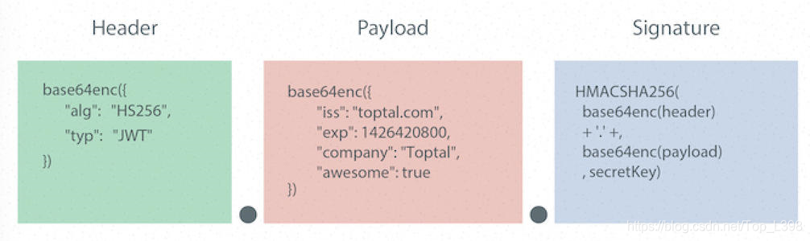

> JWT的特点

- 由于JSON的通用性，JWT支持跨语言
- JWT可以存储自身一些其他业务逻辑所需要的非敏感信息。
- 便于传输，JWT的构成简单，字节占用小
- 不需要再服务端保存会话信息，易于应用扩展
- 不应在JWT的payload中存放敏感信息，因为这部分客户端可以解密
- 保护好secret私钥

## **9. Java基础**

### 9.1 static可以修饰什么，可以修饰类吗？

static一般用来修饰成员变量和方法，也可以修饰类，但是普通类不允许声明为静态的，只有内部类可以。

**追问1：静态内部类的特点**

1. 静态内部类可以用静态成员变量和静态方法（普通内部类不能拥有）
2. 可以直接创建实例，不需要先创建外部类。`Test.StaticInner staticInner = new Test.StaticInner();`，而普通内部类需要先创建外部类：`Test.Inner inner1 = new Test().new Inner();`
3. 只可以直接访问外部类的静态成员，不可以直接访问外部类的非静态成员，需要传入外部类引用的方式才能使用。
4. 不持有外部类的引用（普通内部类持有）

**追问2：什么时候会用到静态内部类**

1. 内部类与所在的外部类有一定的关系，往往只有该外部内会调用此内部类，就无需专门用一个Java文件来存放这个类。

### 9.2 Java为什么不支持多继承

[(34条消息) Java不支持多继承的原因_u014133299的博客-CSDN博客_java为什么不支持多继承](https://blog.csdn.net/u014133299/article/details/77571912)

首先Java是一门面向对象的语言，从语义上来说，一个类继承了另一个类，那么这两个类就可以理解为父子关系，一个儿子只能有一个父亲。

再者多继承容易产生二义性：比如一个抽象类Animal，有一个抽象方法eat。此时有两个类分别继承了这个Animal类，Bird和Horse，但是同时又有一个类Pegasus继承了Horse和Bird类，当Pegasus执行eat方法时，到底是执行Bird的还是Horse的呢？这就产生了歧义。【致命方块】

为何接口不会产生致命方块问题，是以为接口所有的方法都是抽象的，实现的类必须得实现所有接口定义的接口，这不会存在歧义问题。

那么注意的是在1.8的时候，接口可以拥有默认实现，如果我们有两个接口，都同时默认实现了方法a，那么类Test去同时实现T1和T2接口的时候，又该去选择哪个接口呢？

**如果一个类同时实现的多个接口拥有相同的默认实现方法，如果不去在该类中实现该默认方法，就会产生编译时错误！**

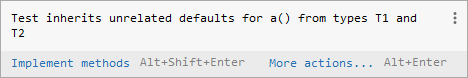

同时在Class文件结构中，只用了一个u2表示它的父类，而用了一个u2数组来表示该类对应的接口

```java
u2             this_class;//当前类
u2             super_class;//父类
u2             interfaces_count;//接口
u2             interfaces[interfaces_count];//一个类可以实现多个接口
```

### 9.3 List一边遍历一边删除

如果是使用正序遍历：注意要修改i = i - 1

```java
public static void main(String[] args) {
    List<String> platformList = new ArrayList<>();
    platformList.add("博客园");
    platformList.add("CSDN");
    platformList.add("掘金");

    for (int i = 0; i < platformList.size(); i++) {
        String item = platformList.get(i);
        if (item.equals("博客园")) {
            platformList.remove(i);
            i = i - 1; 
        }
    }
    System.out.println(platformList);
}
```

如果是逆序遍历：不需要修改

```java
public static void main(String[] args) {
    List<String> platformList = new ArrayList<>();
    platformList.add("博客园");
    platformList.add("CSDN");
    platformList.add("掘金");

    for (int i = platformList.size() - 1; i >= 0; i--) {
        String item = platformList.get(i);
        if (item.equals("掘金")) {
            platformList.remove(i);
        }
    }
    System.out.println(platformList);
}
```

或者使用removeIf方法【推荐】

```java
public static void main(String[] args) {
    List<String> list = new ArrayList<>();
    list.add("aaa");
    list.add("bbb");
    list.add("ccc");

    list.removeIf(item -> "aaa".equals(item));
    // 也可以用下面的代替：
    list.removeIf("aaa"::equals);

}
```

### 9.4 自动装箱和拆箱

```java
public static void main(String[] args) {
    Integer a = new Integer(11);
    Integer b = 11;
    int c = 11;
    System.out.println(a == c); 
    System.out.println(a == b);
    System.out.println(b == c);
}
```

结果为true、false、true

如果a和c比较、b和c比较，因为c是基本数据类型，所以a和b都会进行拆箱，因此都转换为基本数据类型。

而a和b比较，b会进行装箱，取得是缓存池中的11的地址，所以为false

**为什么要有包装类型：**

1. Java本身就是一门OOP语言，对象是灵魂。
2. 基本数据类型有默认值，但是在业务中，可能我更加希望它的值是null，因为默认值也算是值。
3. 泛型参数不能是基本数据类型，必须是Object及其子类。

**自动拆箱带来的NPE问题**

1. 数据库的查询结果可能是null，如果使用基本数据类型进行接受，可能会导致NPE
  
   ```java
   public static void main(String[] args) throws InterruptedException {
       int a = new Test().getNum();
   }
   
   private Integer getNum() {
       return null;
   }
   ```

2. **三元运算符的不正确使用导致诡异的NPE**
  
   ```java
   boolean flag = false;
   Integer a = null;
   Integer n = flag ? 1 : a;
   ```
   
   原因在计算三元表达式结果时，a变量自动拆箱，调用了Integer.intValue()方法。
   
   **在三元表达式中，当第二、第三位操作数中有基本类型和对象时，对象就会拆箱为基本数据类型进行操作。**

### 9.5 序列化ID的作用

首先序列化就是将对象转换为字节流，而反序列化就是将字节流再转换成对象。

一般我们对可以进行序列化的对象进行序列化之前，该对象都得需要一个seriallVersionUID，原因就是Java的序列化机制是通过在运行时判断类的serialVersionUID来验证版本一致性的。在反序列化时，JVM会将传来的字节流中的serialVersionUID与本地实体类中的UID进行比较，如果相同则认为一致的，不相同就会报错。

如果我们没有显示指定UID，Java序列化机制就会根据编译时的class自动生成一个UID，只有同一次编译生成的class才会生成相同的UID。

### 9.6 泛型的缺点

Java中的泛型是伪泛型，这是因为在Java运行期间，所有的泛型信息都会被擦掉，也就是**类型擦除**

```java
public static void main(String[] args) throws NoSuchMethodException, InvocationTargetException, IllegalAccessException {
    List<Integer> list = new LinkedList<>();
    list.add(1);
    //        list.add('a');
    Class<? extends List> clazz = list.getClass();
    Method add = clazz.getDeclaredMethod("add", Object.class);
    add.invoke(list,"a");
    System.out.println(list);
}
```

最终输出的结果是：`[1, a]`

### 9.7 HashMap详解

#### 1. HashMap的hash扰动函数

- 使用扰动函数是为了防止一些比较差的hashCode函数，也就是为了减少哈希碰撞
- 底层1.7之前hash使用四次扰动，1.8之后只使用一次扰动，即hashcode右移16位，然后进行异或，目的是为了更全面的收集信息进一步减少冲突的可能，异或运算的结果更均匀
- 数组长度-1的作用相当于掩码，代替了取余的作用，效率更高

#### 2. 为什么hashmap中String、Integer这样的包装类适合作为key

String、Integer等包装类的特性能够保证Hash值的不可更改性和计算准确性，能够有效的减少Hash碰撞的几率

- 都是final类型，即不可变性，保证key的不可更改性，不会存在获取hash值不同的情况
- 内部已重写了equals()、hashCode()等方法，遵守了HashMap内部的规范，不容易出现Hash值计算错误的情况；

#### 3. hashmap中的size究竟是什么

首先结论就是hashmap中的size其实就是map中所有的键值对数量。如果该数量大于负载因子*容量了，就会进行扩容。

而当hashmap中的链表长度大于8了，就会判断数组的长度是否超过64，如果超过了就会将链表转为红黑树。否则只会对数组扩容。

#### 4. HashMap扩容优化

在1.7的时候，hashMap会对每个元素都进行rehash算法， 计算原来每个元素在扩容之后的哈希表中的位置，但是这样效率过低。

在1.8的时候，HashMap借助两倍扩容机制，使元素不需要进行重新计算位置，而是通过高位运算`e.hash & oldCap`的方式来确定元素是否需要移动，如果高位为0，就表示不需要移动；如果为1，就表示元素在扩容的时候发生了变化，新的下标位置等于原下标位置+原数组长度。

#### 5. 为什么扩容是两倍

一般在计算完hash之后就得进行取余操作来决定该元素放在数组的哪个位置。但是**取余操作中如果除数是2的幂次方则等价于该hash值与其除数减一的与操作，也就是说 hash%length = hash & (length - 1)**，采用二进制与操作，相对于%来说能够提升运算效率。

而且在2的幂次方的前提下采用了这种位运算方式，**hash值始终在和一个大部分数字都为1的值做与运算，那么就有更大的可能性不会发生冲突（这可以提一下1.8时候的扰动函数）**。因为在与运算中，如果一个数全为1，那么结果就完全取决于另外一个数，而这里的另外一个数就是指hash算法求出来的hash值，这样就大大减少了冲突的可能性。因为一个良好的hash函数会导致不同对象的hash值几乎不相等。

### 9.8 Comparator和Comparable

Comparable可作为一个类的内部排序实现，Java中一些普通类型如String、Integer等都实现了该接口，我们直接使用即可。

Comparator是外部排序接口，使用策略模式，一个类的排序规则在基于“开闭原则”时，可通过实现Compartor制定多个比较排序策略，供该类采用。可用于Collections.sort()、Arrays.sort()以及一些内部有序的类（SortedSet、SortedMap等）。

### 9.9 快速失败机制“fail-fast”

这个机制是Java集合的一种错误检测机制，当在迭代集合过程中进行结构上的改变的操作时，有可能会产生fail-fast机制。**单机和多线程时候都有可能会触发**

如果有两个线程，线程1通过iterator在遍历集合A中的元素，在某个时候线程2修改了集合A的结构（是结构的修改，不是简单的修改集合元素中的内容），那么就会报错：ConcurrentModificcationException异常。

```java
public static void main(String[] args) {
    List<String> list = new ArrayList<>();
    for (int i = 0; i < 10; i++) {
        list.add(i + "");
    }
    Iterator<String> iterator = list.iterator();
    int i = 0;
    while (iterator.hasNext()) {
        if (i == 3) {
            list.remove(3);
        }
        System.out.println(iterator.next());
        i++;
    }
}
```

**原因：**迭代器在遍历的时候直接访问集合中的内容， 并且在遍历过程中会使用到一个叫modCount的变量。集合在遍历过程中如果内容发生了变化，就会改变modCount的值。同时抛出异常的主要原因就是每次迭代器hasNext()/next()遍历下一个元素之前，都会判断modCount是否等于expectedModCount，而一开始这两者是相等的。因此如果在遍历过程中，集合的内容发生了变化，就会导致异常的出现。

```java
// 每次调用next/hasNext方法的时候都会去调用该方法来判断集合中的内容是否发生变化
final void checkForComodification() {
    if (modCount != expectedModCount)
        throw new ConcurrentModificationException();
}
```

**解决办法：**使用CopyOnWriterArrayList来代替ArrayList；使用removeIf；使用迭代器中的remove方法而不是使用ArrayList中的remove方法，因为在迭代器中的remove方法里面，会让expectedModCount重新等于modCount

### 9.10 为什么 ArrayList 的 elementData 加上 transient 修饰？

首先被加上transient修饰的属性将不会被序列化。

对于ArrayList而言，由于扩容机制，就可能导致有一定的空间是没有被使用的，list重写了writeObject方法，它先将ArrayList中的非transient属性给序列化，然后会去遍历整个elementData，只序列化已存入的元素，这样即加快了序列化的速度，也减少了序列化之后的文件大小。

### 9.13 重写的规则？

1. 参数列表和返回类型必须完全与被重写的方法一致。
2. 构造方法不能被重写，声明为final的方法不能被重写
3. 声明为static的方法不能被重写，但是能够被再次声明
4. 访问权限不能比父类中被重写的方法低，即父类如果是public，子类就不能是protected
5. 重写的方法能够抛出任何非强制异常（uncheckedException，也叫非运行时异常），但是重写的方法不能抛出新的强制性异常，或者比被重写的方法声明的更广泛的强制性异常。

### 9.14 红黑树和AVL树

链接：https://www.nowcoder.com/discuss/817925?channel=-1&source_id=profile_follow_post_nctrack

普通的二叉查找树在极端情况下可退化成链表，此时的增删查效率都会比较低下。为了避免这种情况，就出现了一些自平衡的查找树，比如 AVL，红黑树等。这些自平衡的查找树通过定义一些性质，将任意节点的左右子树高度差控制在规定范围内，以达到平衡状态。以红黑树为例，红黑树通过如下的性质定义实现自平衡：  

1. **节点是红色或黑色。** 
2. **根是黑色。** 
3. **所有叶子都是黑色（叶子是NIL节点）。** 
4. **每个红色节点必须有两个黑色的子节点。（从每个叶子到根的所有路径上不能有两个连续的红色节点。）** 
5. **从任一节点到其每个叶子的所有简单路径都包含相同数目的黑色节点（简称黑高）。** 

​    有了上面的几个性质作为限制，即可避免二叉查找树退化成单链表的情况。但是，仅仅避免这种情况还不够，这里还要考虑某个节点到其每个叶子节点路径长度的问题。如果某些路径长度过长，那么，在对这些路径上的节点进行增删查操作时，效率也会大大降低。这个时候性质4和性质5用途就凸显了，有了这两个性质作为约束，即可保证**任意节点到其每个叶子节点路径最长不会超过最短路径的2倍**。原因如下：  

​    当某条路径最短时，这条路径必然都是由黑色节点构成。当某条路径长度最长时，这条路径必然是由红色和黑色节点相间构成（性质4限定了不能出现两个连续的红色节点）。而性质5又限定了从任一节点到其每个叶子节点的所有路径必须包含相同数量的黑色节点。此时，在路径最长的情况下，路径上红色节点数量 = 黑色节点数量。该路径长度为两倍黑色节点数量，也就是最短路径长度的2倍。

**AVL和红黑树**

AVL就是平衡二叉树，它的所有子树的高度之差小于等于1。如果插入或删除后破坏了平衡性，就得将其进行旋转处理，但是频繁的旋转会造成性能损失。

1. AVL的时间复杂度虽然优于红黑树，但是性能差异不是太大。
2. 红黑树的插入删除比AVL树更便于控制操作。
3. 红黑树整体的性能略优于AVL树（红黑树旋转情况少于AVL树）

### 9.15 为什么ConcurrentHashMap读操作不需要加锁

[Java 经典面试题：为什么 ConcurrentHashMap 的读操作不需要加锁？ - 云+社区 - 腾讯云 (tencent.com)](https://cloud.tencent.com/developer/article/1461980)

1. 在1.8中ConcurrentHashMap的get操作全程不需要加锁。
2. 是因为Node的成员val是用volatile修饰的，和数组用volatile修饰没有关系。
3. 数组用volatile修饰主要是保证数组在扩容时的可见性

```java
transient volatile Node<K,V>[] table;

static class Node<K,V> implements Map.Entry<K,V> {
    final int hash;
    final K key;
    //可以看到这些都用了volatile修饰
    volatile V val;
    volatile Node<K,V> next;
}
```

### 9.16 接口和抽象类

| 接口                               | 抽象类                              |
| -------------------------------- | -------------------------------- |
| 不可以定义构造器                         | 可以定义构造器                          |
| 只能有抽象方法，1.8的时候有默认实现              | 可以有抽象方法和具体方法，不能有默认方法             |
| 不能有静态方法                          | 可以有静态方法                          |
| 一个类可以实现多个接口                      | 一个类只能继承一个抽象类                     |
| 成员全都是public的                     | 成员可以是public、protected、private、默认 |
| 成员变量实际上全都是常量，public static final | 有抽象方法的类一定是抽象类，而抽象类未必要有抽象方法       |

相同点：

1. 都不能实例化
2. 可以将抽象类和接口作为引用类型。
3. 如果一个类继承了某个抽象类或者实现了某个接口，都需要对其中的抽象方法全部进行实现，否则该类仍然需要被声明为抽象类。

### 9.17 反射导致的异常

```java
public static void main(String[] args) throws Exception {
    String origin = "String  of test";

    Field value2 = origin.getClass().getDeclaredField("value");
    value2.setAccessible(true);
    char[] o2 = (char[]) value2.get(origin);
    o2[0] = 'R';
    o2[1] = 'e';
    o2[2] = 'f';
    o2[3] = 'l';
    o2[4] = 'e';
    o2[5] = 'c';
    o2[6] = 't';

    //此时S3"Reflect of test"
    //origin为"Reflect of test"
    //        String ss="Reflect of test";

    String sss="String  of test";
    System.out.println(sss);
}
```

### 9.18 HashMap和HashTable的区别

1. HashMap是线程不安全的，HashTable是线程安全的，适合在多线程使用，但是它对数据的操作都会使用上synchronized锁，效率低下。
2. HashTable不允许键或值为null的；HashMap的键值都可以为null
3. 初始化容量不同：HashMap的初始容量是16，每次扩容2倍。HashTable初始容量是11，每次扩容2倍 + 1，而且如果指定了HashTable的容量初始值，它会直接使用你给定的大小。
4. 底层数据结构：1.8的时候HashMap有了大改变

> 关于HashTable不允许键或值为null的解释

HashTable的作者认为要从HashTable成功存储和检索对象，用作键的对象必须实现hashCode和equals，但是null不是对象，因此无法调用equals或hashCode，因此HashTable无法将其计算哈希值用以键。

```
* This class implements a hash table, which maps keys to values. Any
* non-<code>null</code> object can be used as a key or as a value. <p>
*
* To successfully store and retrieve objects from a hashtable, the
* objects used as keys must implement the <code>hashCode</code>
* method and the <code>equals</code> method. <p>
```

### 9.19 安全失败机制（fail-safe）

采用安全失败机制的集合容器，在遍历的时候不是直接在集合内容上访问的，而是先复制原有集合内容，在拷贝的集合上进行遍历。

**原理**：由于迭代时是对原集合的拷贝进行遍历，所以在遍历过程中对原集合所做的修改并不能被迭代器检测到，所以不会触发Concurrent Modification Exception。

**缺点**：基于拷贝的遍历是为了避免CME，但是迭代器不能访问到修改后的内容，即迭代器遍历的是一开始那一时刻拿到的集合拷贝，在遍历期间原集合发生的修改迭代器是不知道的。

### 9.20 boolean 占用多少字节

结论：单个 boolean 占用 4 字节，而 boolean 数组中每个 boolean 占用 1 字节。

Java 虚拟机规范中提到：在Java虚拟机中没有任何供 boolean值专用的字节码指令,Java语言表达式所操作的 boolean值,在编译之后都使用**Java虚拟机中的int数据类型**来代替。•Java虚拟机直接支持 boolean类型的数组,虚拟机的 navarra指令参见第6章的newarray小节可以创建这种数组。**boolean类型数组的访问与修改共用byte类型数组的baload和 bastore指令**

在Java虚拟机中，对于大部分与数据类型相关的字节码指令，他们的操作码助记符中都有特殊的字符来表示专门为哪种数据类型服务。但是Java虚拟机的操作码长度只有一个字节，这就带来一个问题，如果每种与数据类型相关的指令都支持Java虚拟机运行时数据类型的话，显然一个字节就不够用了。 所以Java虚拟机规范中，这种特性"Not Orthogonal",并非每种数据类型和每一种操作都有对应的指令。

大部分的指令都没有支持byte、char、short,没有任何指令支持boolean类型。编译器在编译期或者运行期将byte和short类型的数据带符号扩展为相应的int类型数据，将boolean和char类型数据零位扩展为相应的int类型数据。与之类似的，在处理byte、char、short和boolean类型的数组时，也会转换成对应的int类型的字节码指令来处理。因此，大多数对于byte、char、short和boolean类型数据的操作，实际上都是使用相应的int类型作为运算类型的。

```java
byte a = 1;
byte b = 2;
a = a + b; // 编译错误，可以发现 byte + byte 的结果不是 byte 类型，这是因为在计算的时候是按照 int 来计算的。
```

## **10. MyBatis相关面试题**

### 10.1 MyBatis的一二级缓存

[MyBatis一级缓存详解 (qq.com)](https://mp.weixin.qq.com/s?__biz=MzkwMDE1MzkwNQ==&mid=2247496101&idx=1&sn=8d32c975eb41744903bb6331a500c28d&source=41#wechat_redirect)

对于MyBatis的一级缓存中，当MyBatis在执行一次SQL查询或者SQL更新之后，这条SQL语句并不会消失，而是会被MyBatis给缓存起来，再次执行相同SQL语句的时候，就会直接从缓存中进行提取。

**一级缓存又被称为SqlSession级别的缓存**

SqlSession是SqlSessionFactory会话工厂创建出来的一个会话的对象，这个SqlSession对象用于执行具体的SQL语句并返回给用户请求的结果。

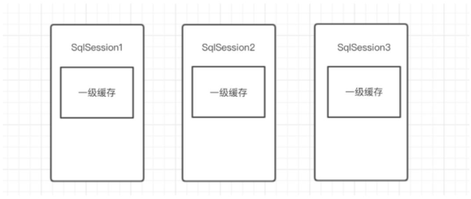

在每次更新操作的时候，MyBatis都会将此SqlSession中的一级缓存给清空掉。对于MyBatis来说，它每次访问数据库都会创建一个SqlSession，就算这两次访问都在同一个方法中。但是如果该方法是存在事务的，那么在同一个事务中，其实都是同一个SqlSession。

[(34条消息) 同一个方法中，Mybatis多次请求数据库，是否要创建多个SqlSession会话？_Abstracted的博客-CSDN博客](https://blog.csdn.net/qq_16159433/article/details/121128555?utm_medium=distribute.pc_aggpage_search_result.none-task-blog-2~aggregatepage~first_rank_ecpm_v1~rank_v31_ecpm-1-121128555.pc_agg_new_rank&utm_term=mybatisplus+每次请求+都需要创建SqlSession&spm=1000.2123.3001.4430)

**如果多个SqlSession需要共享缓存，则需要开启二级缓存**，开启之后，会使用CacheExecutor装饰Executor，进入一级缓存的查询流程前， 会先在CacheExecutor进行二级缓存的查询。

当二级缓存开启之后，同一个namespace的所有的操作语句，都影响着一个共同的cache。而且开启二级缓存的时候，**要求返回的POJO必须是可序列化的**

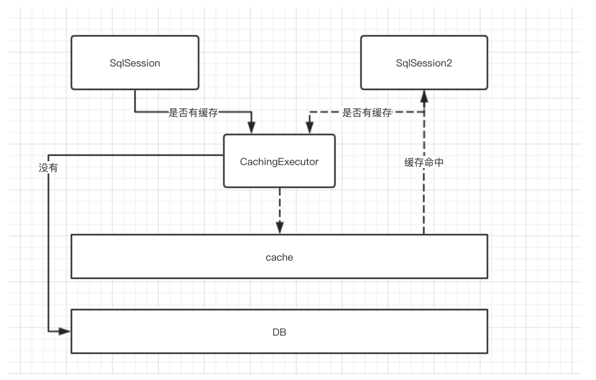

### 10.2 #{}和${}

前者是预编译处理，在处理的时候，会将sql中的#{}替换为？，然后调用PreparedStatement的set方法来赋值。

后者是字符串替换，在处理的时候，把括号里面的值替换成变量的值。

使用前者可以有效的防止SQL注入，提高系统安全性。

## **11. 计算机网络**

> 计算机五层结构

1. **应用层：**提供两个终端设备上的应用程序之间信息交换的服务，它定义了信息交换的格式，消息会传给传输层。HTTP、DNS、SMTP、FTP
2. **传输层：**为两个终端设备进程之间的通信提供通用的数据传输服务。TCP、UDP
3. **网络层：**选择合适的网间路由和交换结点，确保数据及时传送，IP、ARP、ICMP
4. **数据链路层：**将网络层交下来的IP数据报组成成帧，在两个相邻节点之间的链路上传送帧。每一帧包括数据和必要的控制信息（同步信息，地址信息，差错控制）
5. **物理层：**实现相邻计算机节点之间比特流的透明传送，尽可能屏蔽掉具体传输介质和物理设备的差异。

### 11.1 应用层协议

#### HTTP

**HTTP 是一个在计算机世界里专门在「两点」之间「传输」文字、图片、音频、视频等「超文本」数据的「约定和规范」。**

- HTTP全称超文本传输协议，用来规范超文本（网络上的包括文本在内的各种各样的消息）的传输的。具体来说，主要是用来规范浏览器和服务器端的行为的。 HTTP是一种无状态的协议，也就是说，服务器不维护任何有关客户端过去所发请求的消息。默认端口是80。
- HTTP优点：扩展性强、速度快、跨平台支持性好。
- HTTP通信过程：首先服务器在80端口等待客户的请求；浏览器发起到服务器的TCP连接；服务器接受来自浏览器的TCP连接；浏览器和服务器交换HTTP消息；关闭TCP连接。 

> URL和URI是什么？

URI是统一资源标识符，可以唯一标识一个资源。（身份证）

URL是统一资源定位符，提供该资源的路径。它是一种具体的URI。不仅可以用来标识一个资源，还指明了如何定位该资源。（家庭住址）

> HTTP报文首部

对于请求报文来说，它的首部包含**请求行以及其他首部字段**。

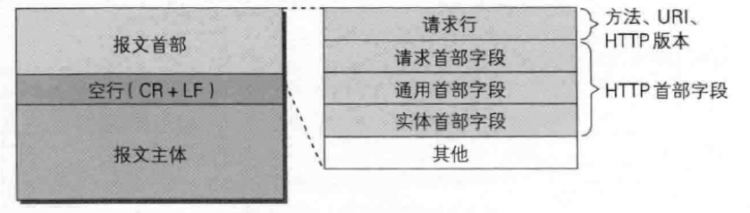

而响应报文，首部包含**状态行和首部字段**。

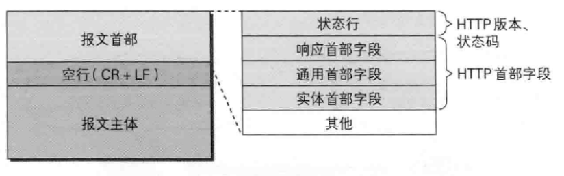

常见字段：

```
Host：github.noaharno.top // 指定域名服务器
Content-Length：1000 // 服务器在返回数据的时候，表明本次回应的数据长度
Connection：keey-alive // 最常用于客户端要求服务器使用TCP持久连接，以便其他请求复用
Content-type：text/html;charset=utf-8 // 服务器回应时告诉客户端，本次数据是什么格式
Accept：*/* // 客户端请求的时候，声明自己可以接受哪些数据格式
Content-Encoding: gzip // 表明数据的压缩方式，服务器返回的数据用了什么压缩格式
Accept-Encoding：gzip，deflate // 客户端表明自己可以接受哪些压缩方法。
```

> HTTP缺点

- 通信使用明文传输，内容可能被窃听
- 不验证通信方的身份，可能遭遇伪装
- 无法证明报文的完整性，可能已经遭到篡改

> HTTP优点

- **简单**

HTTP 基本的报文格式就是 `header + body`，头部信息也是 `key-value` 简单文本的形式，**易于理解**，降低了学习和使用的门槛。

- **灵活和易于扩展**

HTTP协议里的各类请求方法、URI/URL、状态码、头字段等每个组成要求都没有被固定死，都允许开发人员**自定义和扩充**。

同时 HTTP 由于是工作在应用层（ `OSI` 第七层），则它**下层可以随意变化**。

HTTPS 也就是在 HTTP 与 TCP 层之间增加了 SSL/TLS 安全传输层，HTTP/3 甚至把 TCP 层换成了基于 UDP 的 QUIC。

- **应用广泛和跨平台**

互联网发展至今，HTTP 的应用范围非常的广泛，同时天然具有**跨平台**的优越性。

### HTTPS

HTTPS相当于在HTTP和TCP之间加了一层SSL/TLS协议。也就是说，之前是HTTP直接和TCP进行通信，现在变成了HTTP先和SSL通信，然后再由SSL和TCP通信。

SSL是独立于HTTP的协议，其他的运行在应用层的协议也可以配合SSL使用。

- HTTPS是HTTP的加强安全版本，具有安全性的SSL加密传输协议。默认端口号是443.
- 保密性好、信任度高（可认证用户和服务器，确保数据发送到正确的客户机和服务器）。
- 建立一个信息安全通道来保证数据传输的安全；另一种就是确认网站的真实性。
- 相对于HTTP来说，HTTPS的技术门槛较高，并且CA证书的申请大部分都需要一定的资金。对接HTTPS也需要额外的技术支持；对于大部分网站来说，并不关系数据的安全性和保密性；HTTPS加重了服务端的负担，相比HTTP需要更多的资源来支撑，同时降低了用户的访问速度；对于用户来说，HTTP和HTTPS的差异感知不大。

相对于HTTP的缺点来说，HTTPS使用混合加密的方式解决明文传输的风险；使用摘要算法解决数据的完整性；使用数字证书解决了冒充的风险。

**对称加密 + 非对称加密 + 摘要算法 + 数字签名实现可靠性**

> HTTPS的加密方式

**对称加密**指的是加密和解密用的是同一把钥匙。但是注意的是，在加密之前肯定得将密钥发送给对方才能将加密的消息进行解密，可是在互联网上转发密钥的时候，如果通信被窃听了，那么密钥就可能会造成泄露，失去了加密的意义，是不安全的。

**非对称加密**指的是用两把钥匙，一把叫做私钥，一把叫做公钥。公钥可以随便发布，而私钥只能够自己保存。发送密文的一方使用对方的公钥进行加密处理，对方接收到加密信息之后，使用自己的私钥进行解密，保障安全性，但是相对于对称加密来说效率降低。如果是指根据密文和公钥，想要恢复信息原文是非常困难的。

**HTTPS是采用对称加密和非对称加密混合加密的。**使用非对称加密算法将对称加密算法的密钥进行安全交换，然后接下来的传输就使用对称加密进行传输。

> 数字证书

遗憾的就是**非对称加密算法还是存在一些问题的**，那就是**无法保证公钥本身就是货真价实的公钥**。如何证明收到的公钥就是原本预想的那台服务器发行的公开密钥？或许在公钥传输途中，真正的公钥就已经被攻击者替换了。

比如A生成了自己的公钥和私钥，并想和B交换对称加密的公钥。此时A发送非对称加密的公钥的时候，被M给拦截了，并且自己生成一个对称加密的公钥，并使用A发来的公钥加密后发给A，此时A解密之后就认为这个对称加密的公钥来自于B，以后就使用这个公钥进行加密传输数据，这就导致消息在M看来就是明文的了。

因此就需要数字证书了。

当浏览器向服务器发送HTTPS请求的时候，一定要先获取目标服务器的证书，并根据证书中的信息校验证书的合法性。一旦客户端检测到证书非法就发生错误。客户端获取到服务器的证书之后，证书里面包含服务器的公钥信息，客户端就可以放心信任证书上的公钥就是目标服务器的公钥。

数字证书是指在互联网通讯中标志通讯各方身份信息的一个数字认证，人们可以在网上用它识别对方的身份，避免身份被篡改冒充。

数字签名被数字证书包含：公钥和个人等信息经过Hash摘要算法加密形成消息摘要。将消息摘要拿到拥有公信力的认证中心比如CA，用它的私钥对消息摘要加密形成数字签名。

> 摘要算法

摘要算法用来校验数据的**完整性**，解决了篡改的风险。又称哈希算法，只能加密不能解密，常见的摘要算法有：MD5、SHA-1、SHA-256、SHA-512。

客户端在发送明文之前会通过摘要算法计算出明文的指纹，发送的时候将指纹和明文一同加密成密文后再发送给服务器。服务器收到密文并解密之后，用相同的摘要算法计算发送过来的明文，并通过比较客户端一同发过来的指纹，如果相同代表数据是完整的。

> HTTPS工作原理、具体加密传输流程

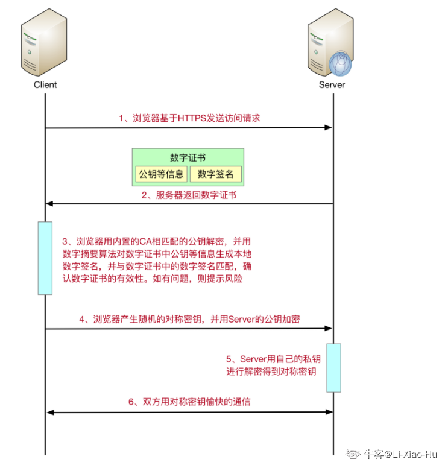

### HTTP和HTTPS的区别

| 区别   | HTTP | HTTPS                   |
|:---- | ---- | ----------------------- |
| 协议   |      |                         |
| 端口   | 80   | 443                     |
| 资源消耗 | 较少   | 由于加密解密处理，会消耗更多的CPU和内存资源 |
| 开销   | 无需证书 | 需要申请到CA申请证书             |
| 加密机制 | 无    | 共享密钥加密和公开密钥加密并用的混合加密机制  |
| 安全性  | 弱    | 由于加密机制，安全性强             |

1. 首先HTTP是超文本传输协议，运行在TCP之上，明文传输，**客户端与服务器端无法校验对方的身份**；HTTPS是具有安全性的SSL加密传输协议，运行在SSL之上，而SSL运行在TCP之上，**是添加了加密和认证机制的HTTP**。
2. HTTP默认是80端口，而HTTPS是443
3. HTTP的资源消耗相对于HTTPS来说较少，因为HTTPS的加解密处理，会消耗更多的CPU和内存资源。
4. HTTPS还得需要向CA申请证书，大部分都需要花费一定的金额
5. HTTP连接是无状态的，没有加密解密机制；而HTTPS使用**共享密钥加密和公开密钥加密并用的混合加密机制，安全性较强**

### HTTP版本对比

**HTTP1.1相比HTTP1.0支持的特性：**

- **连接方式**：HTTP1.0为短连接，HTTP1.1为长连接，注意长连接需要客户端和服务端都支持长连接。
- **状态响应码：**HTTP1.1中新加入了大量的状态码，比如100-在请求大量资源前的预热请求，206--范围请求的标识码。
- **缓存处理：**在HTTP1.1中引入了更多的缓存控制策略。
- **带宽优化及网络连接的使用：**HTTP1.0中存在一些浪费带宽的现象，例如客户端只是需要某个对象的一部分，但是服务器却将整个对象送了过来。而HTTP1.1在请求头中引入了range头域，它允许只请求资源的某个部分，即返回码是206，这样就方便了开发者自由的选择以便于充分利用带宽和连接。
- **HOST头处理：**HTTP1.1在请求头中加入了HOST字段。

**HTTP2相比HTTP1.1支持的特性：**

- **新的二进制格式**：HTTP1.1基于文本格式传输数据；HTTP2.0采用二进制格式传输数据，解析更高效。 
- **多路复用**：在一个连接里，允许同时发送多个请求或响应，并且这些请求或响应能够并行的传输而不被阻塞，避免 HTTP1.1 出现的”队头堵塞”问题。 
- **头部压缩**，HTTP1.1的header带有大量信息，而且每次都要重复发送；HTTP2.0 把header从数据中分离，并封装成头帧和数据帧，使用特定算法压缩头帧，有效减少头信息大小。并且HTTP2.0在客户端和服务器端记录了之前发送的键值对，对于相同的数据，不会重复发送。比如请求a发送了所有的头信息字段，请求b则只需要发送差异数据，这样可以减少冗余数据，降低开销。 
- **服务端推送**：HTTP2.0允许服务器向客户端推送资源，无需客户端发送请求到服务器获取。

### 响应状态码

| 响应码 | 类别                    | 原因短语          |
| --- | --------------------- | ------------- |
| 1XX | Informational（信息性状态码） | 接受的请求正在处理     |
| 2XX | Success（成功状态码）        | 请求正常处理完成      |
| 3XX | Redirection重定向状态码     | 需要进行附加操作以完成请求 |
| 4XX | Client Error 客户端错误状态码 | 服务器无法处理请求     |
| 5XX | Server Error 服务器错误状态码 | 服务器处理请求出错     |

**200 OK**：表示从客户端发来的请求在服务端被正常处理了。

**204 No Content**：服务器接受的请求已经成功处理，但是返回的响应报文中不包含实体的主体部分，没有资源可以返回。另外也不允许返回任何实体的主体。比如当从浏览器发出请求处理后，返回204，浏览器显示的页面不发生更新。一般在只需要从客户端往服务端发消息，而对客户端不需要发送新消息内容的情况下使用。

**206 Partial Content**：客户端进行了范围请求，而服务器成功执行了这部分的GET请求。响应报文中包含由Content-Range指定范围的实体内容。

**301 Moved Permanently**：永久性重定向。

**302 Found**：临时性重定向。请求的资源已经被分配了新的URI，希望用户本次能够使用新的URI访问。

**400 Bad Request**：请求报文中存在语法错误，需要修改请求的内容之后再次发送请求。

**403 Forbidden**：对请求资源的访问被服务器拒绝了。

**404 Not Found**：服务器上无法找到请求的资源。

**500 Internal Server Error**：服务端在执行请求的时候出现了错误。

**502 Bad Gateway**：通常是服务器作为网关或代理的时候返回的错误码，表示服务器自身工作正常，访问后端服务器发生了错误。

**503 Service Unavailable**：服务器暂时处于超负载或正在进行停机维护，无法处理请求。

## 11.2 传输层协议

TCP是一种面向连接的、可靠的、基于字节流的传输层通信协议。

IP层是不可靠的，它不保证网络包的按序交付、不保证网络包中数据的完整性、不保证网络包的可靠性， 因此就需要由传输层的TCP协议来进行负责。因为TCP能保证接收端接收到的网络包是无损坏、无间隔、非冗余和按序的。

### TCP三次握手

> 三次握手的过程

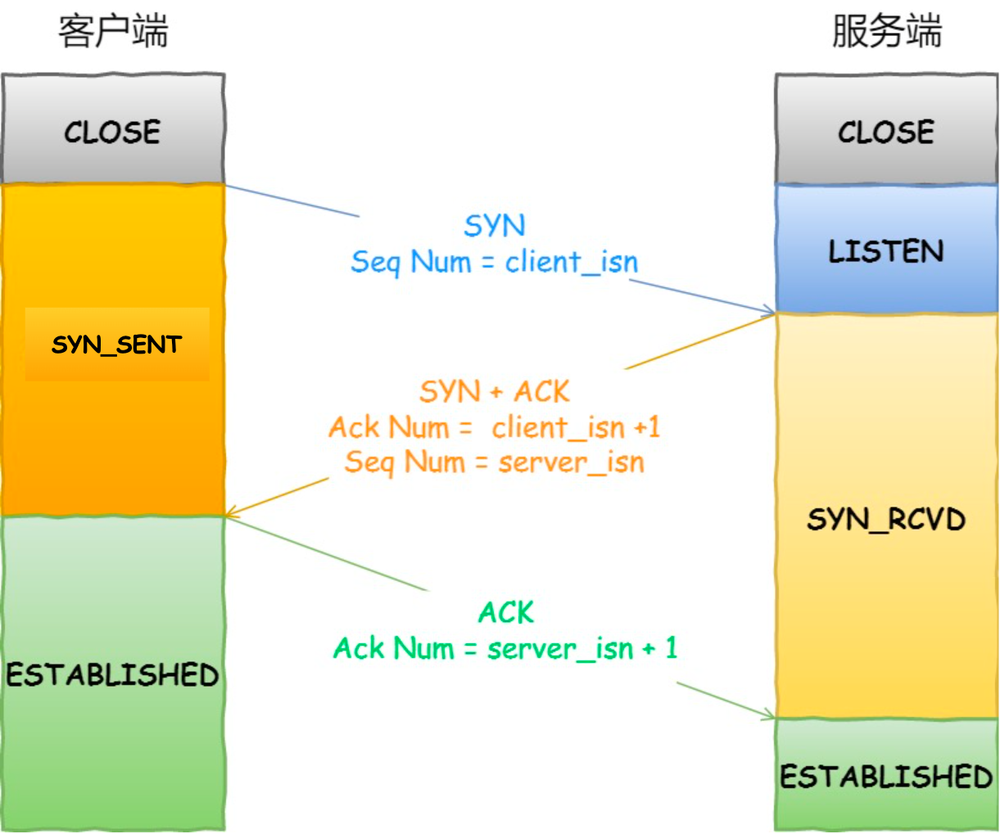

一开始的时候客户端和服务端都是处于CLOSE状态，然后服务器主动监听某个端口，处于LISTEN状态。

客户端随机初始化自己的序列号之后，将其设置在TCP的首部的序列号字段中，然后将SYN标志位设置为1。当客户端发送SYN包之后，自己变成SYN-SENT状态。

服务端收到SYN包之后，它也会去随机初始化自己的序列号，并且将其设置在TCP首部中，然后设置确认应答字段为客户端的序列号+ 1，同时将ACK和SYN标志位都设置为1。最后将该TCP报文发送给客户端，此时服务端处于SYN-RCVD状态。

客户端收到服务端传来的SYN + ACK报文之后，回应服务端一个ACK包，里面包含了确认应答字段的值为服务端的序列号 + 1。然后客户端的状态为ESTABLISHED，当服务端收到ACK包之后，状态也变为ESTABLISHED。

**只有第三次握手是可以携带数据的，前两次都不能**

> 建立连接可以两次握手吗？为什么？

- 不可以
- **避免历史连接**：就比如第一次客户端发送序列号90的SYN给服务端，但是由于网络的原因迟迟未到达。之后客户端重新发送一个序列号为100的SYN给服务端（不是超时重传），在他到达之前，之前延期的那个90的SYN包到达服务端了，如果只是两次握手，那么此时服务端就会进入ESTABLISHED状态，建立好了连接。
- **减少开销**：如果只有两次握手，并且客户端的SYN由于网络原因迟迟未到达，就会导致客户端迟迟未收到ACK，于是就会超时重传。由于没有第三次握手，服务器不清楚客户端是否收到了自己发送的建立连接的ACK确认信号，就会每收到一个SYN就只能先主动建立一个连接。造成不必要的资源浪费。
- **同步双方初始序列号**：序列号对于可靠传输而言非常重要。如果只是两次握手，那么服务端就无法知道客户端到底有没有同步服务端的初始序列号。

> 初始序列号的生成过程

ISN = M + F。基本不可能生成一样的初始化序列号。

M：一个计时器，该计时器每隔4微秒 + 1。

F：Hash算法，根据源IP、目的IP、源端口、目的端口生成的一个随机数值。

**正是有了随机的初始序列号，才能够避免历史报文被下一个相同的四元组的连接接受。**

假如发送端和接收端的初始序列号都是从0开始，那么当两者建立好TCP连接之后，发送端向接收端发送的数据由于网络延时，未能及时到达接收端。并且此时两者由于某些原因断开连接进行重启了，然后重新建立连接。待到他们建立好连接之后，那个延迟的数据终于到达接收端了，此时这个新的TCP连接就会收到历史报文数据。

> 如果已经建立了连接，但是客户端出现故障怎么办？

如果服务端发送了数据包给客户端，由于客户端的连接已经关闭了，此时客户的内核就会回复RST报文来释放连接。

如果服务端一直没有发送数据给客户端，在超过一段时间之后，就会触发**TCP保活机制**

服务端每收到一次客户端的请求之后都会重新复位一个计时器，通常是两个小时。如果两个小时之后还没有收到客户端的任何数据，server就会发送一个探测报文段，每隔75秒发送一次。如果发送了十次都没反应，就会认为客户端出现了故障， 然后就会关闭连接。

> 如果已经建立了连接，客户端掉线再上线的时候发起了SYN握手，服务器怎么应对

首先服务端IP地址、服务端端口号、客户端IP地址都不会变。

**如果客户端端口号改变**：

服务端收到客户端发来的SYN之后，会认为是新的连接请求建立，就会通过三次握手来建立新的连接。那么旧的处于ESTABLISHED状态的服务端连接就会按照上一问的方式处理。

**如果客户端端口号不变**：

处于ESTABLISHED状态的服务端收到客户端的SYN报文（此时Sequence Number和之前的不一样），会回复一个携带了正确序列号和确认号的ACK报文，被称为Challenge ACK。

客户端收到这个ACK之后，发现序列号不是自己期望收到的，于是就会回复RST报文，服务端收到之后会释放掉该连接。

> 第一次SYN丢失怎么办？

客户端迟迟收不到服务端发来的SYN-ACK报文，就会触发超时重传机制。

一般来说，第一次超时重传是在1秒后，第二次2秒，第三次4秒，第四次8秒，第五次16秒。**每次超时时间会是上一次的2倍**

当第五次超时重传之后，会继续等待32秒，如果服务端仍然没有收到SYN-ACK，那么客户端将不再发送SYN包，而是断开TCP连接。

> 第二次握手丢失怎么办？

首先对于客户端来说，它没有收到SYN-ACK报文，客户端触发超时重传机制，重传SYN报文。

其次由于第二次握手丢失，导致服务端收不到客户端传来的ACK，也会触发服务端的超时重传，重传SYN-ACK报文。

> 第三次ACK丢失怎么办？

对于服务端来说，它会根据TCP的超时重传机制，等待3秒、6秒、12秒后重新发送SYN+ACK包，以便客户端重新发送ACK包。

> SYN泛洪

攻击者短时间伪造不同IP地址的SYN报文，服务端每接收到一个SYN报文，就会进入SYN_RCVD状态，但是服务端发送的SYN-ACK报文无法得到IP主机的ACK应答，久而久之就会**占满服务端的半连接队列**，使得服务端无法正常为用户提供服务。

### TCP四次挥手

> 四次回收的过程


1. 第一次挥手：客户端发送一个FIN，并发送一个序列号，用来关闭客户端到服务端的数据连接
2. 第二次挥手：服务端收到这个FIN，并且发回一个ACK，确认需要为收到的序列号加1，此时服务端进入CLOSE_WAIT状态。此时客户端已经没有要发送的数据了，但是仍然可以接受来此服务端的数据
3. 第三次挥手：服务端发送一个FIN，并且发送一个序列号给客户端，此时服务端进入LAST_ACK状态。第三次挥手的作用是服务端关闭与客户端的连接。
4. 第四次挥手：客户端收到服务端发送的FIN之后，进入TIME_WAIT状态，将ACK置为1，并且将确认序号设置为收到序号加1；服务端收到并确认序列号之后，变成CLOSE状态，不再向客户端发送数据。客户端等待2*MSL（报文段最长寿命）时间后，也进入CLOSE状态。完成四次挥手。

> 白话文理解四次挥手

首先四次挥手是因为要确定数据全部传输完了。

1. 可以将四次挥手理解为A和B打电话。
2. A想要结束这次会话，就会告诉B，我要挂电话了。
3. B听到后，就说好的我知道了。但是此时B还有可能有话想和A说。
4. 当B话说完之后，就对A说：我说完了，我要挂电话了
5. A听到后，就说：好的，我知道你要挂电话了。
6. 四次挥手完毕

> 为什么不能把服务器发送的ACK和FIN合并起来，变成三次挥手（CLOSE_WAIT状态意义是什么）？

**产生原因：**

服务端收到客户端断开连接的请求之后，可能会还有一部分数据没有发完，这时先回复ACK表示服务端接受到了客户端发来的断开连接请求。等待数据发送完之后再发送FIN，表示要断开服务端与客户端的数据传送。

**CLOSE_WAIT产生太多的原因：**

CLOSE_WAIT按照正常的操作应该是很短的时间，接收到客户端传来的FIN包并且回复客户端ACK之后，会继续发送FIN包告知客户端关闭连接，之后就会迁移到LAST_ACK状态。

但是close_wait过多只能说明没有迁移到last_ack状态，也就是服务端是否发送FIN包，只有发送了FIN之后才会迁移到last_ack状态，所以**问题定位在是否发送FIN包**。

FIN包的底层的实现其实就是调用socket中的close方法，这里的问题出在没有执行close方法，说明服务端socket忙于读写。 

**CLOSE_WAIT太多解决办法：**

1. 使用完socket就调用close方法。
2. socket读控制，当读取的长度为0时（读到结尾），立即close；
3. 如果read返回-1，出现错误，检查error返回码，有三种情况：INTR（被中断，可以继续读取），WOULDBLOCK（表示当前socket_fd文件描述符是非阻塞的，但是现在被阻塞了），AGAIN（表示现在没有数据稍后重新读取）。如果不是AGAIN，立即close
4. 可以设置TCP的连接时长keep_alive_time还有tcp监控连接的频率以及连接没有活动多长时间被迫断开连接

> 客户端TIME_WAIT状态的意义？（为什么要等待2MSL）

[(34条消息) TCP通信过程中time_wait和close_wait产生过多的原因和解决方法_赵雨诺的博客-CSDN博客_tcp time wait 过多](https://blog.csdn.net/weixin_43851782/article/details/116925584)

- **保证TCP协议的全双工连接能够可靠关闭**

在第四次挥手的时候，客户端发给服务端的ACK可能丢失，TIME_WAIT就是用来重发可能丢失的ACK报文。如果server没有收到ACK，就会重发FIN，如果client在2MSL的时间内收到了FIN，就会重新发送ACK并再次等待2MSL。防止server没有收到ACK而不断重发FIN。MSL是指一个片段在网络中的最大存活时间。2MSL就是一个发送和一个回复所需要的最大时间。如果直到2MSL，client都没有再次收到FIN，那么client推断ACK已经被成功接受，则结束TCP连接。

- **保证这次连接的重复数据段从网络中消失**

客户端在发送完最后一个ACK报文段之后，再经过2MSL，就可以使本次连接持续的时间内所产生的所有报文段都从网络中消失，使下一个新的连接中不会出现这种旧的连接请求报文段。

**拓展：TIME_WAIT过多产生原因：**

如果短时间内进行大量的短连接，就可能会导致客户端所在的操作系统的socket端口和文件描述符被用尽，系统无法再发起新的连接。

**扩展；TIME_WAIT过多解决办法：**

1. 修改为长连接，但是长连接太多也会导致服务器性能问题，并且安全性较差。
2. 增大可用端口范围，但是只能缓解问题
3. 客户端打开tcp_tw_recycle和tcp_timestamps选项：也就是销毁TIME_WAIT，当开启这个配置之后，内核会快速的回收处于TIME_WAIT状态的socket连接。多快？不再是2MSL，而是一个RTO（retransmission timeout，数据包重传的timeout时间）的时间，这个时间根据RTT动态计算出来，但是远小于2MSL。

### TCP和UDP的区别

UDP主要用于那些对高速传输和实时性有较高要求的通信或广播通信。如果我们使用通过IP电话进行通信：如果使用TCP协议，数据在传输过程中如果丢失会被重发，但是这样无法流畅地传输通话人的声音，会导致无法进行正常交流。而采用UDP，它不会进行重发处理，从而也就不会有声音大幅度延迟到达的问题，即使有数据丢失也只会影响某一小部分的通话。

即使是出现网络拥堵，UDP也无法进行流量控制等避免网络拥塞的行为。而且传输途中即使出现了丢包，UDP也不会负责重发。甚至当出现包的到达顺序乱掉的时候也没有纠正功能。

> UDP的用途：

- 包总量较少的通信（DNS、SNMP等）
- 视频、音频等多媒体通信（即时通信）
- 限定于LAN等特定网络中的应用通信
- 广播通信（广播、多播）

> TCP和UDP比较

TCP首部比较长，并且不是一定固定的。而UDP首部固定8个字节。

TCP 的数据大小如果大于 MSS 大小，则会在传输层进行分片，目标主机收到后，也同样在传输层组装 TCP 数据包，如果中途丢失了一个分片，只需要传输丢失的这个分片；UDP 的数据大小如果大于 MTU 大小，则会在 IP 层进行分片，目标主机收到后，在 IP 层组装完数据，接着再传给传输层。

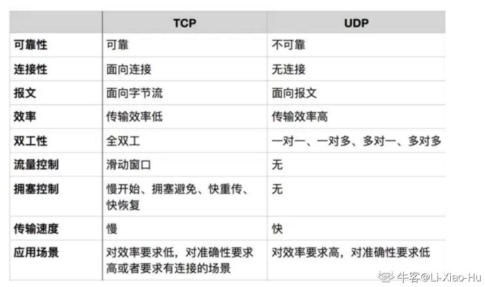

> 为什么说TCP是面向字节流的，而UDP是面向报文的？

**UDP是面向报文的**：发送方的UDP对应用层交下来的报文，不合并不拆分，只是在其上面加上首部之后就交给了下面的网络层，也就是说无论应用层交给UDP多长的报文，它统统发送，一次发送一个。而对于接收方，接收到之后直接去除首部，交给上面的应用层就完成任务了。因此，它需要应用层控制报文的大小，如果报文太长就会导致IP层需要分片，降低效率。

**TCP是面向字节流的**：TCP将上面交下来的数据看成是无结构的字节流来发送，发送方TCP会将数据放入缓存区，等到可以发送的时候才发送，不能发送就等着。如果应用层传送的数据块太长，TCP就可以将它划分短一些再传送。如果应用程序一次只发送一个字节，TCP也可以等待积累有足够多的字节后再构成报文段发送出去。

### TCP协议如何保证可靠传输

> 校验和

 TCP 将保持它首部和数据的检验和。这是一个端到端的检验和，目的是检测数据在传输过程中的任何变化。如果收到段的检验和有差错，TCP 将丢弃这个报文段和不确认收到此报文段。 

TCP的校验和覆盖TCP首部和TCP数据，而IP首部中的校验和只覆盖IP的首部，不覆盖IP数据报中的任何数据。

TCP的校验和是必须的，UDP的校验和是可选的。

TCP和UDP一样，在计算校验和的时候要使用16位的伪首部。

> 序列号和确认应答提高可靠性

当发送端的数据到达接收端的主机之后，接收端主机会返回一个已收到消息的通知，这个消息就叫做确认应答（ACK）。比如发送端发送了1-1000的数据给接收端，接收端就会发出一个ACK 1001，表示下一次我想收到的数据为1001。

如果一段时间之后，发送端都没有收到ACK，那么它就会进行重发。当然发送端没收到ACK并不一定是接收端没收到数据，也有可能是接收端发送的ACK在途中丢失了，没有到达接收端。这种情况同样发送端因为没有收到ACK而认为数据没有到达目的地从而重发数据。

序列号SYN的初始值是在建立连接的时候随机生成的，而后面SYN会累加它所发送过去的数据的字节数。然后接收端查询接受数据TCP首部中的序列号和数据的长度，将自己下一步应该接受的序列号作为ACK返送回去。通过SYN和ACK，TCP可以实现可靠传输。

**序列号对于可靠传输非常重要：**

1. 接收方可以去除重复的数据；
2. 接收方可以根据数据包的序列号按序接收；
3. 可以标识发送出去的数据包中， 哪些是已经被对方收到的（通过 ACK 报文中的序列号知道）；

**TCP给发送的每一个包进行编号，接收方对数据包进行排序，把有序数据传送给应用层。** TCP通常将不按序到达的数据先临时放在接收窗口中，等到字节流中缺少的字节收到之后，再按序交付上层的应用进程。

**TCP 的接收端会丢弃重复的数据。** 

> 超时重传

当 TCP 发出一个段后，它启动一个定时器，等待目的端确认收到这个报文段。如果不能及时收到一个确认，将重发这个报文段。

如果超时重传的数据再次超时的时候，又得再次需要进行重传，这次的超时间隔是上一次的**两倍**。

超时重传时间RTO的计算其实还是比较复杂的，如果较大就可能导致丢了很久才重发，效率低下。如果较小就可能导致并没有丢失就重发了，增加网络拥塞。

规则：RTO的值应该略大于报文往返RTT的值，但是RTT的值其实是不确定的，是动态变化的。因此需要通过采样RTT的时间计算出一个平滑的RTT。除了采样RTT，还得采用RTT的波动范围，避免如果RTT有一个很大的波动很难被发现。

> TCP以段为单位发送数据

TCP在传输大量数据的时候，是以**MSS（Maximum Segment Size）**的大小将数据进行分割发送，重发的时候也是以MSS为单位。MSS正好是IP中不会被分片处理的最大数据长度。

MSS是在三次握手的时候由两端主机之间被计算出来的。两端的主机在发出建立连接的请求的时候，会在TCP首部中写入MSS选项，告诉对方自己的接口能够适应的MSS的大小（此时TCP首部不再是20字节了，而是4字节的整数倍）。然后会在两者之间选出一个较小的值投入使用。 

于此同时，在IP层如果数据大小超过了**MTU（除去IP头部和TCP头部之后，一个网络包能容纳的TCP数据的最大长度）**，同样也会进行分片，那**既然IP层也会分片，为什么还要在TCP层进行分段？**

如果有一份数据比较大，并且在TCP层不分段，如果这份数据在发送过程中丢包，TCP就会发生重传，那么这一份大数据都会被重传（虽然IP层会将这份数据切割成MTU长度的多个小包，但是在TCP层来说，它重传的仍然是那一大份数据）。

而如果数据在TCP层进行分段，那么IP层就不会再进行分段了。此时在传输途中出现丢包，那么TCP也只会重传那一小部分的MSS段，效率比TCP不分段时更高。

> 滑动窗口

如果TCP每发送一个数据，都要进行一次确认应答，然后等到上一个数据包收到了确认应答了，才去发送下一个，这会造成**效率低下**。因此TCP就引入了滑动窗口，**窗口的大小就是无需等待确认应答，而可以继续发送数据的最大值**。

滑动窗口实际上是操作系统开辟的一个缓存空间，发送方主机在等到确认应答返回之前，必须在缓冲区中保留已发送的数据，如果按期收到ACK，此时数据就可以从缓冲区中清除。

假如窗口大小为3个TCP段，那么发送端就可以连发三个TCP数据段，而且途中有ACK丢失，**可以通过下一个ACK进行确认**。只要发送端收到了ACK num，那么num之前的所有数据接收方都已经收到了。**这就叫累计确认或累计应答**

 对于滑动窗口而言，可以使用三个指针来描述窗口的状态。

小于P1的表示已经发送并且收到确认的部分。大于P3的表示不允许发送的部分；窗口的大小就是P3-P1；P2-P1的大小表示已经发送但是未收到确认的字节数。P3-P2代表当前允许发送但是还尚未发送的字节数量。

虽然发送方的发送窗口是根据接收方的接受窗口设置的，但是**在同一时刻，发送方的发送窗口并不总是和接收方的接收窗口一样大。**因为网络传送窗口值需要经历一定的时间滞后，并且这个时间还不是确定的；同时发送方还可能根据网络当时的拥塞情况适当减小自己的发送窗口尺寸。

**TCP强烈不赞成窗口的前沿向后收缩**，也就是对方通知的窗口缩小了，因为有可能发送方再收到这个通知之前，就已经发送了窗口中的许多数据，现在又要收缩窗口，不让发送这些数据，就会产生错误。

> 流量控制

一般来说，我们都希望数据传输的更快一些。但是如果发送方把数据发送的过快，就可能导致接收方来不及接受，从而造成数据的丢失。而所谓流量控制，其实就是**让发送端的发送速率不要太快，要让接收方来得及接受**

TCP 连接的每一方都有固定大小的缓冲空间，TCP的接收端只允许发送端发送接收端缓冲区能接纳的数据。当接收方来不及处理发送方的数据，能提示发送方降低发送的速率，防止包丢失。TCP使用的流量控制协议是可变大小的滑动窗口协议。 （TCP 利用滑动窗口实现流量控制）

当接收端的接受窗口调整为0，对发送端进行流量控制，此时发送端由于自己的发送窗口被调控为0了，就无法再发送数据了，它就会一直等待接收端发送的非零窗口的通知。但是此时如果接收端又有了一些存储空间，将接收窗口调整为300，并通告发送端，然后等待发送端发送数据过来，但是不巧的是，该调整通知丢失了！此时接收端一直等待发送端发来数据，而发送端一直等待接收端的非零窗口通知，就造成了**死锁**。

**TCP使用持续计时器 + 零窗口探测报文进行解决**。所谓的持续计时器，就是等到发送端接收到零窗口通知时，就会启动该计时器，当持续计时器超时的时候，会发送零窗口探测报文，携带一字节数据。等到接收端收到了该零窗口探测报文段，就对零窗口探测报文进行确认，并通告自己的接收窗口。如果不为零，那么死锁的局面就可以被打破了；如果还是为零，那么就重置持续计时器，等待下一次超时或者等待接收端发布窗口通告。

**TCP规定，即使接受窗口为0，也必须接受零窗口探测报文段、确认报文段、携带有紧急数据的报文段**

如果零窗口探测报文段丢失了，注意，**零窗口探测报文段同样也有重传计时器，当零窗口探测报文段超时了，也会进行重传**。

> 拥塞控制

当网络拥塞时，减少数据的发送。 

**为什么有了流量控制，还得有拥塞控制？**

流量控制是避免发送端的数据填满接收端的缓存，避免接收端处理不过来导致数据包丢失。而拥塞控制就是避免发送方的数据填满整个网络。因为当网络出现拥堵的时候，如果继续发送大量的数据包，可能会导致数据包时延、丢失等情况，然后TCP就会进行重传，然后就更加加剧了网络的拥堵，造成恶性循环。因此就需要拥塞控制。

拥塞控制是防止过多的数据注入网络，使得网络中的路由器或者链路过载。发送双方都有一个拥塞窗口（cwnd），它会根据网络的拥塞程度动态变化，发送窗口取的是拥塞窗口和接收窗口的最小值。  

维护一个慢开始门限`ssthresh`状态：

- 当cwnd < ssthresh时，使用慢开始算法

- 当cwnd > ssthresh时，停止使用慢开始算法，转而使用拥塞避免算法

- 当cwnd = ssthresh时，既可以使用慢开始算法，也可以使用拥塞避免算法
1. **慢开始**：最开始发送方的拥塞窗口为1，由小到大递增。并假设慢开始门限ssthresh为16，每经过一个传输轮次，拥塞窗口cwnd加倍（乘2）（具体解释：一开始cwnd为1，TCP只能发送0号报文段，然后cwnd变成2；接着TCP就可以发送1-2号报文段了，之后因为发送了2个，cwnd就变成了2 + 2 = 4；下一次就可以发送3-6共四个报文段了，然后cwnd就会变成4 + 4 = 8；这就相当于翻倍）。当cwnd超过慢开始门限，则使用拥塞避免算法，避免cwnd增长过长。  

2. **拥塞避免**：当cwnd超过慢开始门限，每经过一个往返时间RTT，cwnd就增长1（举例中，ssthresh为16，因此可以发送15-30的号数据报文段，当发送端收到了15-30号报文段的ACK之后，就可以将cwnd的值 + 1，变成17；下一轮就可以发送31-47号数据报文段，共17个。）。在慢开始和拥塞避免过程中，一旦发现**网络拥塞（发送的数据报文段出现了丢失，超时重传计时器超时之后，进行重传）**，就把慢开始门限设置为当前值的一半，并且重新设置cwnd为1，重新慢启动。  
  
   拥塞避免并不是说完全能够避免拥塞，而是指的是在拥塞避免阶段将拥塞窗口控制为按线性规律增长，使网络不容易出现拥塞。

3. **快重传**：接收方每收到一个失序的报文段后就立即发出重复确认，而不是等超时重传计时器超时再重传，发送方只要收到3个连续的重复确认就立即重传。 因为可能个别报文段再网络中丢失，但是实际上网络并没有发送拥塞。这可能导致发送方误以为网络发生拥塞，就会将cwnd设置为1，并错误启动了慢重传算法，降低传输效率。
  
   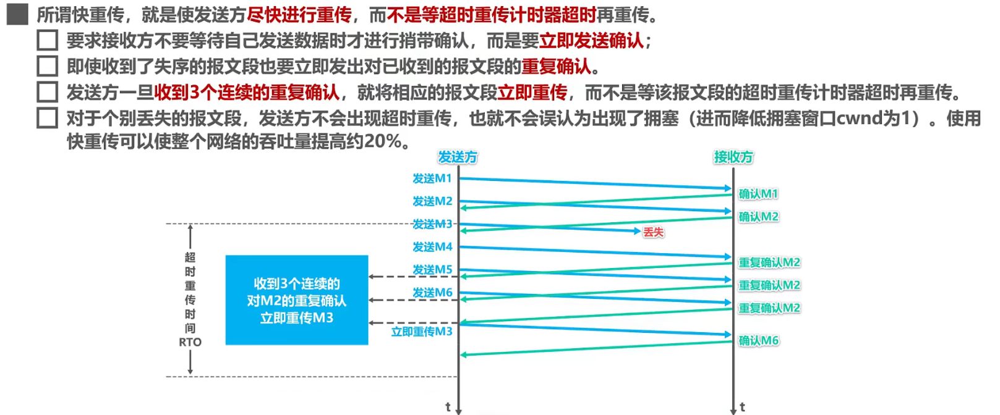

4. **快恢复**：当发送方连续收到三个重复确认，就将慢开始门限减半，将当前的窗口设置为慢开始门限，并采用拥塞避免算法。（采用快恢复算法时，慢开始只在建立连接和网络超时时才使用）

> ARQ协议

也是为了实现可靠传输的，它的基本原理就是每发完一个分组就停止发送，等待对方确认。在收到确认后再发下一个分组。 

**ARQ就是自动重传请求，是OSI模型中数据链路层和传输层的错误纠正协议之一**。它通过使用确认和超时两个机制，在不可靠服务的基础上实现可靠的信息传输。如果发送方在发送后一段时间之内没有收到确认帧，它通常会重新发送。ARQ包含停止等待ARQ协议和连续ARQ协议。

**停止等待ARQ协议：**

基本原理就是每发完一个分组就停止发送，等待对方确认（回复ACK）。如果过了一段时间（超时时间后），还是没有收到ACK确认就说明没有发送成功，需要重新发送，直到收到确认之后才会再次发送下一个分组。

在该协议中，若接收方收到重复分组，就丢弃该分组，而且还要发送确认。

优点是简单，缺点是信道利用率低，等待时间长。

**连续ARQ协议：**

该协议可以提高信道利用率。发送方会维持一个发送窗口，凡是位于发送窗口内的分组可以连续发送出去，而不需要等待对方确认。接收方一般采用累积确认，对按序到达的最后一个分组发送确认，表明到这个分组为止的所有分组都已经正确收到了。

优点：信道利用率高，容易实现，即使确认丢失，也不必重传。

缺点：不能向发送方反映出接收方已经正确收到的所有分组的信息。比如发送方发送了5条消息，但是只有第3条消息丢失了。接收方只能对前两条消息发送确认。而发送方无法知道后续三个分组的情况，只能把后面三个分组都重新传送一次。这也叫Go-Back-N（回退N），表示需要退回来重传已经发送过的N个消息。

### TCP头部

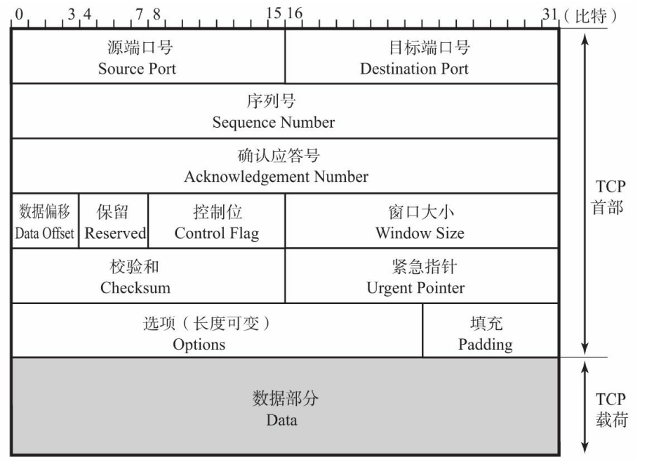

TCP中并没有包长度和数据长度的字段，TCP数据的长度 = IP总长度 - IP首部长度 - TCP首部长度。

- **序列号（Sequence Number）**

字段长32位，指的是发送数据的位置，每发送一次数据，就累加一次该数据字节数的大小。序列号在建立连接的时候由计算机生成的随机数作为初始值，通过SYN包传给接收端主机，然后再将每转发过去的字节数累加到初始值上表示数据的为欸之，此为，在建立连接和断开连接的时候发送的SYN包和FIN包虽然并不携带数据，但是也会作为一个字节增加对应的序列号。

- **确认应答号（Acknowledgment Number）**

同样也是32位，指的是下一次应该收到的数据的序列号。发送端收到这个确认应答以后就可以认为在这个序列号以前的数据都已经被正常接受。

- **数据偏移（Data Offset）**

表示TCP所传输的数据部分应该从TCP包的哪个位开始计算，也可以将其看作是TCP首部的长度，该字段长4位，**单位为4字节**。如果不包含选项字段，那么TCP首部的长度为20字节，因此数据偏移字段的值设置为5。

- **保留（Reserved）**

主要是为了以后扩展使用，一般设置为0，但即使收到的包在该字段不为0，此包也不会丢弃。

- **控制位（Control Flag）**

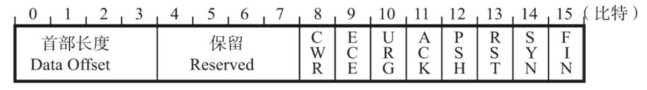

> ACK（Acknowledgement Flag）

该位为1时，确认应答的字段变为有效。TCP规定除了最初建立连接时的SYN包之外该位必须设置为1。

> RST（Reset Flag）标志位

RST表示复位，用来异常的关闭连接，在TCP的设计中它是不可或缺的，**为1的时候表示TCP连接中出现异常必须强制断开连接**。发送RST包关闭连接时，不必等缓冲区的包都发出去（不像FIN包），直接就丢弃缓冲区的包发送RST包。而接收端收到RST包之后，也不必发送个ACK包来确认。

TCP处理程序会在自己认为的异常时刻发送RST包。

1. A向B发起连接，但B之上并未监听相应的端口，因此无法进行通信，这时B操作系统上的TCP处理程序会发RST包。
2. AB正常建立连接，正在通讯时，A向B发送了FIN包要求关闭连接，B发送ACK之后网断了，A通过若干原因放弃了这个连接（例如进程重启）。网通了之后，B又开始发送数据包，A收到之后表示压力很大，不知道这野连接哪来的，就发了个RST包强制把连接关了，B收到之后会出现connect reset by peer错误。

> SYN（Synchronize Flag）

用于建立连接。SYN为1表示希望建立连接，并在其序列号的字段进行序列号初始值的设定

> FIN（Fin Flag）

该标志位为1的时候，表示今后不会再有数据发送，希望断开连接。当通信结束希望断开连接时，通信双方的主 机之间就可以相互交换FIN位置为1的TCP段。每个主机又对对方的FIN包进行确认应答以后就可以断开连 接。不过，主机收到FIN设置为1的TCP段以后不必马上回复一个FIN包，而是可以等到缓冲区中的所有数据 都因已成功发送而被自动删除之后再发。

- **窗口大小（Window Size）**

该字段长为16位。用于通知从相同TCP首部的确认应答号所指位置开始能够接收的数据大小（8位字 节）。TCP不允许发送超过此处所示大小的数据。不过，如果窗口为0，则表示可以发送窗口探测，以了解最新的窗口大小。但这个数据必须是1个字节。

- **校验和（Checksum）**

和UDP类似，**区别在于TCP的校验和无法关闭**

它在计算的时候同样也会使用TCP伪首部，只是协议号为6，表示是TCP协议。同时它计算的时候使用的是**补码**。

一旦在数据包的发送途中的某一个路由器发生故障，经过此路由器的包、协议首部或数据就极有可能被破坏。而TCP或UDP能够提供校验和计算，也可以判断协议首部和数据是否被破坏。

- **紧急指针（Urgent Pointer）**

字段长16位，只有在URG控制位为1时有效。该字段的数值表示本报文段中紧急数据的指针。正确 来讲，从数据部分的首位到紧急指针所指示的位置为止为紧急数据。因此也可以说紧急指针指出了紧急数据 的末尾在报文段中的位置。

- **选项（Options）**

由于数据偏移的影响，长度最大为40字节。用于提高TCP传输性能。

比如MSS选项用于在建立连接的时候决定最大段长度的情况。

### UDP头部

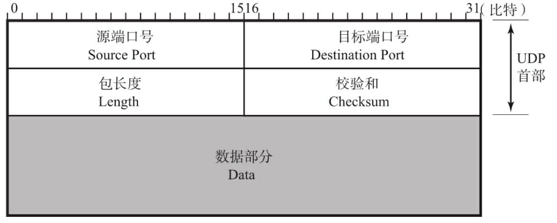

- **源端口号**：表示发送端的端口号，字段长16位。当然有时候可能不会设置源端口号，没有源端口号的时候该字段的值设置为0，可用于不需要返回的通信中。（只针对某个主机或应用，亦或者针对某个组织，只单方面发送更新消息，不需要接收端返回任何确认或应答）
- **目的端口号**：接收端端口，16位
- **包长度**：保存的是UDP首部的长度和数据部分的长度之和。
- **校验和**：

为了提供可靠的UDP首部和数据而设计。

UPD计算校验和的方法和IP数据报首部校验和的方法相似，但是IP数据报校验和只会校验IP数据报的首部，而UDP的校验和是将首部和数据部分一起都校验。

在计算校验和的时候，UDP会在UDP数据报之前添加12个字节的伪首部，**伪首部既不向下传送也不向上递交，仅仅只是为了计算校验和**；

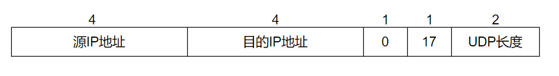

其中17表示协议号，表示这是UDP协议。0是数据填充，将其填充至12字节。

在计算校验和的时候，会先将校验和字段全部填充0，然后将UDP伪首部、首部、数据每16位一组进行二进制**反码**求和，再将求和结果求**反码**，填入校验和字段。

当然UDP中也有可能不用校验和，此时校验和字段中填入0，这种情况下由于不进行校验和计算，协议处理的开销就会降低，但是如果UDP首部的端口号或者IP首部的IP地址遭到破坏，那么可能会对其他通信造成不好的影响。

> 为什么需要伪首部？

TCP/IP中识别一个进行通信的应用需要5大要素，分别为源IP地址、目的IP地址、源端口号、目的端口号、协议号。而UDP首部只包含他们当中的两项。如果其他的三项被破坏了，就可能导致应该收包的应用收不到包，不应该收包的应用收到了包。

### TCP粘包拆包

我们都知道，TCP是面向字节流的，没有边界，但是操作系统在发送TCP数据的时候，会通过缓冲区来进行优化。

如果一次请求发送的数据量比较小，没达到缓冲区大小，TCP就会将多个请求合并成同一个请求进行发送，这就是**粘包**

如果一次请求发送的数据量比较大，超过了缓冲区大小，TCP将其拆分成多次发送，每个大小最大MSS，这就是**拆包**

**常见解决办法**：

1. 发送端将每个包都封装成固定的长度，如果大小不够可以通过填充0达到指定长度。
2. 将消息分为头部和消息体，头部中保存整个消息的长度，只要读取到足够长度的消息之后才算是读取到了一个完整的消息。
3. 可以在数据包之间设置边界，比如添加特殊符号等，就可以通过边界将不同的数据包拆开。

## 11.3 网络层协议

### （TODO）IP

IP协议的作用就是将各种数据包传送给对方

### （TODO）ARP

用于根据IP地址查询相应的以太网MAC地址。

### （TODO）ICMP

用于告知网络包在传输过程中产生的错误以及各种控制信息。

### 11.4 GET和POST的区别

1. GET重点在于从服务器上获得资源，POST重点在于向服务器发送数据。
2. GET传输的数据量小，因为受URL长度影响，但是效率较高（HTTP协议本身没有对URL长度做出任何规定，只是浏览器规定）；POST可以传送大量数据，所以上传文件只能POST
3. GET是不安全的，因为GET请求发送的数据是在URL上，是可见的。而POST是放在请求头部的，是安全的，但是HTTP传输的内容都是明文，虽然浏览器地址栏看不到POST提交的body数据，但是可以通过抓包看见。

### 11.5 Cookie和Session

HTTP是一种无状态协议，也就是说HTTP协议本身不对请求和响应之间的通信状态进行保存。因此就可以使用Cookie和Session来解决这个问题。

- Cookie一般用来保存用户信息。它是web服务器保存在用户浏览器上的文件（key-value），可以包含用户相关的信息。客户端向服务器发起请求的时候就会提取浏览器中的用户信息由HTTP发送给服务器。
  
  第一次客户端向浏览器发送请求，服务器生成Cookie之后通过响应报文中的名为Set-Cookie的首部字段，通知客户端保存Cookie。当下次客户端发送请求的时候，就会自动在请求报文中加入Cookie值并发送出去。

- Session是浏览器向服务器会话过程中，服务器会分配的一块存储空间给SESSION。服务器默认为客户浏览器的cookie中设置sessionId，这个sessionId就和cookie对应，浏览器在向服务器请求过程中传输的cookie包含sessionId，服务器根据传输的cookie中的sessionId获取出会话中存储的信息，然后确认会话的身份信息。

**区别：**

1. cookie数据放在浏览器端，安全性较差；session放在服务器上，安全性相对较高，但是session的实现对客户端的cookie有依赖关系。
2. 单个cookie保存的数据不能超过4K，session无此限制。
3. session会在一定时间内容保存在服务器上，当访问增多，会比较占用服务器的性能。

### 11.6 浏览器中输入url地址->>显示主页的过程

比如www.baidu.com

1. **浏览器通过DNS解析查找域名的IP地址（DNS查找过程：浏览器缓存、路由器缓存、DNS缓存）**
  
   1. 先从浏览器缓存里面查找IP，因为浏览器会缓存DNS记录一段时间（维护一张域名和IP地址的对应表）
   
   2. 如果没有，搜索操作系统中的DNS缓存（维护一张域名和IP地址的对应表）
   
   3. 如果没找到，就会去hosts文件查找是否有该域名和对应IP
   
   4. 如果找不到，就得求助于本地DNS服务器（本地DNS服务器的IP地址一般由本地网络服务商如移动、电信提供，一般是通过DHCP自动分配，目前用的较多的是谷歌提供的公用DNS8.8.8.8和国内的114.114.114.114）
     
      找到本地DNS之后，它也会去查询一遍自己的缓存。
   
   5. 如果都没有，从根域名服务器开始递归搜索，到根（.）、顶级（.com）、权威（xxx.com）域名服务器，再到自己的输入的域名服务器，直到找到IP
     
      比如根域名服务器接收到本地DNS的解析请求之后，发现后缀是.com，就把负责.com的顶级域名服务器ip地址返回给本地DNS。
      
      本地DNS再拿着返回的IP地址去找对应的顶级域名服务器，顶级域名服务器又将负责该域名的权威域名服务器IP返回去。
      
      本地DNS又拿着IP去找对应的权威域名服务器，权威域名服务器最终将对应的主机IP返回给本地DNS，至此就完成了域名解析的过程。
      
      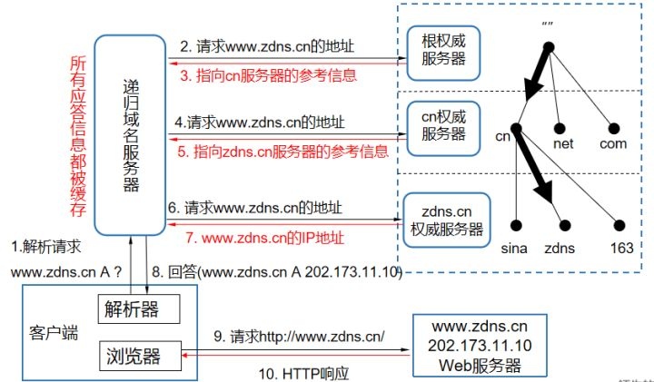

2. **浏览器和服务器建立TCP连接（三次握手）**
  
   1. 应用层发起HTTP请求
   2. 传输层的TCP协议为传输报文提供可靠的字节流服务，也就是用了TCP三次握手
   3. 网络层把TCP分割好的各种数据包传送给接收方。而要保证确实能传到接收方还需要接收方的MAC地址，也就是物理地址。
   4. 链路层将数据发送到数据链路层传输。至此请求报文已经发出，客户端发送的请求的阶段结束。

3. **浏览器向服务器发送一个HTTP请求**（cookies会随着请求发送给服务器）
  
    HTTP的请求包含三部分：请求方法URI协议/版本、请求头、请求正文。
   
    HTTP的响应包含三部分：状态行、响应头、响应正文

4. **服务器处理请求**（通过路径参数映射到对应的请求处理器进行请求）**并发回一个HTML响应**（将处理结果和视图返回给浏览器）。

5. **TCP连接释放。**

6. **浏览器开始显示HTML。**

**这个过程中用到的协议？**

1. DNS：获取域名对应的IP
2. TCP：与服务器建立TCP连接
3. ARP：路由器在与服务器通信时，需要将IP地址转换为MAC地址，需要使用ARP协议。
4. HTTP：在TCP建立连接完成之后使用HTTP协议访问网页。
5. IP：建立TCP协议时，需要发送数据，发送数据在网络层使用IP协议。
6. OSPF：IP数据包在路由器之间，路由选择使用OSPF协议。

### 11.7 Keep-Alive

[(34条消息) http的keep-alive和tcp的keepalive区别_oceanperfect的博客-CSDN博客](https://blog.csdn.net/oceanperfect/article/details/51064574)

> HTTP中的KeepAlive：

在早期的HTTP，每一个HTTP请求都要求打开一个TCP SOCKET连接，并且在使用依次之后就会断开这个连接。这样的消耗无疑是非常大的。因此就可以使用KeepAlive来改善这种状态，**即在一次TCP连接中可以持续发送多份数据而不会断开连接**，只要任意一方没有明确提出断开连接，则保持TCP连接状态。通过该机制，可以减少TCP建立连接次数，提高性能和提高HTTP服务器的吞吐率。但是长时间的TCP连接容易导致系统资源无效占用，配置不当的KeepAlive带来的损失也是很大的。

同时为了避免资源浪费，web服务软件一般会提供`keepalive_timeout`参数，用来指定HTTP长连接的超时时间。比如HTTP的长连接的超时时间是60秒，web服务软件就会启动一个定时器，如果客户端在完成一个HTTP请求之后，60秒内都没有再发起新的请求，定时器的时间一到，就会触发回调函数来释放连接。

> TCP中的KeepAlive

也叫**保活机制**，该功能由内核实现，当客户端和服务端长达一定时间没有进行数据交互的时候，内核为了确保该连接是否还有效，就会发送探测报文，来检查对方是否还在线，然后来决定是否关闭该连接。

TCP连接建立之后，如果应用程序或者上层协议一直不发送消息或者隔很久才发送一次数据，这是掉线了还是确实没有数据传输，连接还需不需要保持？当超过一段时间（两小时）之后，TCP自动发送一个数据为空的报文给对方，如果对方回应了这个报文，说明连接还可以继续保持，如果没有报文返回，并且重复了多次之后达到了保活探测次数（一般都是每隔75秒，一共十次）后还是没有，就会认为连接丢失，没有继续保持下去。

注意，应用程序若想使用 TCP 保活机制需要通过 socket 接口设置 `SO_KEEPALIVE` 选项才能够生效，如果没有设置，那么就无法使用 TCP 保活机制。

> HTTP如何保证长连接

一种是应用层自己去实现心跳包：由应用程序自己发送心跳包来检测连接是否正常。大致就是服务器在一个Timer事件中定时向客户端发送一个数据包，然后启动一个低级别的线程，在该线程中不断检测客户端的回应。如果在一定的时间内都没有收到回应，就会认为客户端掉线。同样如果客户端在一定时间没有收到服务端的心跳包，也会认为连接不可用。

一种是直接使用TCP的KeepAlive机制，因为HTTP实际上是基于TCP协议的，而且如果我们自己去实现心跳包的话，代码较多而且较为复杂。

### 11.8 网络七层模型

整个流程我们以信息发送为例，假如A想发送消息给B。

**应用层**：直接向用户提供服务，完成用户希望在网络上完成的各种工作。就比如A在应用聊天框里面输入消息，并且点击发送按钮，这一刻就进入了应用层协议的处理。**HTTP、HTTPS、FTP、SMTP**

**表示层**：负责数据格式的转换，将应用处理的信息转换为适合网络传输的格式，或者将来自下一层的数据转换为上层能处理的格式。

**会话层**：建立和管理应用程序之间的通信；如果A一次性发送五条数据，是每发送一次信息建立一次通信连接然后断开，还是一旦建立好连接之后就将这五条消息连续发送给对方，决定采用哪种连接方法是会话层应该做的事情。**会话层负责决定建立连接和断开连接的时机，而传输层进行实际的建立和断开处理**，**SSL/TSL协议**

**传输层**：会话层只对何时建立连接、何时发送数据等问题进行管理，并不具备实际的传输数据的功能，而传输层会确保所传输的数据到达目标地址，如果没有收到就会重发。

**网络层**：网络层负责将数据发送至最终目标地址，端对端的发送。通过路由选择算法，为报文通过通信子网选择最合适的路径。比如计算机网络中有很多台计算机，如果找到想要发送的那台？如果中间有多个节点，该如何选择路径？**ARP、IP、ICMP**

**数据链路层**：通信传输实际上是通过物理的传输介质实现的，该层的作用就是在这些通过传输介质互连的设备之间进行数据处理。将IP转换为MAC地址

在计算机网络中由于各种干扰的存在，物理链路是不可靠的。该层的主要功能就是：通过各种控制协议，将有差错的物理信道变为无差错的、能可靠传输数据帧的数据链路。

它的具体工作是接收来自物理层的位流形式的数据，并封装成帧，传送到上一层；同样，也将来自上层的数据帧，拆装为位流形式的数据转发到物理层。这一层的数据叫做帧。

**物理层**：解决两个硬件之间怎么通信的问题，常见的物理媒介有光纤、电缆、中继器等。它主要定义物理设备标准，如网线的接口类型、光纤的接口类型、各种传输介质的传输速率等。

它的主要作用是传输比特流（就是由1、0转化为电流强弱来进行传输，到达目的地后在转化为1、0，也就是我们常说的数模转换与模数转换）。这一层的数据叫做比特。

## **12. 操作系统**

### 12.1 同步和异步？

1. 如果系统中存在临界资源（资源数量少于竞争资源的线程数量的资源），例如正在写的数据以后可能被另外一个线程读到，或者正在读的数据可能已经被另外一个线程写过了，那么这些数据就必须进行同步存取。
2. 当应用程序在对象上调用了一个需要花费很长时间来执行的方法，并且不希望让程序等待方法的返回时，就应该使用异步编程。
3. 事实上所谓的同步就是指阻塞式操作，而异步就是非阻塞式操作。

### 12.3 线程、进程、协程

进程是系统进行资源分配和调度的一个独立单位，是一个在内存中运行的应用程序；线程是进程划分的更小的运行单位，一个进程可以有多个线程。

**进程和线程的区别：**

1. **根本区别：**进程是操作系统资源分配的基本单位，而线程是处理器任务调度和执行的基本单位。
2. **资源开销：**每个进程都有独立的代码和数据空间（程序上下文），程序之间的切换会有较大的开销；线程可以看作是轻量级的进程，同一类线程共享代码和数据空间，每个线程都有自己独立的运行栈和PC，线程之间切换的开销比较小。
3. **包含关系：**线程是进程的一部分，所以线程也被称为轻量级进程。
4. **内存分配：**同一个进程的线程共享本进程的地址空间和资源，而进程和进程之间的地址空间和资源是独立的。 
5. **影响关系：**一个进程崩溃之后，在保护模式下不会对其它进程产生影响，但是一个线程崩溃后有可能导致整个进程都死掉。进程比线程更有健壮性。
6. **执行过程：**每个独立的进程有程序运行的入口、顺序执行序列和程序出口。但是线程不能独立执行，必须依存在应用程序中，由应用程序提供多个线程执行控制，两者均可并发执行

进程和线程的主要差别在于它们是不同的操作系统资源管理方式。进程有独立的地址空间，一个进程崩溃后，在保护模式下不会对其它进程产生影响，而线程只是一个进程中的不同执行路径。线程有自己的堆栈和局部变量，但线程之间没有单独的地址空间，一个线程死掉就等于整个进程死掉，所以多进程的程序要比多线程的程序 健壮，但在进程切换时，耗费资源较大，效率要差一些。但对于一些要求同时进行并且又要共享某些变量的并发操作，只能用线程，不能用进程。

> 有了进程为什么还要有线程？

- 进程只能在一个时间干一件事情，如果想要同时干多个事情就无能为力了。
- 进程在执行过程中如果阻塞，比如等待输入，整个进程就会被挂起，即使进程中有些工作不依赖于输入的数据也将无法运行。
- 从操作系统的层面来说，线程的切换相对于进程来说消耗较小。

> 什么是协程

协程是一种比线程更加轻量级的存在，他完全由程序所控制，在**用户态**执行，可以让性能大幅度提升。

一个操作系统可以有多个进程，一个进程可以有多个线程，而一个线程又可以有多个协程。

可以将协程理解为一个特殊的函数，这个函数在某个地方挂起，并且可以重新在挂起处继续运行。而且一个线程内的多个协程的运行是**串行的**，也就是说**当线程内的某一个协程运行的时候，其他协程必须挂起。**

协程的切换是在线程内完成的，涉及到的资源比较小，切换的代价比较低。如果线程内的某个协程调用了阻塞IO，那么就会导致线程切换发生。**实际上协程只有在等待IO的过程中才能重复利用线程，协程 + 异步才能发挥出协程的最大作用**。

**协程的使用**：可以利用协程在IO等待时间就去切换执行其他任务，当IO操作结束之后再自动回调，那么就会大大节省资源并提高性能，从而实现异步编程。

**注意**：协程只有再等待IO的过程中才能重复利用线程。而线程在等待IO过程中会陷入阻塞状态，切换到其他线程，而过多的线程的切换会占用大量的系统时间，并且系统线程会占用非常多的内存空间。

**协程无法被操作系统所感知到，因此在协程调用阻塞IO操作（打印、读取文件、Socket接口等）的时候，操作系统会让线程进入阻塞状态，当前的协程和其它绑定在该线程之上的协程都会陷入阻塞而得不到调度，这往往是不能接受的。**

### 12.4 什么是上下文切换？

1. 在多线程编程中，线程的个数一般都大于CPU核心的个数，而一个CPU在任意时刻只能被一个线程使用，为了让这些线程都有效执行，**CPU采取的策略就是为每个线程分配时间片并轮转的形式。**当一个线程的时间片用完的时候就会重新处于就绪状态让给其它线程使用，这个过程就叫做上下文切换。
2. 概括来就是说，当前任务在执行完CPU的时间片切换到另一个任务之前会先保存自己的状态，以便下次再切换回这个任务时，可以再加载这个任务的状态。**任务从保存到再加载的过程就是一次上下文切换。**
3. 频繁的上下文切换会消耗大量的CPU事件。

### 12.5 死锁

#### 1. 死锁形成的条件

- **互斥条件：**资源只能有一个进程占用。如果此时还有其它的进程来请求该资源，就只能等待直到占有资源的进程用毕释放。
- **占有并等待**：一个进程至少应该占有一个资源，并等待另一个资源，而该资源被别的进程所占有。
- **非抢占：**资源不能被抢占，只能在持有资源的进程完成任务后，该资源才会被释放。 
- **循环等待：**若干进程之间形成一种头尾相接的循环等待关系。

#### 2. 如何避免死锁

预防死锁，就要避免上述的四个死锁形成条件。

1. 避免一个线程同时获得多个锁
2. 避免一个线程在锁内同时占用多个资源，尽量保证每个锁只占用一个资源。
3. 尝试使用定时锁，使用lock.tryLock(timeout)来替换使用内部锁机制。

### 12.6 孤儿进程和僵尸进程

**孤儿进程：**一个父进程退出，而它的一个或多个子进程还在运行，那么这些子进程成为孤儿进程。孤儿进程将被init进程（进程号为1）所收养，并由init进程对他们完成状态收集工作。

**僵尸进程：**一个进程使用fork创建子进程之后，如果子进程退出，而父进程并没有调用wait或waitpid获取子进程的状态信息，那么子进程的进程描述符仍然保存在系统中。这种进程称之为僵尸进程。在Linux中，僵尸进程不占用资源，只是它对应的PCB还存在。可能造成内存泄漏

**如何杀死僵尸进程？**

 首先僵尸进程一但出现会很难自己消亡，会一直存在直至系统重启。虽然僵尸进程几乎不占用系统资源，但是数量太多了之后还是会对系统带来其它的影响。因此就需要杀掉僵尸进程。而僵尸进程是无法直接使用kill -9命杀掉的。

1. **重启服务器**
2. **找到该defunct（失效的）僵尸进程的父进程，将该进程的父进程杀掉，将僵尸进程变成孤儿进程，然后由init进程收养**

**它们是如何产生的？**

当你运行一个程序时，它会产生一个父进程以及很多子进程。 所有这些子进程都会消耗内核分配给它们的内存和CPU 资源。这些子进程完成执行后会发送一个 Exit 信号然后死掉。这个 Exit 信号需要被父进程所读取。父进程需要随后调用 wait 命令来读取子进程的退出状态，并将子进程从进程表中移除。  

若父进程正确的读取了子进程的 Exit 信号，则子进程会从进程表中删掉。但若父进程未能读取到子进程的 Exit 信号，则这个子进程虽然完成执行处于死亡的状态，但也不会从进程表中删掉。

### 12.7 用户态和系统态

运行在应用态的进程可以直接读取用户程序的数据。运行在系统态的进程几乎可以访问计算机上的任何资源。

**用户态切换到内核态的三种方式：**

1. **系统调用**：用户态主动通过系统调用的方式切换到内核态。如果处于用户态的进程想要调用操作系统提供的系统态级别的子功能的时候，就可以通过系统调用的方式向操作系统提出服务请求，并由操作系统代为完成。
2. **异常：**当CPU在执行运行在用户态下的程序时， 发生了某些事先不可知的异常，这时就会触发当前由运行进程切换到处理此异常的内核相关程序中，也就转到了内核态，比如缺页中断。
3. **外围设备的中断：**当外围设备完成用户请求的操作后，会向CPU发出相应的中断信号，这时CPU就会暂停执行下一条即将要执行的指令转而去执行与中断信号对应的处理程序，如果先前执行的指令是用户态下的程序，那么这个转换的过程自然也就发生了由用户态到系统态的切换。比如硬盘读写操作完成，系统会切换到硬盘读写的中断处理程序中执行后续操作等。

### 12.8 线程和进程的生命周期

> 线程的生命周期

对于通用的生命状态来说，一共有五种状态：

1. **初始状态：**线程已经被创建，但是还不允许分配CPU运行。这个状态是属于编程语言特有的，不过这里的创建仅仅是在编程语言层面被创建，而在操作系统层面，真正的线程还未被创建，比如new Thread，这时候在编程语言层面线程是新建状态
2. **可运行状态：**线程可以分配CPU执行，在这个时候，真正的操作系统层面的线程已经被成功创建了，但是还暂未分配CPU。
3. **运行状态：**可运行状态的线程被分配到了处理机资源，进入运行状态
4. 运行状态的线程如果调用一个阻塞的API（例如以阻塞的方式读取文件）或者等待某个事件（例如条件变量），那么线程就会切换至**休眠状态**，同时释放CPU使用权，休眠状态的线程永远无法获得CPU使用权。当等待的事件出现了，线程就会从休眠状态转换到可运行状态。
5. 线程执行完毕或者出现异常就会进入**终止状态**，此时意味着线程的生命周期结束了。

不同的编程语言会有不同的实现，比如Java中的线程生命周期可以分为六个状态。

1. **NEW（初始化状态）**
2. **RUNNABLE（可运行/运行状态）**：Java里面可以把可运行状态和运行状态进行合并，因为这两个状态在操作系统调度层面有用，而JVM层面不关心这两种状态，因为JVM将线程调度交给操作系统处理了。
3. **BLOCK（阻塞状态）**
4. **WAITING（无时限等待）**
5. **TIMED_WAITING（有时限等待）**
6. **TERMINATED（终止状态）**

**Java中各大状态的转换】**

- **RUNNABLE与BLOCKED的状态转换**

当线程等待synchronzied的隐式锁的时候，等待的线程会从RUNNABLE转换位BLOCKED状态，而当等待的线程获取到隐式锁的时候，就会从BLOCKED状态转换回RUNNABLE状态。

如果线程调用阻塞式API，在操作系统层面，的确会转换到休眠状态，释放CPU资源。但是在Java层面线程的状态依然保持RUNNABLE状态，**JVM根本不关心操作系统调度相关的状态**，因为在JVM看来，等待CPU使用权（操作系统层面此时处于可执行状态）和等待IO（操作系统层面处于休眠状态）没有区别，都是在等待某个资源，所以都归入了RUNNABLE状态。

平时说的Java在调用阻塞式API时线程阻塞，说的其实是操作系统层面的阻塞状态。

- **RUNNABLE和WAITTING状态切换**

第一种：在隐式锁中调用wait方法

第二种：调用无参数的Thread.join方法，这是一种线程同步方法，比如有一个线程对象ThreadA，当调用A.join方法的时候，执行这条语句的线程会等待A线程执行完毕，而等待中的这个线程就会从RUNNABLE转换为WAITTING。当线程A执行完之后，线程B就会从WAITTING转换回RUNNABLE

第三种：调用LockSupport.park方法，使用unpark又回去了。

- **RUNNABLE和TIMED_WAITTING**

带有超时参数的各种方法，比如sleep、wait、jon、parkNanos、parkUntil

- **NEW到RUNNABLE**

Java刚创建出来的对象就是NEW状态，只需要调用线程对象的start方法就可以转换为RUNNABLE状态。

- **RUNNABLE到TERMINATED**

执行完run之后自动转换。同时如果执行期间抛出异常也会转换。

如果需要强制中断run方法执行，首先Thread中的stop方法可以，但是不建议使用，可以使用interrupt方法。

> 进程的生命周期

NEW创建状态：进程正在被创建

READY就绪态：进程创建成功，并且获得了除处理器以外的所有所需资源，一旦获得处理器资源即时间片之后就可以运行

RUNNING运行态：进程在处理器上运行，注意的是，单核CPU下任意时刻只能有一个进程处于运行状态

WAITING阻塞态：进程正在等待某一事件而暂停运行，比如等待某资源可用或等待IO操作完成，即使处理器空闲，该阻塞态的进程也无法被执行

TERMINATED结束态

### 12.9 进程间的通信方式

每个进程都有不同的用户地址空间，任何一个进程的全局变量在另外一个进程中都看不到，因此如果进程之间想要交换数据必须要通过内核，在内核中开辟一片缓冲区，进程A将数据从用户空间拷贝到内核缓冲区，进程B再从内核缓冲区将数据读走，这种内核提供的机制被称为进程间通信。

**匿名管道**

管道是一种半双工的通信方式，也就是数据只能单向流动，而且匿名管道只能在具有亲缘关系的进程间使用，通常是指父子进程。管道这种通信方式效率低，不适合进程间频繁交换数据。

- 父进程创建管道，得到两个文件描述符指向管道的两端
- 父进程fork出子进程，子进程也有两个文件描述符指向同一管道，创建的子进程会复制父进程的文件描述符
- 父进程关闭管道读端，子进程关闭管道写端（管道只支持单向通信）。父进程可以往管道里面写，子进程从管道里面读。管道是利用环形队列实现的，数据从写端流入从读端流出。

**有名管道**

对于有名管道，他可以在不相关的进程间也能相互通信。因为有名管道提前创建了一个类型为管道的设备文件，在进程里只要使用这个设备文件就可以相互通信。

### 12.10 线程间通信方式

线程间的通信方式主要用于线程同步，而不是数据交换

**锁机制**：

比如互斥锁、条件变量、读写锁等等。

- 互斥锁提供了以排他方式防止数据结构被并发修改的方法
- 读写锁允许多个线程同时读共享数据，但是只能有一个线程对共享数据进行写操作
- 条件变量可以以原子的方式阻塞线程，直到某个特定条件为真未知。对条件的测试是在互斥锁的保护下进行的。条件变量始终和互斥锁一起使用

**信号量机制**：Semaphore

**信号机制**：Signal

### 12.11 用户态和内核态

如果面试官问什么是系统调用，就可以扯到用户态和内核态

[从根上理解用户态与内核态 - 知乎 (zhihu.com)](https://zhuanlan.zhihu.com/p/388057431)

### 12.12 Linux常用命令

查看端口占用情况：lsof -i:端口号，list open files

杀掉执行PID的进程：kill -9

kill命令对应的是kill -15，系统会发送SIGTERM信号给对应的进程，大部分进程收到之后会先释放自己的资源再停止，也就是说SIGTERM多半是会被阻塞的；而kill -9会发送SIGKILL信号，代表强制删除

显示系统内所有的进程信息：ps -elf

以全屏交互式的界面显示进程排名：top

## 13. RPC项目指南

### 项目介绍

项目借鉴了Dubbo的SPI机制，使用SPI机制对一些类进行配置。

服务提供者端启动：启动代码就常规的Netty服务端启动代码，从容器中获取NettyRpcServer（被@Component标注），然后调用它的start方法，等待客户端建立连接。

同时在启动类上，有注解@RpcScan，它内部包含@Import注解，导入了一个注册类CustomScannerRegistrar，它实现了ImportBeanDefinitionRegistrar，该类的执行时机：在容器刷新过程中的invokeBeanFactoryPostProcessor阶段，ConfigurationClassPostProcessor会起到作用，它内部最终会调用ImportBeanDefinitionRegistrar的registerBeanDefinitions方法实现中，它会扫描所有标注了@RpcService的类，后续再进行实例化。

对于Spring整合Dubbo来说，它也是有一个类似RpcScan的注解，同样会扫描所有的标注了@DubboService注解的class。

同时还向Spring容器中引入了SpringBeanPostProcessor，它实现了BeanPostProcessor接口，重写了postProcessBeforeInitialization和postProcessAfterInitialization方法，

- 在前者方法中，会判断该类是否被RpcService标注，如果是，就进行服务发布流程，构造RpcServiceConfig，将其注入到注册中心，并做好缓存。
- 在后者方法中，会判断该类的属性中是否有被@RpcReference标注的，如果有，就创建其代理类，并注入其中


Dubbo中的@DubboReference是在类进行populate的时候，如果发现该字段是标注了该注解的话，就会去实例化他


服务消费者端启动，启动之后并未直接向服务端通信，而是正常流程启动，利用CustomScannerRegistrar和SpringBeanPostProcessor进行一些初始化操作。接下来如果我们调用暴露的服务，比如HelloController中有属性@RpcReference HelloService，在调用Service的hello方法的时候，由于HelloController中注入的Service是它的代理类，因此执行的时候会执行它的invoke方法，在该方法里面，构造RpcRequest，并向服务端发送RPC请求。

在发送请求的流程中， 首先会去注册中心查找该请求的服务，如果有多个，就使用负载均衡策略选择一个。得到对应服务的ip和端口之后，看看有没有已经建立好对应的连接了，如果没有就创建新的连接，然后客户端发送请求给服务端，经过压缩、序列化之后，服务端收到请求，执行好了之后，将结果再发给客户端，客户端收到请求，解析出结果，返回给调用者。RPC结束。

在我的RPC项目中，并没有对zookeeper中的节点进行缓存，也没有订阅zookeeper的变化，而且是在执行远程服务方法的时候才去zookeeper中获取服务的地址。

同时客户端和服务端之间还拥有心跳检测机制。

压缩使用的GZIP，

Netty自带的心跳核心类，IdleStateHandler。

### 如何解决粘包、拆包问题？

四种方法：

1. 短连接，每次传输数据都是一次连接，传输完毕就关闭连接。频繁建立和关闭消耗资源
2. 固定长度，如果太长就浪费资源，如果太短就可能有些数据无法完整传输
3. 固定分隔符：数据包中无法含有该分隔符
4. 预设长度，本项目采用的方式：

使用的是Netty的**LengthFieldBasedFrameDecoder**类，有五个参数：最大长度、长度偏移、长度占用字节、长度调整、剥离字节数。

```
this(RpcConstants.MAX_FRAME_LENGTH, 5, 4, -9, 0);
```

5表示长度的偏移量为5，并且长度占用4个字节。

0表示所有的数据我都接受，不抛弃。

### 序列化机制是？为啥选kryo？

JDK序列化：Java自带的，不支持跨语言，

hessian序列化：时间较早，跨语言，

Protostuff序列化：跨语言

Kryo：针对Java

1. Kryo序列化的“对象”是数据以及少量元信息，这和JAVA默认的序列化的本质区别，java默认的序列化的目的是语言层次的，将类，对象的所有信息都序列化了，也就是就算是不加载类的定义，也可以根据序列化后的信息动态生成类的所有信息。而Kryo反序列化时，必须能加载类的定义，这样Kryo可以节省大量的字节空间。
2. 使用变长int，变长long存储int，long类型，大大节省空间。
3. 元数据（字符串类型）使用缓存机制，重复出现的字符串使用int来存储，节省存储空间。
4. 字符串类型使用UTF-8存储，但会使用ascii码进一步优化空间

[为什么如此高效？解密kryo各个数据类型的序列化编码机制，强 - 知乎 (zhihu.com)](https://zhuanlan.zhihu.com/p/272816835)

### 说说本项目的协议设计：

```
 *   0    1    2    3    4       5   6   7   8   9         10      11      12   13   14   15  16
 *   +----+----+----+----+-------+---+---+---+---+-----------+-----+---- -- +----+----+----+--+
 *   |   magic   code    |version|   full length |messageType|codec|compress|    RequestId    |
 *   +-------------------+-------+---------------+-----------+-----+--------+-----------------+
 *   |                                                                                        |
 *   |                                         body                                           |
 *   |                                                                                        |
 *   |                                        ... ...                                         |
 *   +----------------------------------------------------------------------------------------+
 * 4B  magic code（魔法数）   1B version（版本） 4B full length（消息长度）1B messageType（消息类型）
 * 1B compress（压缩类型） 1B codec（序列化类型） 4B  requestId（请求的Id）
```

### BIO、NIO、AIO

BIO：

- 线程发起IO请求，不管内核是否准备好IO操作，从发起请求起，线程一直阻塞，直到操作完成；
- 一个连接一个线程
- 同步并阻塞，服务器实现模式为一个连接一个请求，即客户端有连接请求时服务器端就需要启动一个线程进行处理，如果这个线程不做任何事情会造成不必要的开销，可以通过线程池改善。
- 适用于连接数比较小，且固定的架构，JDK1.4之前的唯一选择

NIO：

- 线程发起IO请求，立即返回；内核在做好IO操作的准备之后，通过调用注册的回调函数通知线程做IO操作，线程开始阻塞，直到操作完成；
- 一个请求一个线程；
- 同步非阻塞，客户端发送的连接请求都会注册到多路复用器上，多路复用器轮询到有IO请求的时候才启动一个线程去处理
- 适用于连接数较多且连接比较短的架构，比如聊天服务器，1.4开始支持

AIO：

- 线程发起IO请求，立即返回；内存做好IO操作的准备之后，做IO操作，直到操作完成或失败，通过调用注册的回调函数通知线程做IO操作完成或者失败。
- 一个有效请求一个线程
- 异步非阻塞，客户端的IO请求都是由OS先完成了再通知服务器应用去启动线程进行处理。
- 适用于连接数比较多，且连接比较长的架构，比如相册服务器，充分调用OS参与并发操作。


### Netty的零拷贝

### HTTP如何解决粘包问题？知道chunked吗？

https://blog.csdn.net/u013378306/article/details/107742524

### zookeeper作为注册中心是怎么存储的，存储什么数据？

### 为什么要把每个服务端注册成临时节点？ 

### 客户端发起调用的时候每次都去获取节点信息吗？ 

### 如果每次都获取的话性能就会比较低，有没有什么优化方案？（用watcher） 

### 使用watcher的时候需要注意什么？watcher回调完后还要做什么事情吗？ 

### rpc中应用线程池调用者发送调用后，请求跟响应是怎么异步关联的呢？（回调）

### 基于回调要怎么异步关联起来呢，有没有什么思路？ 

### 消息里为什么要有requestID？

如果使用netty的话，一般会用channel.writeAndFlush()方法来发送消息二进制串，这个方法调用后对于整个远程调用(从发出请求到接收到结果)来说是一个异步的，即对于当前线程来说，将请求发送出来后，线程就可以往后执行了，至于服务端的结果，是服务端处理完成后，再以消息的形式发送给客户端的。于是这里出现以下两个问题：

1）怎么让当前线程“暂停”，等结果回来后，再向后执行？

2）如果有多个线程同时进行远程方法调用，这时建立在client server之间的socket连接上会有很多双方发送的消息传递，前后顺序也可能是随机的，server处理完结果后，将结果消息发送给client，client收到很多消息，怎么知道哪个消息结果是原先哪个线程调用的？

　　如下图所示，线程A和线程B同时向client socket发送请求requestA和requestB，socket先后将requestB和requestA发送至server，而server可能将responseA先返回，尽管requestA请求到达时间更晚。我们需要一种机制保证responseA丢给ThreadA，responseB丢给ThreadB。

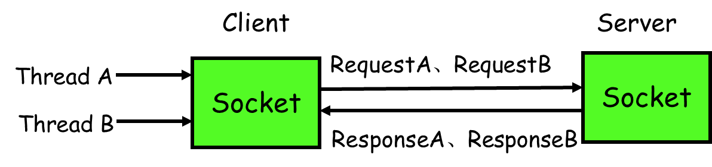

怎么解决呢？

1）client线程每次通过socket调用一次远程接口前，生成一个唯一的ID，即requestID（requestID必需保证在一个Socket连接里面是唯一的），一般常常使用AtomicLong从0开始累计数字生成唯一ID；

2）将处理结果的回调对象callback，存放到全局ConcurrentHashMap里面put(requestID, callback)；

3）当线程调用channel.writeAndFlush()发送消息后，紧接着执行callback的get()方法试图获取远程返回的结果。在get()内部，则使用synchronized获取回调对象callback的锁，再先检测是否已经获取到结果，如果没有，然后调用callback的wait()方法，释放callback上的锁，让当前线程处于等待状态。

4）服务端接收到请求并处理后，将response结果（此结果中包含了前面的requestID）发送给客户端，客户端socket连接上专门监听消息的线程收到消息，分析结果，取到requestID，再从前面的ConcurrentHashMap里面get(requestID)，从而找到callback对象，再用synchronized获取callback上的锁，将方法调用结果设置到callback对象里，再调用callback.notifyAll()唤醒前面处于等待状态的线程。

### 项目中[负载均衡怎么实现的

### 有没有提供什么扩展的接口，钩子给其人或程序方便扩展。

### JDK动态代理机制是怎么实现的
